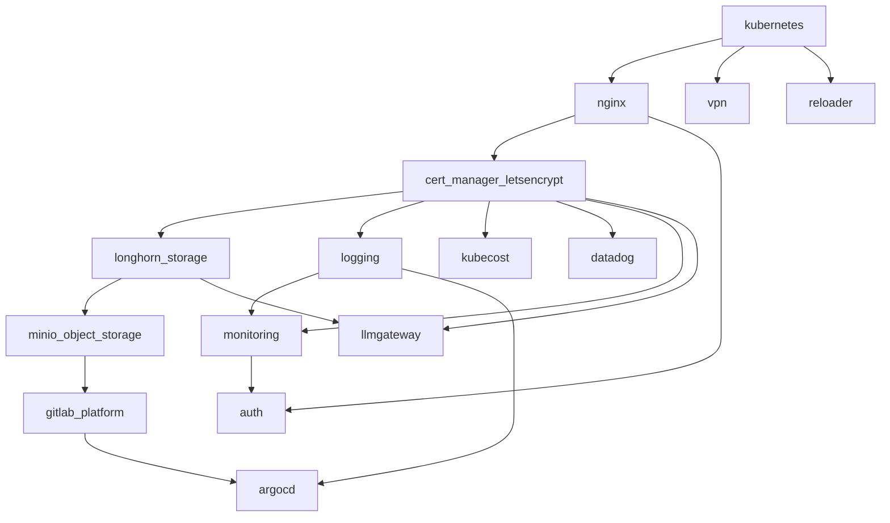

# AGENTS.md: AI Collaboration Guide

This document provides essential guidelines for AI models interacting with this homelab infrastructure project.

## Quick Reference for AI Agents

**Key Files to Read First:**

- `stage2/main.tf` - Module dependencies and orchestration
- `stage2/variables.tf` - All Terraform input variables
- `stage1/inventories/inventory.yml` - Kubernetes version pinning
- `Dockerfile` - Container tool versions

**Common Patterns:**

| Task | Location | Pattern |
|------|----------|---------|
| Add Terraform module | `stage2/<module-name>/` | Create `*.tf`, `variables.tf`, `provider.tf`, `templates/` |
| Add Helm chart | Module's main `.tf` | Use `helm_release` resource with version pinning |
| Add Ansible role | `stage1/roles/<role>/` | Create `tasks/main.yml`, `defaults/main.yml`, `templates/` |
| Add new variable | `stage2/variables.tf` | Include type, description, default, validation |
| Enable optional module | `stage2/main.tf` | Use `count = var.<module>_enable ? 1 : 0` |

**Before Making Changes:**

1. Run `task precommit` to validate
2. Check module dependencies in `stage2/main.tf`
3. Verify version compatibility in `Dockerfile` and `inventory.yml`

## Project Overview

**Homelab Infrastructure** - A comprehensive two-stage infrastructure-as-code solution for provisioning single-node Kubernetes clusters with enterprise-grade applications. Uses Ansible for server setup and Kubernetes cluster bootstrap, followed by Terraform for deploying a complete application stack including GitLab, monitoring, storage, VPN, and CI/CD tools.

**Core Architecture:**

- **Stage 1 (Ansible)**: Server hardening, Kubernetes cluster provisioning (kubeadm/k3s/minikube)
- **Stage 2 (Terraform)**: Application deployment and infrastructure services
- **Containerized Tooling**: Docker image with kubectl, helm, terraform, ansible, kubent

**Supported Platforms:**

- **Target**: Ubuntu AMD64 servers (GitLab limitation)
- **Kubernetes Options**: kubeadm (recommended), k3s (alternative), minikube (experimental)
- **Infrastructure**: Single-node clusters optimized for homelab environments

## Project Structure

```text
homelab-infrastructure/
├── stage1/                       # Ansible playbooks and roles
│   ├── ansible.cfg               # Ansible configuration
│   ├── site.yml                  # Main playbook orchestration
│   ├── inventories/
│   │   └── inventory.yml         # Host definitions and version pinning
│   ├── roles/
│   │   ├── host_setup/           # Server hardening (fail2ban, ufw)
│   │   ├── kubeadm_*/            # kubeadm cluster setup
│   │   ├── k3s_*/                # k3s cluster setup
│   │   ├── minikube_*/           # minikube cluster setup
│   │   └── localhost_post_setup/ # Post-deployment tasks
│   └── requirements*.txt         # Python/Ansible dependencies
├── stage2/                       # Terraform modules
│   ├── main.tf                   # Module orchestration and dependencies
│   ├── variables.tf              # All input variables
│   ├── providers.tf              # Provider configurations
│   ├── backend.tf                # Terraform Cloud backend
│   ├── kubernetes/               # CoreDNS, Prometheus CRDs
│   ├── nginx/                    # NGINX Ingress Controller
│   ├── cert-manager-letsencrypt/ # TLS certificate management
│   ├── longhorn-storage/         # Distributed block storage
│   ├── minio-object-storage/     # S3-compatible object storage
│   ├── gitlab-platform/          # GitLab CI/CD (AMD64 only)
│   ├── monitoring/               # Prometheus, Grafana, AlertManager, ElastAlert2
│   ├── logging/                  # ECK (Elasticsearch, Kibana, Filebeat)
│   ├── auth/                     # OAuth2 proxy (Auth0)
│   ├── argocd/                   # GitOps continuous deployment
│   ├── kubecost/                 # Cost monitoring
│   ├── vpn/                      # Tailscale and WireGuard
│   ├── datadog/                  # Datadog monitoring (optional)
│   ├── stakater-reloader/        # Auto-restart on Secret/ConfigMap changes
│   └── llmgateway/               # LLM Gateway - unified LLM API (optional)
├── scripts/                      # Helper scripts
├── container/                    # Container customization files
├── Dockerfile                    # Alpine container with all tools
├── Taskfile.yml                  # Task runner (primary command interface)
├── .pre-commit-config.yaml       # Pre-commit hooks configuration
└── .env.sample                   # Environment variable template
```

## Build & Commands

**Task Runner (Taskfile.yml):**

| Command | Description |
|---------|-------------|
| `task repo:setup` | Install dependencies (pre-commit, ansible-galaxy, pip) |
| `task docker:build` | Build Alpine container image |
| `task docker:run` | Start container with volume mounts |
| `task docker:exec` | Interactive bash session in container |
| `task precommit` | Run all pre-commit hooks |
| `task stage1:ansible:ping` | Verify SSH connectivity to server |
| `task stage1:ansible:playbook` | Deploy Stage 1 (Ansible) |
| `task stage2:terraform:init` | Initialize Terraform |
| `task stage2:terraform:plan` | Plan Terraform deployment |
| `task stage2:terraform:apply` | Apply Terraform deployment |

**Stage 1 (Ansible) - Inside Container:**

```bash
task docker:exec
cd stage1
ansible-playbook --ask-become-pass -i "inventories/inventory.yml" site.yml
```

**Stage 2 (Terraform) - Inside Container:**

```bash
cd stage2
terraform workspace select <workspace-name>
terraform init && terraform apply
```

### Development Environment

- **Container Workspace**: `/srv` (project root mounted)
- **SSH Keys**: `~/.ssh` mounted for Git and server access
- **Kubernetes Config**: Copied to `container/root/.kube/config` after Stage 1
- **SSH Passphrase**: Use `ssh-add` before running Ansible

## Configuration Management

**Environment Variables (.env file):**

Critical configuration managed through environment variables:

```bash
# Kubernetes cluster configuration
kubernetes_cluster_type=kubeadm    # kubeadm, k3s, or minikube
server_ssh_host=192.168.1.100      # Target server IP
server_ssh_user=ubuntu             # SSH username
server_ssh_port=2222               # SSH port (must not be 22)

# Architecture support
host_machine_architecture=amd64    # amd64 or arm64

# Additional configuration
docker_default_data_path=/var/lib/docker
etc_hosts_json=[]                  # Custom host entries
```

**Terraform Variables:**

Extensive variable system in `stage2/variables.tf` covering:

- Network configuration (domains, IPs, ingress settings)
- Storage settings (Longhorn, MinIO capacity)
- Application configuration (GitLab, monitoring, auth)
- Resource limits and security settings

**Configuration Best Practices:**

When adding new configuration options:

1. Add to appropriate variable files with type validation
2. Include sensible default values
3. Document variable purpose and constraints
4. Update environment variable mappings
5. Test with both default and custom values

## Code Style & Infrastructure Standards

**File Organization:**

- **Ansible**: Follow role-based structure with tasks, templates, defaults
- **Terraform**: Modular approach with separate directories per service
- **Templates**: Use `.j2` for Ansible Jinja2, `.tftpl` for Terraform templates
- **Variables**: Consistent naming with underscores, descriptive prefixes

**Naming Conventions:**

- **Resources**: Use consistent prefixes (e.g., `gitlab_`, `prometheus_`, `minio_`)
- **Files**: Use kebab-case for playbooks, snake_case for variables
- **Domains**: Follow pattern `service.domain.local` for local services

**Version Management:**

Container tools (pinned in `Dockerfile`):

| Tool | Version | Source |
|------|---------|--------|
| kubectl | 1.34.2 | dl.k8s.io |
| helm | 3.19.2 | helm.sh |
| terraform | 1.14.1 | hashicorp.com |
| taskfile | 3.45.5 | taskfile.dev |
| trivy | 0.68.1 | aquasecurity |

Kubernetes components (pinned in `stage1/inventories/inventory.yml`):

| Component | Version |
|-----------|---------|
| kubeadm/kubectl | 1.33.4 |
| containerd | 2.1.4 |
| cilium-cli | 0.18.6 |
| runc | 1.3.0 |
| cni | 1.7.1 |
| crictl | 1.34.0 |
| k3s | v1.30.2+k3s1 |
| minikube | 1.33.1 |

**Helm Charts**: Version pinning in Terraform `helm_release` resources

**Pre-commit Hooks** (`.pre-commit-config.yaml`):

| Hook | Purpose |
|------|---------|
| `ansible-lint` | Validate Ansible playbooks and roles |
| `terraform_fmt` | Format Terraform files |
| `terraform_validate` | Validate Terraform configuration |
| `terraform_trivy` | Security scanning for Terraform |
| `terraform_tflint` | Lint Terraform files |
| `detect-private-key` | Prevent committing private keys |
| `gitleaks` | Detect secrets in code |

**Security Standards:**

- **Secrets**: Never commit sensitive data; use Terraform Cloud/environment variables
- **SSH**: Key-based authentication required, non-standard ports enforced
- **TLS**: Let's Encrypt certificates for all ingress endpoints
- **RBAC**: Proper role-based access control for all services

## Infrastructure Components

**Terraform Module Dependencies** (defined in `stage2/main.tf`):



**Core Kubernetes Stack:**

1. **Cluster Options**:
   - **kubeadm**: Production-ready, full control, recommended for AMD64
   - **k3s**: Lightweight, good for resource-constrained environments
   - **minikube**: Development/testing, local development workflows

2. **Networking**: Cilium CNI for kubeadm, built-in for k3s/minikube

3. **Storage**: Longhorn distributed storage with configurable data paths

**Application Services:**

1. **Ingress & Security**:
   - NGINX Ingress Controller with MetalLB load balancing
   - cert-manager with Let's Encrypt integration
   - OAuth2 proxy with Auth0 authentication

2. **CI/CD & DevOps**:
   - GitLab platform with registry, runners, and object storage
   - ArgoCD for GitOps workflows
   - MinIO for S3-compatible object storage

3. **Monitoring & Observability**:
   - Prometheus stack (Prometheus, Grafana, AlertManager)
   - Elasticsearch stack (ECK operator, Kibana, Filebeat)
   - ElastAlert2 for log-based alerting
   - Kubecost for cost monitoring
   - Datadog integration (optional, via `datadog_enable`)

4. **Networking & Access**:
   - Tailscale mesh VPN integration
   - WireGuard VPN server with web UI
   - Custom CoreDNS configuration for local domains

5. **Utilities**:
   - Stakater Reloader - auto-restart pods on Secret/ConfigMap changes
   - LLM Gateway - unified API for multiple LLM providers (optional, via `llmgateway_enable`). See [stage2/llmgateway/README.md](stage2/llmgateway/README.md)

## Deployment Workflows

**Initial Setup Workflow:**

1. **Prerequisites**:
   - Ubuntu AMD64 server with SSH key access
   - Non-standard SSH port (not 22)
   - Terraform Cloud workspace configured
   - Domain/DNS setup for local services

2. **Environment Preparation**:

   ```bash
   cp .env.sample .env    # Configure environment
   task repo:setup        # Install dependencies
   ```

3. **Stage 1 Execution**:

   ```bash
   task docker:exec
   cd stage1
   ansible-playbook --ask-become-pass -i "inventories/inventory.yml" site.yml
   ```

4. **Stage 2 Execution**:

   ```bash
   cd stage2
   terraform workspace select <workspace>
   terraform init && terraform apply
   ```

**Maintenance & Updates:**

- **Security Updates**: Regular package updates via Ansible host_setup role
- **Application Updates**: Terraform plan/apply with updated chart versions
- **Backup Strategy**: GitLab automated backups to MinIO object storage
- **Monitoring**: Prometheus alerts for system health and capacity

## Troubleshooting

**Common Issues:**

1. **ServiceMonitor CRD Error**:

   ```bash
   # In stage2/monitoring/prometheus-stack.tf, within the helm_release resource
   # for kube-prometheus-stack, temporarily add the following parameter:
   # reuse_values = true
   # Then re-run: terraform apply
   ```

2. **GitLab Registry Storage Full**:

   ```bash
   # Expand MinIO PVCs:
   kubectl edit -nminio-tenant pvc data{0,1,2,3}-minio-tenant-pool-0-0
   ```

3. **SSH Connection Issues**:

   ```bash
   # Add SSH key if using passphrase:
   eval "$(ssh-agent)"
   ssh-add
   ```

4. **Architecture Compatibility**:
   - GitLab only supports AMD64; automatically skipped on ARM64
   - Other services support both AMD64 and ARM64

## Security & Best Practices

**Infrastructure Security:**

- **Server Hardening**: fail2ban, UFW firewall, snap removal, secure SSH
- **Network Security**: Non-standard SSH ports, ingress-only application access
- **Data Protection**: TLS everywhere, encrypted storage volumes
- **Access Control**: OAuth2 proxy authentication for all web services

**Operational Security:**

- **Secrets Management**: Terraform Cloud variables, never committed to Git
- **Regular Updates**: Automated package updates and security patching
- **Monitoring**: Comprehensive alerting for security and operational events
- **Backup Strategy**: Automated GitLab backups with retention policies

**Development Security:**

- **SSH Key Management**: Key-based authentication, proper key rotation
- **Container Security**: Alpine base images, minimal package installation
- **Code Quality**: Pre-commit hooks, infrastructure validation

## Git Workflow

- **Quality Gates**: Always run `task precommit` before commits
- **Container Testing**: Test Ansible/Terraform changes in container environment
- **Version Control**: Never commit `.env` files or sensitive configuration
- **Branch Strategy**: Feature branches for infrastructure changes
- **Review Process**: Infrastructure changes require careful review due to impact

## Optional Modules

Modules controlled by enable flags in Terraform variables:

| Module | Variable | Default |
|--------|----------|---------|
| GitLab | `host_machine_architecture == "amd64"` | Auto (AMD64 only) |
| Logging (ECK) | `logging_module_enable` | `true` |
| Datadog | `datadog_enable` | `false` |
| Tailscale | `tailscale_enable` | `false` |
| WireGuard | `wireguard_enable` | `false` |
| LLM Gateway | `llmgateway_enable` | `false` |

## Architecture Notes

- **Single-Node Focus**: Optimized for homelab, not production clusters
- **Extensibility**: Modular Terraform design - add modules in `stage2/<name>/`
- **GitOps Ready**: ArgoCD for application lifecycle management
- **Storage**: Longhorn (block) + MinIO (S3-compatible object storage)
