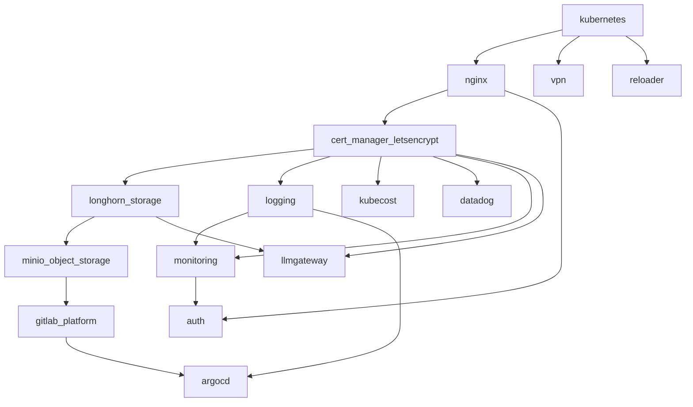

# Homelab Infrastructure

[](https://github.com/chrisleekr/homelab-infrastructure/actions/workflows/push.yml)
[](https://github.com/chrisleekr/homelab-infrastructure/actions/workflows/container-security.yml)
[](https://www.terraform.io/)
[](https://kubernetes.io/)
[](LICENSE)

> Provisioning a single-node Kubernetes cluster with kubeadm/k3s, Ansible and Terraform

## Overview

A comprehensive two-stage infrastructure-as-code solution for provisioning single-node Kubernetes clusters with enterprise-grade applications. Uses Ansible for server setup and Kubernetes cluster bootstrap, followed by Terraform for deploying a complete application stack including GitLab, monitoring, storage, VPN, and CI/CD tools.

**Core Architecture:**

- **Stage 1 (Ansible)**: Server hardening, Kubernetes cluster provisioning (kubeadm/k3s/minikube)
- **Stage 2 (Terraform)**: Application deployment and infrastructure services
- **Containerized Tooling**: Docker image with kubectl, helm, terraform, ansible, kubent

**Supported Platforms:**

- **Target**: Ubuntu AMD64 servers (GitLab limitation)
- **Kubernetes Options**: kubeadm (recommended), k3s (alternative), minikube (experimental)
- **Infrastructure**: Single-node clusters optimized for homelab environments

## Project Structure

```text
homelab-infrastructure/
├── stage1/                       # Ansible playbooks and roles
│   ├── ansible.cfg               # Ansible configuration
│   ├── site.yml                  # Main playbook orchestration
│   ├── inventories/
│   │   └── inventory.yml         # Host definitions and version pinning
│   ├── roles/
│   │   ├── host_setup/           # Server hardening (fail2ban, ufw)
│   │   ├── kubeadm_*/            # kubeadm cluster setup
│   │   ├── k3s_*/                # k3s cluster setup
│   │   ├── minikube_*/           # minikube cluster setup
│   │   └── localhost_post_setup/ # Post-deployment tasks
│   └── requirements*.txt         # Python/Ansible dependencies
├── stage2/                       # Terraform modules
│   ├── main.tf                   # Module orchestration and dependencies
│   ├── variables.tf              # All input variables
│   ├── providers.tf              # Provider configurations
│   ├── backend.tf                # Terraform Cloud backend
│   └── <module>/                 # Individual service modules
├── scripts/                      # Helper scripts
├── container/                    # Container customization files
├── Dockerfile                    # Alpine container with all tools
├── Taskfile.yml                  # Task runner (primary command interface)
├── .pre-commit-config.yaml       # Pre-commit hooks configuration
└── .env.sample                   # Environment variable template
```

## Build & Commands

**Task Runner (Taskfile.yml):**

| Command | Description |
|---------|-------------|
| `task repo:setup` | Install dependencies (pre-commit, ansible-galaxy, pip) |
| `task docker:build` | Build Alpine container image |
| `task docker:run` | Start container with volume mounts |
| `task docker:exec` | Interactive bash session in container |
| `task precommit` | Run all pre-commit hooks |
| `task stage1:ansible:ping` | Verify SSH connectivity to server |
| `task stage1:ansible:playbook` | Deploy Stage 1 (Ansible) |
| `task stage2:terraform:init` | Initialize Terraform |
| `task stage2:terraform:plan` | Plan Terraform deployment |
| `task stage2:terraform:apply` | Apply Terraform deployment |
| `task stage2:terraform:lock` | Regenerate provider lock for multi-platform |

**Container Tools:**

<!-- VERSIONS_START - Do not remove this comment, used by sync-versions workflow -->
| Tool | Version |
|------|---------|
| kubectl | 1.35.0 |
| helm | 3.19.4 |
| terraform | 1.14.3 |
| taskfile | 3.46.4 |
| trivy | 0.69.0 |
<!-- VERSIONS_END - Do not remove this comment -->

## Quick Start

### Prerequisites

1. Set up Terraform Cloud and create an API key.

2. Install Ubuntu AMD64 on a server and configure the following:
   - GitLab (`registry.gitlab.com/gitlab-org/build/cng/kubectl`) does not support ARM64 yet.
   - Note that the server SSH port must not be `22`.

   ```shell
   $ ssh chrislee@192.168.1.100

   >$ sudo mkdir -p /etc/systemd/system/ssh.socket.d
   >$ sudo cat >/etc/systemd/system/ssh.socket.d/override.conf <<EOF
   [Socket]
   ListenStream=2222
   EOF

   >$ sudo systemctl daemon-reload
   >$ reboot

   $ ssh chrislee@192.168.1.100 -p2222

   >$ vim ~/.ssh/authorized_keys
   # Add the public key located at ~/.ssh/id_rsa.pub to the authorized_keys file
   ```

### Stage 0: Setup the Environment

1. Copy the `.env.sample` file to a new file named `.env` and configure it accordingly.

   ```bash
   cp .env.sample .env
   ```

   - Make sure to set `kubernetes_cluster_type` to either `k3s` or `kubeadm`.
   - Note that `minikube` can be provisioned but failed to work with the current setup.

2. Ensure that you have an SSH key file ready for use with Ubuntu (e.g., `~/.ssh/id_rsa.pub`).

3. Run `repo:setup` to make sure you have all the necessary tools.

   ```bash
   task repo:setup
   ```

### Stage 1: Provision Kubernetes Cluster

1. Verify access by running the following commands:

   ```bash
   $ task docker:exec
   /srv# cd stage1
   /srv/stage1# ansible all -i "inventories/inventory.yml" -m ping
   ```

   - If you want to validate the Ansible playbook, you can run the following command:

     ```bash
     /srv/stage1# ansible-playbook --ask-become-pass -i inventories/inventory.yml site.yml --check
     BECOME password: <ubuntu root password>
     ```

2. Prepare the VM template by running the following command:

   ```bash
   /srv/stage1# ansible-playbook --ask-become-pass -i "inventories/inventory.yml" site.yml
   BECOME password: <ubuntu root password>
   ```

   - At the end of the playbook, the `.kube/config` should be copied to the local machine in `container/root/.kube/config`.

### Stage 2: Deploy Kubernetes Infrastructure

1. Initialize Terraform by running the following commands:

   ```bash
   $ task docker:exec
   /srv# cd stage2
   /srv/stage2# terraform workspace select <workspace name>
   /srv/stage2# terraform init
   ```

2. Provision infrastructure using Terraform by running the following commands:

   ```bash
   /srv/stage2# terraform plan
   /srv/stage2# terraform apply
   ```

## Configuration Management

**Environment Variables (.env file):**

```bash
# Kubernetes cluster configuration
kubernetes_cluster_type=kubeadm    # kubeadm, k3s, or minikube
server_ssh_host=192.168.1.100      # Target server IP
server_ssh_user=ubuntu             # SSH username
server_ssh_port=2222               # SSH port (must not be 22)

# Architecture support
host_machine_architecture=amd64    # amd64 or arm64

# Additional configuration
docker_default_data_path=/var/lib/docker
etc_hosts_json=[]                  # Custom host entries
```

**Terraform Variables:**

Extensive variable system in `stage2/variables.tf` covering:

- Network configuration (domains, IPs, ingress settings)
- Storage settings (Longhorn, MinIO capacity)
- Application configuration (GitLab, monitoring, auth)
- Resource limits and security settings

## Infrastructure Components

**Terraform Module Dependencies:**



**Core Kubernetes Stack:**

1. **Cluster Options**:
   - **kubeadm**: Production-ready, full control, recommended for AMD64
   - **k3s**: Lightweight, good for resource-constrained environments
   - **minikube**: Development/testing, local development workflows

2. **Networking**: Cilium CNI for kubeadm, built-in for k3s/minikube

3. **Storage**: Longhorn distributed storage with configurable data paths

## Stage 2 Modules

Each module has its own README with detailed configuration options:

| Module | Description |
|--------|-------------|
| [Kubernetes](stage2/kubernetes/README.md) | CoreDNS, Prometheus CRDs |
| [NGINX](stage2/nginx/README.md) | Ingress Controller with MetalLB |
| [Cert Manager](stage2/cert-manager-letsencrypt/README.md) | TLS certificate management with Let's Encrypt |
| [Longhorn](stage2/longhorn-storage/README.md) | Distributed block storage |
| [MinIO](stage2/minio-object-storage/README.md) | S3-compatible object storage |
| [GitLab](stage2/gitlab-platform/README.md) | CI/CD platform with registry and runners (AMD64 only) |
| [Monitoring](stage2/monitoring/README.md) | Prometheus, Grafana, AlertManager, ElastAlert2 |
| [Logging](stage2/logging/README.md) | ECK (Elasticsearch, Kibana, Filebeat) |
| [Auth](stage2/auth/README.md) | OAuth2 proxy with Auth0 |
| [ArgoCD](stage2/argocd/README.md) | GitOps continuous deployment |
| [Kubecost](stage2/kubecost/README.md) | Cost monitoring |
| [VPN](stage2/vpn/README.md) | Tailscale and WireGuard |
| [Datadog](stage2/datadog/README.md) | Datadog monitoring (optional) |
| [Stakater Reloader](stage2/stakater-reloader/README.md) | Auto-restart on Secret/ConfigMap changes |
| [LLM Gateway](stage2/llmgateway/README.md) | Unified LLM API (optional) |

## Optional Modules

Modules controlled by enable flags in Terraform variables:

| Module | Variable | Default |
|--------|----------|---------|
| GitLab | `host_machine_architecture == "amd64"` | Auto (AMD64 only) |
| Logging (ECK) | `logging_module_enable` | `true` |
| Datadog | `datadog_enable` | `false` |
| Tailscale | `tailscale_enable` | `false` |
| WireGuard | `wireguard_enable` | `false` |
| LLM Gateway | `llmgateway_enable` | `false` |

## Troubleshooting

See [TROUBLESHOOTING.md](TROUBLESHOOTING.md) for common issues and solutions.

## Git Workflow

- **Quality Gates**: Always run `task precommit` before commits
- **Container Testing**: Test Ansible/Terraform changes in container environment
- **Version Control**: Never commit `.env` files or sensitive configuration
- **Branch Strategy**: Feature branches for infrastructure changes
- **Review Process**: Infrastructure changes require careful review due to impact

## Contributing

See [CONTRIBUTING.md](CONTRIBUTING.md) for development guidelines.

## Security

See [SECURITY.md](SECURITY.md) for vulnerability reporting.

## License

This project is licensed under the MIT License - see the [LICENSE](LICENSE) file for details.
