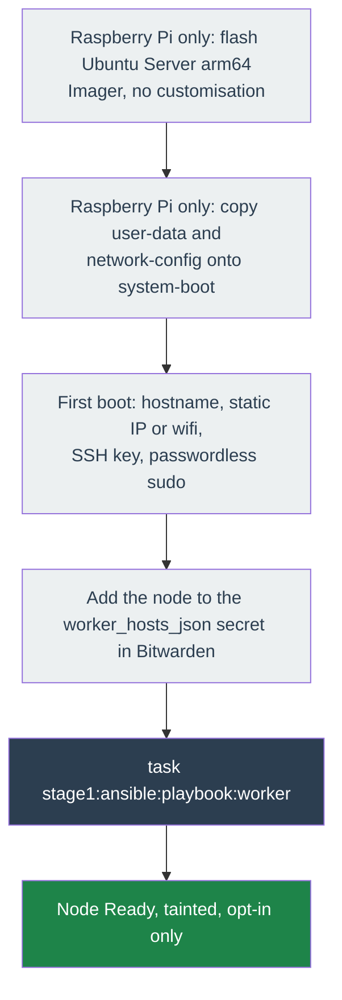

# Adding a worker node

Joins an additional machine to the existing kubeadm cluster as a worker.

The join itself is generic: any Ubuntu machine reachable over SSH with passwordless sudo
can become a worker, arm64 or amd64. Only the **image preparation** in steps 1-3 is
Raspberry Pi specific, because the cloud-init seed partition only exists on Ubuntu's
single-board-computer images.

- **Raspberry Pi**: start at step 1. After flashing, the only manual action is copying two
  files onto the SD card.
- **Any other machine** (an amd64 mini-PC, a VM): install Ubuntu Server however you
  normally would, ensure SSH plus passwordless sudo for your user, then **skip to step 4**.

## How it works



## 1. Flash the image (Raspberry Pi)

In Raspberry Pi Imager, pick **Other general-purpose OS → Ubuntu → Ubuntu Server (64-bit)**.

There are two easy mistakes here, and both produce a Pi that looks fine and then fails
confusingly.

**It must be Ubuntu, not Raspberry Pi OS.** Imager offers Raspberry Pi OS first. Both ship
cloud-init and both are arm64, so it looks like it should work, but stage1 targets Ubuntu
and three things break on Raspberry Pi OS:

- it uses NetworkManager rather than netplan, so the `network-config` seed below does not
  apply as written and the node comes up on DHCP;
- it runs `dphys-swapfile`, which re-enables swap on every boot, and **kubelet refuses to
  start while swap is on**. `host_setup` only does `swapoff -a` plus an `/etc/fstab` edit,
  which does not stop it;
- it has no `apparmor` unit, so `kubeadm_pre_setup`'s apparmor task errors.

**It must be Server, not Desktop.** A worker is headless, so a desktop image spends a large
share of a Pi's limited RAM on GNOME and gdm3. The desktop image's cloud-init seed also
creates a 1 GB swap file by default, and swap stops kubelet from starting.

Tell them apart from the boot partition alone, before you ever boot the Pi:

| Check | Ubuntu Server | Ubuntu Desktop | Raspberry Pi OS |
|---|---|---|---|
| Partition name | `system-boot` | `system-boot` | `bootfs` |
| `network-config` file | present | **absent** | absent |
| `user-data` contains | a `chpasswd:` block | **`users: []` and `swap:`** | commented examples |

**Skip the customisation dialog** (the gear icon). Imager can pre-seed a hostname, user and
SSH key, but it cannot set an SSH port, a static IP, or wifi, and whatever it writes is
overwritten in the next step anyway. Keeping the config in a file under version control
beats keeping it in a GUI dialog.

## 2. Seed cloud-init (Raspberry Pi)

Re-insert the card. The FAT32 `system-boot` partition mounts automatically
(`/Volumes/system-boot` on macOS). If it mounts as `bootfs`, you flashed Raspberry Pi OS —
go back to step 1.

Copy **both** example files over the matching files on that partition. Filenames are exact:
no extension, UTF-8 without BOM.

| Copy | Over | Sets |
|---|---|---|
| [`user-data.example`](../stage1/cloud-init/raspberry-pi/user-data.example) | `user-data` | hostname, user, SSH key, sudo, SSH port |
| [`network-config.example`](../stage1/cloud-init/raspberry-pi/network-config.example) | `network-config` | static IP, or wifi |

Then fill in the placeholders. Three values **must** agree with this node's entry in
`worker_hosts_json` (step 4), or the join will fail or the node will be unreachable:

| `user-data` / `network-config` | must equal | `worker_hosts_json` |
|---|---|---|
| `hostname` | = | `name` — kubeadm registers the node under its hostname |
| `addresses` (in `network-config`) | = | `host` |
| `users: - name:` | = | `user` |

Also replace `ssh_authorized_keys` with your own public key, change the `chpasswd` recovery
password from `changeme`, and set the gateway and nameservers in `network-config` to match
your LAN.

**sshd stays on the default port 22 — do not change it in the seed.** Ubuntu socket-activates
sshd, and a partial `ssh.socket` override in cloud-init leaves the daemon bound to nothing on
*both* ports, which locks you out with no recovery but a re-flash (learned the hard way). A
worker is LAN-only and never port-forwarded, so 22 is fine (UFW rate-`limit`s it). Leave
`port` out of `worker_hosts_json`, or set it to `22`. If you want a non-standard port, change
it on the live node after join — see "Changing the SSH port later".

**The recovery password is deliberate.** `ssh_pwauth: true` plus a `chpasswd` password means
a wrong SSH key cannot lock you out. Harden it after join (see below).

Networking goes in `network-config` rather than being hand-written into `/etc/netplan` from
`user-data`. It is the mechanism the image's own boot-partition README documents, and
because `meta-data` sets `dsmode: local`, cloud-init applies it *before* bringing the
network up — so the Pi comes up directly on its static address instead of taking a DHCP
lease first and switching. Note cloud-init only reads it on **first boot**; to change the
address later, edit `/etc/netplan/50-cloud-init.yaml` on the node and run `netplan apply`.

## 3. Boot and verify (Raspberry Pi)

Boot the Pi. First boot takes a few minutes: cloud-init creates the user, applies the
network, and restarts `ssh.socket` on the new port.

Confirm you can reach it (use `wlan0` instead of `eth0` if you configured wifi):

```bash
ssh ubuntu@192.168.1.102 'hostname; ip -4 addr | grep inet; sudo -n true && echo "passwordless sudo OK"'
```

Expect the hostname you set, the static address, and `passwordless sudo OK`. All three
matter: a wrong hostname breaks the kubeadm join, and sudo that prompts breaks the playbook.

If SSH is refused but the Pi answers `ping`, log in on a monitor as `ubuntu` with the
`chpasswd` password, then check `cloud-init status --long` and `systemctl status ssh.service`.

This is the only manual touch in the process.

## 4. Declare the node

Set the `worker_hosts_json` secret in Bitwarden (raw JSON value, no `\"` escaping needed — `bws run`
injects it natively). One JSON object per worker:

```json
[{"name":"worker-01","host":"192.168.1.102","port":"2222","user":"ubuntu","labels":{"node.homelab/class":"low-power"}}]
```

| Key | Required | Default | Notes |
|---|---|---|---|
| `name` | yes | — | Must match the cloud-init `hostname`. Becomes the Kubernetes node name. |
| `host` | yes | — | IP or resolvable hostname. |
| `port` | no | `22` | SSH port. Must match `ListenStream` in the seed. |
| `user` | no | `ubuntu` | SSH user, needs passwordless sudo. |
| `taints` | no | `worker_default_taints` | Per-node taints. `[]` means schedulable. |
| `labels` | no | `{}` | Per-node labels, applied from the control plane. |

Adding a second worker means appending a second object. No YAML changes.

## 5. Provision and join

```bash
task stage1:ansible:playbook:worker
```

This runs host hardening, installs the container runtime and kubelet, and joins the node.
On cgroup v2 (Ubuntu 22.04+, what this repo targets) the memory cgroup controller is already
on, so nothing reboots. Only a legacy cgroup v1 image triggers the one-time reboot.

The architecture is detected per host, so an arm64 worker joining an amd64 control plane
gets arm64 binaries automatically. Nothing needs setting for this.

## 6. Verify

```bash
kubectl get nodes -o wide
kubectl describe node worker-01 | grep -A2 Taints
kubectl get pods -A -o wide --field-selector spec.nodeName=worker-01
```

Expect the node `Ready` with the architecture of the machine you added (`ARCH=arm64` for a
Pi, `amd64` for an x86 box), carrying its `node.homelab/class:NoSchedule` taint, and running
only the components that deliberately tolerate it:

| Component | Why it tolerates the taint |
|-----------|----------------------------|
| `cilium`, `kube-proxy` | CNI and service proxy, required on every node |
| `node-exporter` | Node metrics |
| `longhorn-manager`, `longhorn-csi-plugin`, `instance-manager`, `engine-image` | Let pods here mount Longhorn volumes. Replicas do **not** land on the worker: it has no `node.longhorn.io/create-default-disk=true` label, so Longhorn gives it no disk |
| `datadog-agent` | Node metrics, logs and OOM-kill events |

Anything else running there tolerates the taint unexpectedly and should be pinned back to
the control plane with a `nodeSelector` in stage2.

The Longhorn and Datadog tolerations match on the taint key alone (`operator: Exists`), so
they cover any `node.homelab/class` value rather than one specific class.

## Scheduling onto the worker

Workers are tainted by default, because a Raspberry Pi is a poor place for the scheduler to
put things by accident, and because an arm64 node cannot run the amd64-only images in this
cluster (GitLab in particular). Nothing lands there unless it opts in.

To run a workload on the worker, tolerate the taint:

```yaml
tolerations:
  - key: node.homelab/class
    operator: Equal
    value: low-power
    effect: NoSchedule
nodeSelector:
  kubernetes.io/arch: arm64
```

Three ways to change the policy, in increasing order of scope:

- **One schedulable worker**: give that node `"taints": []` in `worker_hosts_json`.
- **A different taint for one node**: give that node its own `taints` list, e.g. a GPU key.
- **A different fleet-wide default**: set the `worker_default_taints` secret in Bitwarden.

## Harden the worker after join

The seed leaves password auth on so a wrong SSH key cannot lock you out during bring-up.
Once the node has joined and key-based SSH is confirmed working, close that hatch:

```bash
# confirm key auth works first — this must succeed WITHOUT prompting for a password:
ssh -o PasswordAuthentication=no ubuntu@192.168.1.102 true && echo "key auth OK"

# then disable password auth and lock the password
sudo sed -i 's/^#\?PasswordAuthentication.*/PasswordAuthentication no/' /etc/ssh/sshd_config.d/*.conf 2>/dev/null
echo 'PasswordAuthentication no' | sudo tee /etc/ssh/sshd_config.d/99-hardening.conf
sudo passwd -l ubuntu
sudo systemctl restart ssh
```

## Changing the SSH port later

The seed deliberately leaves sshd on port 22, because changing it in cloud-init is what
caused a full lockout during this project's bring-up: Ubuntu socket-activates sshd, and a
first-boot `ssh.socket` override that clears 22 but fails to bind the new port leaves the
daemon dead on both, with no way in.

If you want a non-standard port, do it on the **live** node, where 22 stays reachable as a
fallback until the new port is confirmed, and where you can see which unit is actually in
use first:

```bash
# 1. see how sshd is activated on this image (socket vs service)
systemctl status ssh.socket ssh.service --no-pager

# 2. if socket-activated, override the socket (empty ListenStream clears the default 22):
sudo install -d /etc/systemd/system/ssh.socket.d
printf '[Socket]\nListenStream=\nListenStream=2222\n' | sudo tee /etc/systemd/system/ssh.socket.d/listen.conf
sudo systemctl daemon-reload && sudo systemctl restart ssh.socket

# 3. from ANOTHER terminal, confirm the new port works BEFORE closing the old session:
ssh -p 2222 ubuntu@192.168.1.102 true && echo "2222 OK"
```

Then set `"port": "2222"` for this node in `worker_hosts_json` and open it in the firewall.
Automating this in `host_setup` is a possible follow-up; today the repo never manages the
sshd port (the control plane's port was set at OS-install time too).

## Removing a worker

```bash
kubectl drain worker-01 --ignore-daemonsets --delete-emptydir-data
kubectl delete node worker-01
```

Then remove the object from `worker_hosts_json`. Emptying the list restores the original
single-node cluster: every worker play becomes a no-op.

## A note on the memory cgroup and boot layout

kubelet requires the memory cgroup controller. Every Ubuntu since 21.10 (so 22.04, 24.04,
26.04) uses cgroup v2, which enables it by default. `host_setup` checks
`/sys/fs/cgroup/cgroup.controllers` and, finding `memory` already present, does nothing. The
step only acts on legacy cgroup v1 images (older Raspberry Pi / ARM SBC builds), where it
appends `cgroup_enable=memory` to the kernel command line and reboots once.

On that v1 fallback, mind the Ubuntu 26.04 A/B boot scheme (`piboot-try`): the command line
lives at `/boot/firmware/current/cmdline.txt`, and a kernel update rotates `current/` into
`old/` and regenerates a fresh `current/`. A manual edit there does **not** persist across
kernel updates and may need re-applying. This does not affect the cgroup v2 images this repo
targets, where the step is a no-op.
([reference](https://ubuntu.com/hardware/docs/boards/explanations/piboot-ab))

## Known gaps

- **Worker upgrades are not automated.** Bumping `kubeadm_version` upgrades the control
  plane (`kubeadm upgrade apply`) and re-downloads worker binaries, but does not run
  `kubeadm upgrade node` on workers.
- **SD card endurance.** kubelet and containerd write constantly. Booting from a USB SSD is
  worth considering for a long-lived node.
