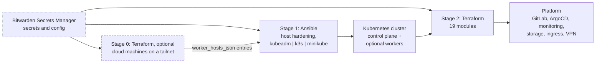

# Homelab Infrastructure

Infrastructure-as-code for a single-node Kubernetes homelab. Ansible bootstraps and hardens the cluster, Terraform deploys the platform on top of it.

-   __Get started__

    ---

    Five steps from a bare Ubuntu box to a running platform. Prerequisites, secrets, both stages, and how to verify it worked.

    [Start here](start/index.md)

-   __Cloud (Stage 0)__

    ---

    Optional Terraform that creates machines in a cloud account and joins them to a tailnet as workers. Today: Oracle Cloud Always Free ARM.

    [Read the Stage 0 docs](stage0/index.md)

-   __Cluster (Stage 1)__

    ---

    The Ansible half. Architecture, the six plays of `site.yml`, inventory and worker declaration, tags, handlers, and all ten roles.

    [Read the Stage 1 docs](stage1/index.md)

-   __Platform (Stage 2)__

    ---

    The Terraform half. 19 modules, what each deploys, and the `depends_on` graph that decides the order.

    [Read the Stage 2 docs](stage2/index.md)

-   __Operations__

    ---

    Runbooks for a cluster that already exists: Kubernetes upgrades, adding a worker, secrets, and a symptom index.

    [Open the runbooks](operations/index.md)

-   __Reference__

    ---

    Version pins and their sources of truth, every `task` command, repository layout, Terraform variables.

    [Browse the reference](reference/index.md)

-   __Contribute__

    ---

    Development guidelines, the security policy, and the conventions AI agents follow in this repository.

    [Contributing guide](contribute/contributing.md)

## What this provisions

| Stage | Tool | Produces |
|---|---|---|
| Stage 0 (optional) | Terraform | Ampere A1 machines in an Oracle Cloud Always Free tenancy, joined to a Tailscale tailnet with no inbound ports open by default. They become worker entries for Stage 1 to join to a cluster that already exists. Skip it entirely for a LAN-only homelab. |
| Stage 1 | Ansible | A hardened Ubuntu host running Kubernetes via kubeadm (recommended), k3s, or minikube (experimental). Cilium CNI, containerd, MetalLB, metrics-server. |
| Stage 2 | Terraform | GitLab, ArgoCD, Prometheus and Grafana, Elasticsearch and Kibana, Longhorn, MinIO, cert-manager, OAuth2 proxy, VPN, and more. |

## Supported platforms

- **Control plane**: Ubuntu AMD64 recommended. GitLab publishes no ARM64 image, so on ARM64 that one module is skipped and everything else still deploys.
- **Workers**: optional, AMD64 or ARM64. A Raspberry Pi works. Architecture is detected per host.
- **Kubernetes**: kubeadm (recommended), k3s (alternative), minikube (experimental).
