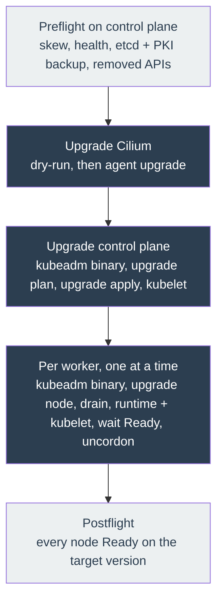

# Kubernetes upgrades

How to move the cluster to a new Kubernetes version, what it disrupts, and how to recover.

## The one rule

**One minor version at a time.** kubeadm supports upgrading `1.N` to `1.N+1` and nothing
further. `preflight-version-skew.yml` refuses anything else, so this is enforced, not
advisory. To go from 1.34 to 1.36, run the playbook twice: once at 1.35, once at 1.36.

**There is no downgrade.** kubeadm does not implement one. If an upgrade goes wrong the
options are re-running `kubeadm upgrade apply` at the same version with `--force`, or
restoring the etcd snapshot. Plan accordingly.

## What to bump

Everything lives in `stage1/inventories/inventory.yml`:

| Variable | Drives |
|---|---|
| `kubeadm_version` | kubeadm **and** kubelet binaries on every node. This is the switch that arms an upgrade. |
| `kubectl_version` | the kubectl binary on the control plane |
| `cilium_version` | the Cilium agent and operator running in the cluster |
| `cilium_cli_version` | only the local CLI that drives Helm. A different release train to `cilium_version`. |
| `pluto_version` | the deprecated-API scanner used as a preflight |
| `containerd_version`, `runc_version`, `cni_version`, `crictl_version`, `nerdctl_version` | node container runtime and tooling |

Check the [version skew policy](https://kubernetes.io/releases/version-skew-policy/) and the
[Cilium version notes](https://docs.cilium.io/en/stable/operations/upgrade/) before bumping.

Then run the playbook as normal:

```sh
task stage1:ansible:playbook
```

An unchanged inventory is a no-op: every upgrade step is gated on
`kubeadm_node_upgrade_pending`, which is false when the installed version already matches.

## What happens, in order



Cilium moves before the control plane so the datapath already speaks the API surface the new
API server exposes.

The step ordering is not a convention, it is a test.
`stage1/tests/test_upgrade_ordering.py` parses the Ansible include graph and fails the build
if a drain stops preceding the kubelet swap, if uncordon leaves the `always:` block, or if
Cilium stops preceding the control plane. It runs in pre-commit and via `task stage1:test`.

## Expected disruption

| Phase | Disruption |
|---|---|
| Preflight | None. Read-only apart from writing the backup. |
| Cilium upgrade | Brief per-node datapath reload as the agent DaemonSet rolls. Existing connections may reset. |
| Control plane | API server unavailable for roughly 1 to 2 minutes while static pods restart. Workloads keep running; `kubectl` and any controller reconciliation pause. |
| Per worker | That worker's pods are evicted and rescheduled. With `serial: 1` only one worker is affected at a time. Single-replica workloads pinned to that worker are down until it returns. |
| Postflight | None. |

## The control plane is never drained

This is a deliberate deviation from the upstream runbook, which drains every node including
control-plane nodes.

This is a single-node control plane that also runs the workloads, and Longhorn is configured
with `defaultReplicaCount: 1`, so every persistent volume has its only replica there.
Draining it evicts every stateful workload with nowhere to reschedule, turning a rolling
upgrade into a full-cluster outage. It also gains nothing: the API server, etcd, the
scheduler and the controller manager are static pods that kubeadm restarts in place
regardless of cordon state.

The trade-off is that non-DaemonSet pods on the control plane experience the kubelet restart
directly rather than being drained first. On this cluster that is strictly better than the
alternative. If a second control-plane node or Longhorn replicas above 1 are ever added,
revisit this.

Workers **are** drained, because they have somewhere to reschedule to.

## Escape hatch

To provision or join nodes without touching any already-bootstrapped node:

```sh
ansible-playbook -i inventories/inventory.yml site.yml -e kubeadm_upgrade_enabled=false
```

This skips every preflight, the control-plane upgrade and every worker roll. Fresh installs
and joins still run.

**There is no worker-only upgrade path.** `task stage1:ansible:playbook:worker` limits the
run to `localhost:agent`, so the `hosts: server` play never executes and
`kubeadm_server_preflight_passed` is never set. Every worker then skips its upgrade. That
task is for provisioning and joining new workers, not for upgrading existing ones. Upgrading
always means a full `task stage1:ansible:playbook`.

## Verify

```sh
kubectl get nodes -o custom-columns=NAME:.metadata.name,VERSION:.status.nodeInfo.kubeletVersion,STATUS:.status.conditions[-1].type
kubectl -n kube-system get pods
cilium status --wait
```

Every node should report the new version and `Ready`, and no node should show
`SchedulingDisabled`. `postflight-verify.yml` asserts exactly this at the end of every run,
so a green playbook already proves it.

## Recovery

**A worker fails mid-upgrade.** `any_errors_fatal: true` stops the run before the next worker
is touched, and the `always:` block uncordons the failed node. Fix the node, then re-run the
full playbook (`task stage1:ansible:playbook`, not the worker-only task). It resumes from
where it stopped: every step is version-gated, so already-upgraded nodes are skipped, and the
control plane being current does not block the workers that are still behind.

**A worker is left cordoned.** `kubectl uncordon <node>`. The next postflight will catch it
if you forget.

**`kubeadm upgrade apply` fails part way.** Re-run at the same version:

```sh
kubeadm upgrade apply v<version> --force
```

**etcd is corrupted.** Restore from the snapshot taken by `preflight-backup.yml`, which lives
in `kubeadm_upgrade_backup_dir` (default `/var/backups/kubeadm`) alongside a copy of
`/etc/kubernetes/pki`. Both are needed: etcd data is useless without the CA that signed every
certificate in the cluster. Follow the upstream
[etcd restore procedure](https://kubernetes.io/docs/tasks/administer-cluster/configure-upgrade-etcd/#restoring-an-etcd-cluster).

**Removed APIs block the preflight.** `preflight-deprecated-apis.yml` prints every offending
object. Migrate the manifests, or the Helm releases in `stage2/`, then re-run.

## Known limitations

- **A full run is the only upgrade path.** The worker roll reads
  `kubeadm_server_preflight_passed` from the control plane's hostvars, so the `hosts: server`
  play must run in the same invocation. Any `--limit` that excludes the control plane makes
  every worker skip its upgrade silently.
- **A dead containerd on a joined node is not self-healing.** The runtime installers only run
  on a fresh node or inside the drained upgrade window, so a plain re-run no longer restarts a
  stopped runtime. Bump a runtime version to force the flow, or fix the unit by hand.
