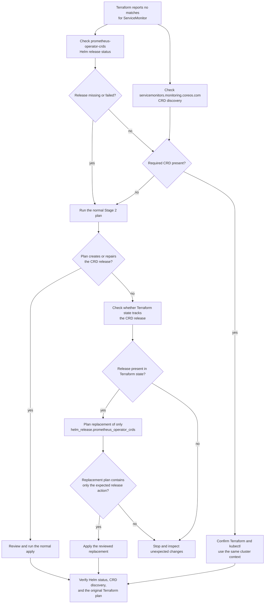

# Troubleshooting

This document covers common issues and their solutions.

## Table of Contents

- [Development Environment](#development-environment)
- [Stage 0: cloud workers](#stage-0-cloud-workers)
- [Stage 1: Ansible](#stage-1-ansible)
- [Stage 2: Terraform](#stage-2-terraform)
- [Architecture Compatibility](#architecture-compatibility)

## Development Environment

### Running pre-commit for all files

```bash
task precommit
```

### SSH passphrase

If you need to add an SSH passphrase, use ssh-add:

```bash
eval "$(ssh-agent)"
ssh-add
```

This process is added to the `.bashrc` file and automatically executes when you launch the Docker container.

## Stage 0: cloud workers

### Traffic to a cloud pod stalls, small requests are fine

Symptom: DNS answers and health checks work, then large responses and TLS handshakes hang with no error and nothing in the cluster changed to explain it. Only traffic crossing to a [Stage 0](../stage0/index.md) node is affected.

Cause: the tailnet path is 1280 bytes while Cilium is pinned to a 1500-byte cluster MTU, so pod payloads above roughly 1230 bytes are black-holed rather than rejected. This is a known unresolved limit, not a misconfiguration.

Confirm it with the probe in step 7 of the [Oracle free tier worker](oracle-free-tier-worker.md#7-check-mtu-across-the-tunnel) runbook. Background and the available options: [MTU and the Cilium pin](../stage1/architecture.md#mtu-and-the-cilium-pin).

### A newly provisioned node never appears on the tailnet

There is no way back into it. UFW closes before Tailscale is installed and the auth key is deleted whether the join succeeded or not, so a failed first boot leaves no reachable SSH path. Destroy and re-provision. Reasoning: [Stage 0 first boot](../stage0/architecture.md#first-boot).

### `stage0_oci_accounts must contain an account1 entry`

The top-level key in `TF_VAR_stage0_oci_accounts` is not exactly `account1`, or that secret did not inject. `stage0/providers.tf` looks the key up by that literal. A missing secret rather than a mis-keyed one reads `No value for required variable` instead. See [Confirm the credentials work](../stage0/oci-freetier.md#12-confirm-the-credentials-work).

## Stage 1: Ansible

### SSH Connection Issues

If Ansible fails to connect to the target server:

1. Verify SSH connectivity manually:

   ```bash
   ssh -p <port> <user>@<host>
   ```

2. Ensure the SSH key is added:

   ```bash
   eval "$(ssh-agent)"
   ssh-add
   ```

3. Check that the SSH port (the `server_ssh_port` secret in Bitwarden) matches the server configuration.

## Stage 2: Terraform

### Error with `no matches for kind "ServiceMonitor"`

```text
Error: unable to build kubernetes objects from release manifest: resource mapping not found for name: "nginx-ingress-nginx-controller" namespace: "nginx" from "": no matches for kind "ServiceMonitor" in version "monitoring.coreos.com/v1"
```

This error means the Kubernetes API used by Terraform cannot discover the required Prometheus Operator CRD. The CRD may be missing, its Helm release may have failed, or the command may be inspecting a different kubeconfig context.



Check the standalone release and the required CRD:

```bash
kubectl config current-context
helm status prometheus-operator-crds --namespace kube-system
kubectl get crd servicemonitors.monitoring.coreos.com
```

Run the normal Stage 2 plan. If Terraform proposes creating or repairing `module.kubernetes.helm_release.prometheus_operator_crds`, review the plan and run the normal apply:

```bash
task stage2:terraform:plan
task stage2:terraform:apply
```

If Helm reports the release as deployed but the CRD remains missing and the normal plan proposes no repair, confirm that Terraform state tracks the release:

```bash
terraform -chdir=stage2 state show module.kubernetes.helm_release.prometheus_operator_crds
```

If the state lookup succeeds, preview and apply an explicit replacement of only the CRD release:

```bash
terraform -chdir=stage2 plan -replace=module.kubernetes.helm_release.prometheus_operator_crds
terraform -chdir=stage2 apply -replace=module.kubernetes.helm_release.prometheus_operator_crds
```

The release retains surviving CRDs through `helm.sh/resource-policy=keep` and adopts them again through `take_ownership=true`. Do not delete a Prometheus Operator CRD to repair this error because deleting a CRD also deletes every custom resource stored under it.

If both the release and CRD are healthy, confirm that Terraform and kubectl use the same cluster and rerun the original plan. The error is not caused by a missing CRD in the cluster you inspected.

### GitLab registry storage full

```bash
$ kubectl logs -ngitlab gitlab-registry-<pod-id>
{"error":"XMinioStorageFull: Storage backend has reached its minimum free drive threshold..."}
```

**Solution:**

Expand MinIO PVCs:

```bash
kubectl edit -nminio-tenant pvc data0-minio-tenant-pool-0-0
kubectl edit -nminio-tenant pvc data1-minio-tenant-pool-0-0
kubectl edit -nminio-tenant pvc data2-minio-tenant-pool-0-0
kubectl edit -nminio-tenant pvc data3-minio-tenant-pool-0-0
```

### Terraform state lock

If Terraform reports a state lock error:

```bash
cd stage2
terraform force-unlock <lock-id>
```

**Note:** Only use this if you're certain no other process is running Terraform.

### Docker push to GitLab registry fails with 500 Internal Server Error

**Symptoms:**

```text
error: failed to copy: unexpected status from PUT request to https://registry.example.com/v2/.../blobs/uploads/...: 500 Internal Server Error
unknown: unknown error
```

**Registry logs show:**

```text
api error InvalidArgument: Invalid arguments provided for gitlab-registry-storage/...: (checksum missing, want "CRC64NVME", got "")
```

**Cause:**

This occurs when using MinIO with the GitLab registry's `s3_v2` driver. Recent MinIO versions require CRC64NVME checksums for `UploadPartCopy` operations, but the AWS SDK v2 used by the s3_v2 driver doesn't send them.

**Solution:**

Add `checksum_disabled: true` to the registry storage configuration in `stage2/gitlab-platform/templates/registry-storage.tftpl`:

```yaml
s3_v2:
  region: us-east-1
  bucket: gitlab-registry-storage
  regionendpoint: "${minio_endpoint}"
  forcepathstyle: true
  accesskey: ${minio_access_key}
  secretkey: ${minio_secret_key}
  chunksize: 26214400
  checksum_disabled: true  # Required for MinIO compatibility
```

**Reference:** [GitLab Container Registry Administration](https://docs.gitlab.com/ee/administration/packages/container_registry.html)

## Architecture Compatibility

### GitLab AMD64 Only

GitLab (`registry.gitlab.com/gitlab-org/build/cng/kubectl`) does not support ARM64 yet.

- GitLab is automatically skipped on ARM64 architectures
- Other services support both AMD64 and ARM64

### Checking Current Architecture

The architecture is set by the `host_machine_architecture` secret in Bitwarden (`amd64` or `arm64`). Check the injected value inside the container:

```bash
echo "$host_machine_architecture"    # amd64 or arm64
```

## Getting Help

If your issue is not covered here:

1. Check the [Stage 2 module documentation](../stage2/index.md) for detailed configuration
2. Review the [GitHub Issues](https://github.com/chrisleekr/homelab-infrastructure/issues) for similar problems
3. Open a new issue with:
   - Description of the problem
   - Steps to reproduce
   - Error messages
   - Environment details (architecture, Kubernetes version, etc.)
