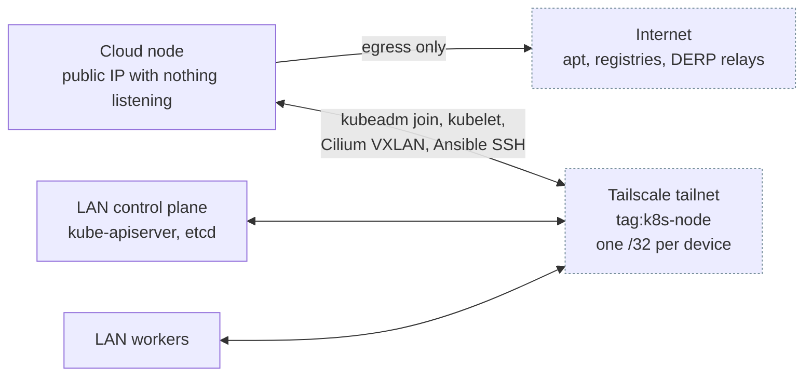
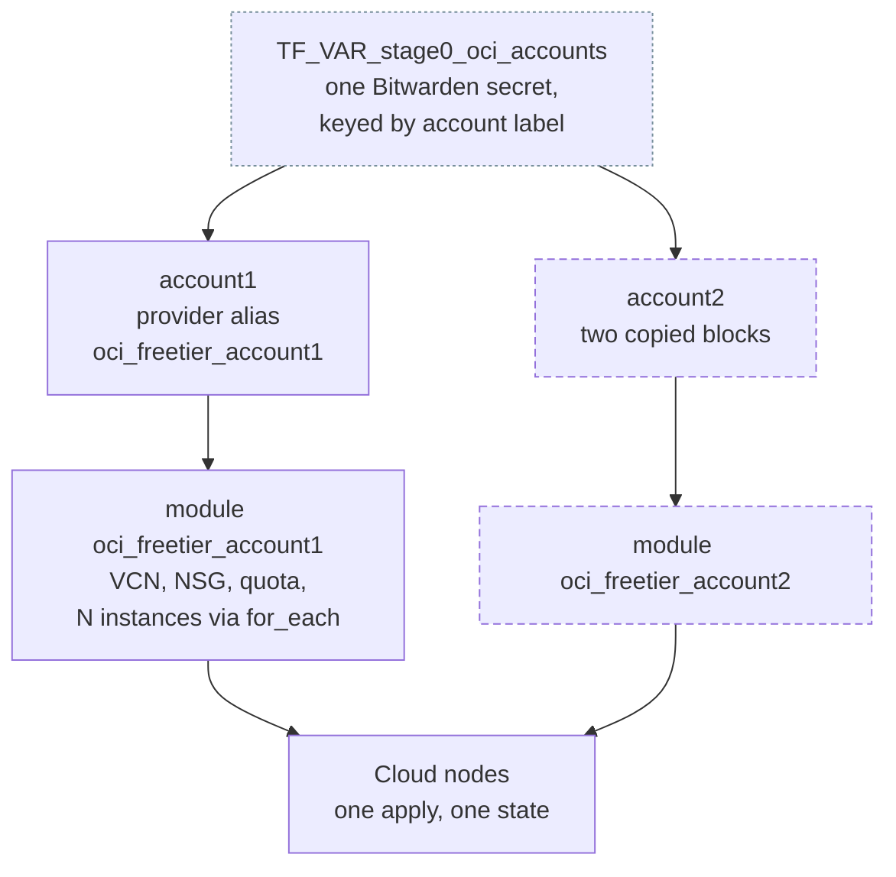

# Cloud architecture

This page is the part of stage 0 that holds for any cloud: how a cloud node reaches the cluster, what a provider module has to guarantee, and how accounts are wired. How Oracle Cloud implements it is [Oracle Cloud free tier](oci-freetier.md).

## Where a cloud node sits

A stage 0 node is an ordinary Kubernetes worker that happens to live in someone else's data centre. Nothing about the cluster changes to accommodate it. What changes is how it is *reached*: there is no LAN path, so every packet between it and the control plane rides the tailnet.



Two consequences follow from that shape, and both are the reason the setup has the steps it does.

**The tailnet has to exist before the node does.** Every LAN node needs `tailscale_node_enable` on and its own `/32` advertised, or the new node joins a mesh with nothing to talk to. This is why the runbook rolls Tailscale to the existing cluster as its own separate change, before any cloud machine is created.

**Only the cloud node sets `--accept-routes`.** It consumes the `/32` each home node advertises. A LAN node that sets it accepts the VPN pod's `/24` and sends its own LAN traffic into the tunnel, cutting its own connectivity. See [`tailscale_node`](../stage1/roles/tailscale-node.md).

## First boot

A cloud machine is exposed from the instant it exists, and nothing can reach it to fix that until it is on the tailnet. Every provider module therefore owes the same four guarantees, whatever it is built on. The Oracle implementation is [How cloud-init builds the node](oci-freetier.md#how-cloud-init-builds-the-node).

| Guarantee | Why |
|---|---|
| No inbound rule at any cloud network layer | The instance holds a public IP for egress. Nothing should be reachable on it, so the closed state is the default rather than something a rule has to undo |
| The host firewall closes **before** the tailnet join, not after | That is the safe failure direction. The machine is never sitting on a public IP with an open door, at the cost of the lockout below |
| The auth key never appears in a command line, and the tmpfs copy is deleted whether the join succeeded or not | cloud-init records every command it runs verbatim in `/var/log/cloud-init-output.log`. A key that reached a log outlives the boot that used it. The copy inside `user_data` still survives in IMDS, so revoke the key once the node has joined |
| The module emits a `worker_hosts_json` entry per node | The handoff to stage 1 is data you paste, not prose you follow |

!!! danger "A failed first boot locks the node out permanently"

    SSH is permitted on the tailnet interface only, and the firewall is closed before Tailscale is installed. If the install or the join fails, the node has no reachable SSH path and the auth key has already been deleted.

    Recovery means the provider's serial console, and the image sets no password. In practice: destroy and re-provision.

## The account model

The unit of isolation is a **cloud account**. The unit of provisioning is a **node**, one entry in that account's `nodes` map. A single Terraform Cloud workspace, `homelab-stage0`, holds every account, so one `task stage0:terraform:apply` provisions all of them into one state.



The workspace name carries no provider and no account, matching `homelab-stage2`. Everything account-specific lives in the configuration instead, wired by hand in two blocks:

| Block | File | Name |
|---|---|---|
| Provider configuration | `stage0/providers.tf` | `provider "oci"` with `alias = "oci_freetier_account1"`, reading the `account1` key of both secrets |
| Module call | `stage0/main.tf` | `module "oci_freetier_account1"`, taking `providers = { oci = oci.oci_freetier_account1 }` |

`account1` is required. A `validation` block on `stage0_oci_accounts` rejects a map without that key, and the four secrets stage 0 needs have no default, so a secret that failed to inject stops the plan rather than producing an instance nothing can reach. That is why `account1` needs no `count` and no null handling.

Adding `account2` is a copy of both blocks with the number changed, plus the two outputs in `stage0/outputs.tf`. Later accounts are optional, so their module carries `count = lookup(var.stage0_oci_accounts, "account2", null) != null ? 1 : 0` and their provider block needs `try()` fallbacks for the same reason. Optionality is paid for by the accounts that are optional, not by `account1`.

### Why not one module iterating the account map

Terraform forbids it. Per [HashiCorp's module development docs](https://developer.hashicorp.com/terraform/language/modules/develop/providers):

> Since the association between resources and provider configurations is static, module calls using `for_each` or `count` cannot pass different provider configurations to different instances. If you need different instances of your module to use different provider configurations then you must use a separate module block for each distinct set of provider configurations.

So the number of accounts is fixed at write time whatever the design, and the only real choice is where the repetition lives. Three short blocks per account in one root is the cheaper end of that trade: it keeps one workspace, one state and one apply. A workspace per account would make a new account data-only, at the cost of an apply each and a workspace name that has to match a JSON key exactly.

## Handing the node to Stage 1

Terraform emits a ready-made `worker_hosts_json` entry per node, with one field missing:

```bash
task stage0:terraform:output
```

`node_ip` is deliberately absent, because **Terraform does not know the tailnet address**. Tailscale assigns the `100.x` address when cloud-init runs `tailscale up`, which is after the instance resource has already returned. Read it from `tailscale status` and fill it in. That is the one manual step in the handoff.

Two fields in the emitted entry are not obvious:

- `snapd_purge: false` preserves the provider's guest agent where that agent ships as a snap, which it does on Oracle's Ubuntu images. Stage 1's `host_setup` role purges snapd and pins it against reinstall, which would destroy the agent permanently. On Oracle that agent reports the memory metric [idle reclamation](oci-freetier.md#idle-reclamation) reads, so losing it costs you the node.
- The taint value is `cloud` rather than something narrower, so the existing Longhorn and Datadog tolerations keep working. They match on key alone with `operator: Exists`.

## Known limits

| Limit | Consequence | Detail |
|---|---|---|
| Path MTU | Pod payloads over roughly 1230 bytes have nowhere to go on the tunnel. **Unresolved**, and it applies to every cloud node regardless of provider | [MTU across the tunnel](../stage1/architecture.md#mtu-and-the-cilium-pin) |
| One auth key per apply | The key is rendered into every node's boot payload, so provisioning more than one node at a time needs a reusable key | [Security posture](oci-freetier.md#security-posture) |

Provider-specific limits, including the Always Free ceiling and Oracle's idle reclamation, are on [Oracle Cloud free tier](oci-freetier.md).

## Extending Stage 0

Contributor territory. Adding a second provider is these wiring points:

| What | Where |
|---|---|
| Provider module | `stage0/<provider>/`, mirroring `stage0/oci-freetier/` |
| Account variable | `stage0_aws_accounts` in `stage0/variables.tf` |
| Provider config | `stage0/providers.tf`: a `required_providers` entry and an aliased provider block reading the `account1` key of the new maps |
| Dispatch | One `module "aws_freetier_account1"` block in `stage0/main.tf`, gated on the new map holding an `account1`, and passing its alias in `providers` |
| Required account | `stage0/variables.tf`: `stage0_oci_accounts` has no default and validates that `account1` exists, so an AWS-only checkout would fail every plan. Making OCI optional again means both maps defaulting to `{}` and a guard demanding at least one of them |
| Root outputs | `stage0/outputs.tf` reads `module.oci_freetier_account1` only, so the new provider's nodes would silently never reach `task stage0:terraform:output` |
| Docs | `docs/stage0/<provider>.md`, or `scripts/check-docs.py` fails the build |

Accounts are held in one map **per provider**, not a single provider-agnostic map. Almost nothing in an account entry is portable: `tenancy_ocid` / `user_ocid` / `fingerprint` are the OCI API-key signing triple, and `nodes` carries `VM.Standard.A1.Flex` shape config where AWS would carry an instance type. Only `region` is genuinely shared. Since `map(object)` is a closed type, one shared map would become a union of every provider's fields with `optional()` on all of them, at which point the type checking stops meaning anything.

Per-provider maps also delete the `provider` discriminator field. Which map an account sits in is the discriminator, so dispatch is a lookup against that map rather than a string compare where a typo silently yields `count = 0` and an empty plan.

## Next

[Oracle Cloud free tier](oci-freetier.md) sets up an account and provisions the first node.
