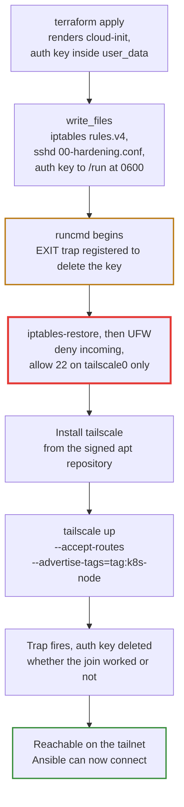

# Oracle Cloud free tier

`stage0/oci-freetier/` provisions Oracle Cloud Always Free Ampere A1 instances and joins them to the tailnet, so [Stage 1](../stage1/index.md) can treat them as ordinary workers.

This page is both halves of Oracle: the one-time [account setup](#account-setup), and the [reference](#what-the-module-creates) for what the module creates and the constraints it works inside. What holds for any cloud, rather than for Oracle specifically, is [Cloud architecture](architecture.md).

## Always Free limits

Read this before sizing anything. The allowance is what decides how many nodes you can have, and it is per tenancy rather than per instance.

From [Oracle's Always Free Resources page](https://docs.oracle.com/en-us/iaas/Content/FreeTier/freetier_topic-Always_Free_Resources.htm).

| Resource | Allowance |
|---|---|
| Ampere A1, `VM.Standard.A1.Flex` | 1,500 OCPU hours and 9,000 GB hours per month, equivalent to **2 OCPUs and 12 GB of memory** |
| A1 instance count | One 2-OCPU instance, or two 1-OCPU instances |
| Block Volume | **200 GB total**, boot plus block combined, tenancy-wide. Minimum boot volume **47 GB** |
| Images | Ubuntu is Always Free eligible on A1 |
| Placement | Must be in the tenancy home region, which cannot be changed later |

!!! warning "The allowance was halved on 2026-06-15"

    A1 Always Free was 4 OCPUs and 24 GB until Oracle halved it without announcement. Re-check the page above before assuming any of these numbers still hold.

These figures are encoded in `local.always_free` in `stage0/oci-freetier/free-tier.tf` and enforced two ways.

`terraform_data.freetier_guard` sums OCPUs, memory and boot storage across every node in the account and fails at plan time, before any API call. This is the check that matters, because the allowance is per tenancy and a per-node check would miss two nodes that are each individually legal.

`oci_limits_quota.freetier_ceiling` sets compartment quotas as a backstop against anything created outside Terraform. All three quota names it uses are **scoped per availability domain**, not per tenancy ([compute quotas](https://docs.oracle.com/en-us/iaas/Content/Quotas/Concepts/resourcequotas_topic-Compute_Quotas.htm), [block volume quotas](https://docs.oracle.com/en-us/iaas/Content/Quotas/Concepts/resourcequotas_topic-Block_Volume_Quotas.htm)), so in a multi-AD region the effective ceiling is the value times the AD count. The Terraform guard is the tenancy-wide one.

The storage guard cannot see volumes created outside this module either. Both limits are real and neither is papered over.

## Account setup

One-time, roughly 45 minutes, most of it clicking through the OCI console. Do it once per cloud account. Adding a *node* to an account you already set up needs none of it, see [Oracle free tier worker](../operations/oracle-free-tier-worker.md).

Everything here is manual on purpose. A credential cannot grant itself rights, and putting the policy that authorises Terraform under Terraform's control is a footgun.

Every console step below has the same three parts. **Go to** is the click path, arrows reading left to right. The numbered list is what to fill in once you are there. **You should see** is how to tell it worked before moving on. Bold is always a thing you click or type.

!!! note "Find Users and Groups once, before you start"

    Oracle ships the identity domain page in two arrangements, and [Creating a Group](https://docs.oracle.com/en-us/iaas/Content/Identity/groups/create-groups.htm) documents both. **Users** and **Groups** are in one of these places:

    - **A row of tabs across the top of the domain page.** Open the **User management** tab; **Users** and **Groups** are sections within it.
    - **A left sidebar headed Identity domain.** **Users** and **Groups** are their own entries in it.

    Work out which one you have now, on your own domain page. Every step below says "open **Groups**" or "open **Users**" and means whichever of the two applies to you.

### 1. Sign up and note your home region

Sign up at [oracle.com/cloud/free](https://www.oracle.com/cloud/free/), then sign in at [cloud.oracle.com](https://cloud.oracle.com).

!!! warning "The home region you pick during signup is permanent"

    Always Free compute must live in the tenancy home region and the region cannot be changed afterwards. Choose the one nearest you. If the tenancy already exists, confirm its home region before writing anything: it is shown in the region menu at the top right, and again as `region=` in the Configuration File Preview in step 7.

### 2. Create the group

The group comes first, so that step 3 can add the user to it on the creation form rather than as a second pass.

**Go to:** **navigation menu**, top left → **Identity & Security** → under **Identity**, **Domains** → your domain, named **Default** on a new tenancy → **User management** or **Identity domain** → **Groups**.

1. Select **Create group**.
2. **Name**: `homelab-terraform`.
3. **Description**: anything, for example `Terraform service account for stage 0`.
4. Add no members and leave **User can request access** clear. Step 3 adds the only member this group ever has.
5. Select **Create**.

**You should see:** `homelab-terraform` in the Groups list, with 0 members.

Reference: [Creating a Group](https://docs.oracle.com/en-us/iaas/Content/Identity/groups/create-groups.htm).

### 3. Create the Terraform user

**Go to:** the same domain page as step 2 → **User management** or **Identity domain** → **Users**.

1. Select **Create**, above the user list.
2. **First name** and **Last name**: anything identifiable, for example `Terraform` and `Homelab`. Both are required.
3. Clear the **Use the email address as the username** checkbox. A second field, **Username**, appears once you do.
4. **Username**: `terraform-homelab`.
5. **Email**: your own address. A primary email is required, and this user never signs in interactively, so whose it is does not matter.
6. In the group list further down the same form, tick `homelab-terraform`.
7. Select **Create**.

**You should see:** the new user's details page, with `homelab-terraform` listed under its groups. Leave this page open; step 7 comes back to it.

Reference: [Creating a User](https://docs.oracle.com/en-us/iaas/Content/Identity/users/create-user-accounts.htm).

### 4. Create the compartment

Every resource stage 0 creates lives in a dedicated `homelab` compartment, and both the IAM policy scope and the quota ceiling depend on it being its own compartment.

It is created here rather than by Terraform because the policy in step 5 names it, and OCI rejects a policy statement that references a compartment which does not exist. Terraform authenticates using rights that policy grants, so it cannot be what creates the thing the policy has to name first.

**Go to:** **navigation menu**, top left → **Identity & Security** → under **Identity**, **Compartments**.

1. Select **Create compartment**.
2. **Name**: `homelab`, exactly. The policy statements and the quota statements both address it by name.
3. **Description**: anything, for example `Homelab cloud workers`.
4. **Parent compartment**: the **root** compartment, the one carrying your tenancy name.
5. Select **Create compartment**.

**You should see:** `homelab` in the compartment list. Open it and **copy its OCID**, which starts `ocid1.compartment.oc1..`. Step 8 collects it alongside the credentials.

Reference: [Managing Compartments](https://docs.oracle.com/en-us/iaas/Content/Identity/compartments/managingcompartments.htm).

### 5. Grant the policy

**Go to:** **navigation menu**, top left → **Identity & Security** → under **Identity**, **Policies**. Not **Compartments**, directly above it in the same list, which is where step 4 was.

1. Select **Create Policy**.
2. **Name**: `homelab-terraform-policy`. It cannot be changed later.
3. **Description**: anything.
4. **Compartment**: the **root** compartment, the one carrying your tenancy name. It defaults to whichever compartment the list happened to be showing, and where a policy is attached controls who can later change it, so set it rather than accepting the default.
5. Switch the policy builder from **Basic** to **Customize (Advanced)**, which replaces the template picker with a free-text box, and paste:

    ```text
    Allow group homelab-terraform to manage instance-family in compartment homelab
    Allow group homelab-terraform to manage virtual-network-family in compartment homelab
    Allow group homelab-terraform to manage volume-family in compartment homelab
    Allow group homelab-terraform to read all-resources in compartment homelab
    Allow group homelab-terraform to inspect compartments in tenancy
    Allow group homelab-terraform to manage quota in tenancy
    Allow group homelab-terraform to manage compute-capacity-reports in tenancy
    ```

6. Select **Create**.

**You should see:** `homelab-terraform-policy` in the Policies list of the root compartment, holding all seven statements.

The last three are tenancy-scoped because quotas are tenancy-level objects, and because `ListAvailabilityDomains` and `GetCompartment` both require `COMPARTMENT_INSPECT` at the tenancy per the [IAM policy reference](https://docs.oracle.com/en-us/iaas/Content/Identity/Reference/iampolicyreference.htm). `inspect compartments` is read-only: it carries no create, update or delete anywhere. `manage quota` is not. Quota permissions [cannot be scoped below the tenancy](https://docs.oracle.com/en-us/iaas/Content/Quotas/Concepts/resourcequotas_authentication_and_authorization.htm), so that one statement grants create, update and delete on quota policies tenancy-wide, including the ceiling that caps this account. Every other statement is confined to `homelab`.

`compute-capacity-reports` is an individual resource type that no aggregate covers, so `manage instance-family` does not reach it, and `CreateComputeCapacityReport` is a tenancy-level call. The verb reads alarming but the [Core Services policy reference](https://docs.oracle.com/en-us/iaas/Content/Identity/Reference/corepolicyreference.htm) gives it exactly one permission, `COMPUTE_CAPACITY_REPORT_CREATE`, covering exactly one API. `inspect`, `read` and `use` grant nothing at all on this type, so `manage` is the only verb that works. It creates no resource and changes no state. Without it the capacity pre-check in [Capacity retries](#capacity-retries) turns itself off, saying so on stdout, and the apply loop falls back to fixed waits.

Add one more line **only** if you intend to set `stage0_budget_enable = true`. Budgets are created in the root compartment and their resource type is `usage-budgets`, so without this the apply fails on an authorization error:

```text
Allow group homelab-terraform to manage usage-budgets in tenancy
```

Policy changes take effect within about 10 seconds.

Reference: [Managing Policies](https://docs.oracle.com/en-us/iaas/Content/Identity/Tasks/managingpolicies.htm).

### 6. Generate the API signing key

On the host shell, not in the console and not inside the container. `~` means different things in those two places: the container's `$HOME` is a bind mount of `container/root` in the repo, so a key generated there is not the one step 11 reads.

Per [Oracle's API signing key docs](https://docs.oracle.com/en-us/iaas/Content/API/Concepts/apisigningkey.htm):

```bash
mkdir -p ~/.oci
openssl genrsa -out ~/.oci/oci_api_key.pem 2048
chmod go-rwx ~/.oci/oci_api_key.pem
openssl rsa -pubout -in ~/.oci/oci_api_key.pem -out ~/.oci/oci_api_key_public.pem
```

No passphrase. Terraform reads the key from an environment variable and cannot answer a prompt.

This is **not** an SSH key. It signs API requests; the SSH key that gets you onto the instance is a separate thing, loaded in step 11.

### 7. Upload the public key

**Go to:** the `terraform-homelab` user's details page. If you still have it open from step 3, use that. Otherwise: **navigation menu** → **Identity & Security** → **Domains** → your domain → **User management** or **Identity domain** → **Users** → the user's name.

1. In the **Resources** panel at the bottom left of the user's page, select **API keys**.
2. Select **Add API key**.
3. Choose **Paste a public key**, then paste the entire contents of `~/.oci/oci_api_key_public.pem`, `BEGIN` and `END` lines included.

    ```bash
    cat ~/.oci/oci_api_key_public.pem      # macOS: pbcopy < ~/.oci/oci_api_key_public.pem
    ```

4. Select **Add**.

A **Configuration File Preview** appears, an ini block opening `[DEFAULT]` with `user=`, `fingerprint=`, `tenancy=`, `region=` and `key_file=`. **Do not close it yet.** It carries four of the six values step 8 needs, so copy the whole block somewhere first. Step 8 maps each line onto its variable.

If you already closed it, it is recoverable: on the **API keys** list, open the **three-dot menu** next to the fingerprint and select **View configuration file**.

Reference: [How to Upload the Public Key](https://docs.oracle.com/en-us/iaas/Content/API/Concepts/apisigningkey.htm).

### 8. Collect the credential values

Nothing to click here. This is a scratch note you keep open while filling in step 11, so write the six values down somewhere first.

Four come straight from the **Configuration File Preview** in step 7, which maps onto them like this:

```ini
[DEFAULT]
user=ocid1.user.oc1..aaaaaaaa...                                  # user_ocid
fingerprint=a1:b2:c3:d4:e5:f6:07:18:29:3a:4b:5c:6d:7e:8f:90       # fingerprint
tenancy=ocid1.tenancy.oc1..aaaaaaaa...                            # tenancy_ocid
region=ap-sydney-1                                                # region
key_file=<path to your private keyfile>                           # ignore, see below
```

`key_file` is the one line that does not carry over. It names a path on disk, and this setup never puts the key on a path Terraform can read. The PEM contents go into Bitwarden instead.

The other two are not in the preview at all:

| Value | Where |
|---|---|
| `compartment_ocid` | The `homelab` compartment from step 4. **Identity & Security**, **Compartments**, `homelab`, **Copy** next to **OCID** |
| private key | The whole of `~/.oci/oci_api_key.pem` from step 6, `BEGIN` and `END` lines included. It never leaves your machine except into Bitwarden |

Fallbacks if you dismissed the preview and cannot get it back:

```bash
# fingerprint, recomputed from the private key
openssl rsa -pubout -outform DER -in ~/.oci/oci_api_key.pem | openssl md5 -c
```

`tenancy_ocid` is also under **Profile menu**, **Tenancy: \<name\>**, **Copy** under **Tenancy Information**. `user_ocid` is **Copy** under **User Information** on the user's page. `region` is the home region from step 1.

**You should end up with** a scratch note like this. It is not a file and nothing reads it, it just saves you hunting through console tabs while filling in step 11:

```text
region           ap-sydney-1
tenancy_ocid     ocid1.tenancy.oc1..aaaaaaaabcdefgh1234567890
user_ocid        ocid1.user.oc1..aaaaaaaaijklmnop1234567890
fingerprint      a1:b2:c3:d4:e5:f6:07:18:29:3a:4b:5c:6d:7e:8f:90
compartment_ocid ocid1.compartment.oc1..aaaaaaaaqrstuvwx1234567890
```

Step 11 turns those five into the JSON of `TF_VAR_stage0_oci_accounts`, where the names above are the literal JSON keys. The private key is not one of them: it is multi-line, so it goes into a separate secret built by a command that reads the file, and you never paste it by hand.

The three OCIDs are easy to mix up once they are all in the clipboard. Every OCID names its own type in the second segment, so check that it reads `tenancy`, `user` or `compartment` before pasting. See [Resource Identifiers](https://docs.oracle.com/en-us/iaas/Content/General/Concepts/identifiers.htm).

### 9. Create the Terraform Cloud workspace

`init` creates it. When no workspace in the organization carries the `homelab` and `stage0` tags from `stage0/backend.tf`, the CLI prompts for a name and applies both tags itself, per [`workspaces.tags`](https://developer.hashicorp.com/terraform/cli/cloud/settings). If it does not prompt, create `homelab-stage0` in the UI with both tags and re-run.

```bash
task stage0:terraform:init      # at the prompt, enter: homelab-stage0
```

Enter the name exactly. The task runs `terraform workspace select homelab-stage0` straight after `init`, so anything else fails on the next line. Run it in the container shell or under `bws run`, since `init` needs `TF_TOKEN_app_terraform_io`.

Then set the execution mode, in the Terraform Cloud UI:

**Workspace** → **Settings** → **General** → **Execution Mode** → **Local (custom)** → **Save settings**

A new workspace inherits the project default, which is usually **Remote**. Remote runs execute on HCP's own VMs, which never see the `TF_VAR_*` that `bws run` injects into your shell. `homelab-stage2` needs the same setting, for the same reason.

One workspace holds every cloud account, so there is nothing to repeat here when a second account appears. Accounts are distinguished inside the configuration instead, and one apply covers all of them. See [the account model](architecture.md#the-account-model).

### 10. Create the Tailscale auth key

You may already have one. Check first, in the container shell:

```bash
printenv TF_VAR_stage0_tailscale_auth_key | cut -c1-16   # tskey-auth-... , or nothing if unset
```

Set means step 11 has nothing to do here. Either way, open the [Keys](https://console.tailscale.com/admin/settings/keys) page and find the key behind it, or the stage 1 `tailscale_auth_key` if that is all you have. What you do next depends on the row:

| In the console | Action |
|---|---|
| Reusable, live, `tag:k8s-node` | Reuse it, then revoke it after the apply |
| One-off, live, `tag:k8s-node` | Works, but stage 0 spends it. Generate a new one if stage 1 still needs this one |
| Revoked | Spent, or revoked by hand. Generate a new one |
| Expired | Generate a new one |
| `tag:k8s-gateway` | The stage 2 vpn pod's key. Wrong tag, generate a new one |

Live means neither expired nor revoked. Tailscale "automatically revokes one-off keys after they are used", so a one-off key still listed as live has never joined anything. See [auth keys](https://tailscale.com/kb/1085/auth-keys).

Reusing a key already stored under the stage 1 name copies it to the stage 0 name. Run it on the **host**, in bash: the container shell drops the access token, `. .env` is bash-only syntax, and `bws run` strips `BWS_ACCESS_TOKEN` from whatever it launches. That last one is why `bws secret create` stays in the outer shell and `bws run` only reads the old value.

```bash
set -a; . .env; set +a
bws secret create TF_VAR_stage0_tailscale_auth_key \
  "$(bws run --project-id "$BWS_PROJECT_ID" -- printenv tailscale_auth_key)" \
  "$BWS_PROJECT_ID"
```

Otherwise generate one in the admin console, tagged `tag:k8s-node`, expiry **1 day**, which is the minimum the form accepts.

`tag:k8s-node` must already exist in your tailnet policy's `tagOwners`, because key creation rejects a tag the policy does not define. The policy itself, the auto-approver and the port rules are covered once in the [`tailscale_node` role page](../stage1/roles/tailscale-node.md).

Use a **single-use** key unless you are provisioning more than one node in the same apply. One key is shared by every node in an apply, and a reusable key tagged `tag:k8s-node` mints cluster nodes for whoever steals it.

### 11. Load the secrets into Bitwarden

Four secrets. Full reference in [Bitwarden secrets](../operations/bitwarden-secrets.md); this is the shape of the two awkward ones.

Run these **on the host**, where step 6 wrote the key. `bws` is installed in the container too, but the commands below read `~/.oci/oci_api_key.pem`, and `scripts/docker-run.sh` mounts only `~/.ssh` from the host. Load the Bitwarden ids first:

```bash
set -a; . .env; set +a
```

**`TF_VAR_stage0_oci_accounts`** is a JSON object keyed by account label. One key must be exactly `account1`, because `stage0/providers.tf` looks it up by that literal. Every field except the contents of `nodes` comes straight from step 8:

Single-quote the JSON so the shell leaves the double quotes alone:

```bash
bws secret create TF_VAR_stage0_oci_accounts '{
  "account1": {
    "region": "ap-sydney-1",
    "tenancy_ocid": "ocid1.tenancy.oc1..aaaaaaaa...",
    "user_ocid": "ocid1.user.oc1..aaaaaaaa...",
    "fingerprint": "a1:b2:c3:d4:e5:f6:07:18:29:3a:4b:5c:6d:7e:8f:90",
    "compartment_ocid": "ocid1.compartment.oc1..aaaaaaaa...",
    "nodes": {
      "oci-worker-01": { "ocpus": 2, "memory_gbs": 12, "boot_disk_gbs": 100 }
    }
  }
}' "$BWS_PROJECT_ID"
```

Each node key becomes the instance display name, the Tailscale MagicDNS hostname and the Kubernetes node name, so pick something you are willing to type. All three shape fields are optional and default to exactly the values shown, so `"oci-worker-01": {}` is equivalent. The whole `nodes` map has to fit inside the [Always Free ceiling](#always-free-limits), which is checked at plan time across the account rather than per node.

**`TF_VAR_stage0_oci_private_keys`** uses the same keys with PEM values. The key is multi-line, so build the JSON rather than pasting it:

```bash
bws secret create TF_VAR_stage0_oci_private_keys "$(python3 -c '
import json, pathlib
print(json.dumps({"account1": pathlib.Path.home().joinpath(".oci/oci_api_key.pem").read_text()}))
')" "$BWS_PROJECT_ID"
```

Then the remaining two, skipping the auth key if step 10 already copied it:

```bash
bws secret create TF_VAR_stage0_ssh_public_key     "$(cat ~/.ssh/id_rsa.pub)" "$BWS_PROJECT_ID"
bws secret create TF_VAR_stage0_tailscale_auth_key "tskey-auth-..."           "$BWS_PROJECT_ID"
```

### 12. Confirm the credentials work

Re-enter the container so the new secrets are injected, then plan. This costs nothing and touches no capacity:

```bash
task docker:exec
task stage0:terraform:plan
```

A clean plan proves the signing key, the OCIDs and the policy are all correct. Three failures are common and each names its own cause:

| Message | Cause |
|---|---|
| `stage0_oci_accounts must contain an account1 entry` | The top-level key is not exactly `account1`, or the secret did not inject |
| `No availability domains returned for this tenancy` | The Terraform user lacks tenancy-level inspect rights, so step 5 is incomplete |
| `No value for required variable` | That secret did not inject. Re-enter the container, and see [Environment and secrets](../start/environment.md) |

The account is ready. [Oracle free tier worker](../operations/oracle-free-tier-worker.md) is the runbook that turns it into a cluster node.

## What the module creates

Everything below is created inside the `homelab` compartment, which the module takes as an OCID and never manages. Why that boundary sits where it does is [step 4](#4-create-the-compartment).

Account-level, once per account regardless of node count:

| Resource | Notes |
|---|---|
| VCN and internet gateway | `10.0.0.0/16`, with a public route table |
| Subnet | `10.0.0.0/24`, pinned to an ingress-free security list this module owns |
| Default security list | The VCN's own, adopted and emptied of ingress |
| Network security group | Egress rule only |
| Compartment quota | A backstop ceiling, see [Always Free limits](#always-free-limits) |

Then one `VM.Standard.A1.Flex` instance per entry in the account's `nodes` map.

Only when `stage0_budget_enable` is true, a monthly budget on the compartment as well. It is off by default because an unupgraded Always Free account has no payment method and cannot be charged, and enabling it needs the extra IAM grant in step 5.

## How cloud-init builds the node

Terraform creates the instance and hands it a cloud-init payload. Everything below happens once, before Ansible can reach the host, and is defined in `stage0/oci-freetier/templates/cloud-init.yaml.tftpl`. It is this module's implementation of the [first boot guarantees](architecture.md#first-boot).



Three parts of that order are Oracle-specific or easy to get wrong, and are the ones worth understanding.

**The firewall closes before Tailscale is installed.** That is the safe direction: the machine is never sitting on a public IP with an open door. It is also why a failed first boot is unrecoverable, see the [lockout warning](architecture.md#first-boot).

**The auth key never appears in a command line.** It is written to a `0600` file on tmpfs and passed as `--auth-key=file:`, because cloud-init records every `runcmd` verbatim in `/var/log/cloud-init-output.log`. The `EXIT` trap is registered before anything can fail, so the key is removed however the script ends. A failed join leaves no key to retry with.

**The image's own firewall is replaced, not flushed.** The OCI Ubuntu image ships an `/etc/iptables/rules.v4` that accepts SSH and rejects the rest, independent of UFW, and Stage 1 cannot work through it. A bare flush would leave the host unfirewalled until Ansible arrives. The baseline is rewritten instead, so UFW takes over within the same boot and `netfilter-persistent` restores the same posture on every reboot after it.

## Inbound defence

There are three cloud-side layers plus the host, and the reason there are three is that **OCI unions security rules rather than intersecting them**. One stray permissive rule at any layer defeats the whole posture on a public IP, so each layer is closed on its own terms.

| Layer | What it does | Where |
|---|---|---|
| Network security group | Egress rule only. No inbound rule exists to open | `stage0/oci-freetier/network.tf` |
| Subnet security list | Pinned to an ingress-free list this module owns, rather than inheriting the VCN default | `stage0/oci-freetier/network.tf` |
| VCN default security list | Adopted and emptied, so a subnet added later without `security_list_ids` inherits nothing | `stage0/oci-freetier/network.tf` |
| Host firewall | UFW plus the persistent iptables baseline, SSH on `tailscale0` only | `stage0/oci-freetier/templates/cloud-init.yaml.tftpl` |

The break-glass hatch is `stage0_ssh_ingress_cidrs`, empty by default. When set, the same CIDRs are opened in both the NSG and the node's UFW, because opening one without the other silently fails. A `validation` block rejects anything wider than a `/24`, which rules out `0.0.0.0/0` and its equivalent spellings.

Egress is left wide open on purpose. A Kubernetes node needs registries, apt and Tailscale DERP, and a restricted list breaks silently and much later.

## Security posture

| Control | Detail |
|---|---|
| IMDSv2 only | `are_legacy_imds_endpoints_disabled = true` shuts out a blind SSRF that cannot set headers. It is **not** a session-token scheme: OCI's IMDSv2 takes a static, documented `Authorization: Bearer Oracle` header, so anything on the node that can set one still reads `user_data`. Treat the auth key as readable on the box for the life of the instance |
| Least-privilege IAM | Terraform authenticates as the dedicated user from step 3, never as a tenancy administrator. Every statement is confined to `homelab` except `inspect compartments`, `manage quota` and `manage compute-capacity-reports`, which OCI only scopes at the tenancy. See [step 5](#5-grant-the-policy) for what each of the three permits |
| Credential scoping | Each account gets its own provider alias, so one account's signing key can only ever reach that account's resources. State is shared: a single plan covers every account, so read it before approving |
| Volume encryption | OCI encrypts block volumes at rest with Oracle-managed keys by default. Customer-managed keys need Vault, which is not free tier |
| Auth key handling | Kept out of argv and out of the cloud-init log. The file on tmpfs is deleted whether the join worked or not, but the copy inside `user_data` is readable from IMDS for the life of the instance, per the row above. Mechanism in [How cloud-init builds the node](#how-cloud-init-builds-the-node) |
| Tailscale install | The signed apt repository, not `install.sh` piped to a shell, matching how stage 1's `tailscale_node` role installs it |
| Image pinning | `source_id` is updatable for Linux images, so an unpinned image would let a newer Canonical publish replace the boot volume of an already-joined node in place. `ignore_changes` blocks that; re-image deliberately with `terraform apply -replace=...`, which shows the destroy and create in the plan first |

!!! warning "One auth key is shared by every node in an apply"

    `stage0_tailscale_auth_key` is rendered into each instance's `user_data`, so provisioning more than one node at once needs a **reusable** key, which Tailscale warns is dangerous if stolen. A stolen key tagged `tag:k8s-node` mints devices with whatever that tag can reach. Prefer applying one node at a time with a one-off key. See [auth keys](https://tailscale.com/kb/1085/auth-keys).

## Capacity retries

Always Free A1 capacity is frequently unavailable, worst on accounts that have not been upgraded to pay as you go. Oracle returns "Out of host capacity" and `apply` can fail for days.

`scripts/oci-apply-retry.sh` loops `terraform apply` on exactly that string, with a bounded attempt count and a wait between attempts, and logs every attempt so a silent give-up is impossible. Any other failure aborts immediately, because retrying a bad credential or an over-quota plan just burns attempts.

```bash
task stage0:terraform:apply:retry
```

Tune with `OCI_APPLY_MAX_ATTEMPTS` and `OCI_APPLY_SLEEP_SECONDS`, defaulting to 30 attempts five minutes apart.

### Capacity pre-check

Capacity frees up in short windows, so how fast the loop reacts matters more than how many attempts it makes. During each wait the script polls [`CreateComputeCapacityReport`](https://docs.oracle.com/en-us/iaas/tools/oci-cli/latest/oci_cli_docs/cmdref/compute/compute-capacity-report/create.html) every `OCI_CAPACITY_POLL_SECONDS`, 30 by default, and starts the next apply the moment the report reads `AVAILABLE`. That cuts the maximum detection interval from five minutes to 30 seconds without raising the `LaunchInstance` call rate at all, because the report is a separate API that launches nothing.

The report is a trigger, never a veto. A negative report does not cancel or extend anything: the wait still ends within one report round trip of `OCI_APPLY_SLEEP_SECONDS` and the apply runs regardless. This is deliberate. The report [can disagree with reality](https://github.com/oracle/oci-cli/issues/748), and a false negative that skipped an apply would make the loop worse than the fixed sleep it replaces. Wired this way the pre-check can only ever save time.

It queries the largest node under `account1`, which is the hardest single placement in that account. A positive result does not prove two nodes fit, and it says nothing about any later account. A false positive costs one apply, which is what every attempt costs today.

The pre-check disables itself, with a line saying so, if anything it needs is missing: the `oci` or `jq` binaries, the `TF_VAR_stage0_oci_*` secrets, a readable availability domain, a numeric shape in `nodes`, or the `manage compute-capacity-reports in tenancy` grant from [step 5](#5-grant-the-policy). The loop then behaves exactly as it did before. If the report starts failing after the loop is already running, the script says so once and reverts to the fixed budget for the rest of the run. Credentials come from the same injected secrets Terraform uses, passed as [CLI environment variables](https://docs.oracle.com/en-us/iaas/Content/API/SDKDocs/clienvironmentvariables.htm) with the signing key in `OCI_CLI_KEY_CONTENT`, so no `~/.oci/config` and no key file is written.

Set `OCI_CAPACITY_POLL_SECONDS` below `OCI_APPLY_SLEEP_SECONDS`. At or above it the first sleep consumes the whole budget and no poll ever runs, leaving the pre-check armed but inert.

## Idle reclamation

Oracle reclaims Always Free instances that are idle for 7 days, judged on CPU p95, network and memory all being under 20%, ANDed together.

A cloud worker carries the `node.homelab/class=cloud:NoSchedule` taint, so it is idle by construction. **This is an unmitigated risk**, accepted deliberately when the node was designed. Memory is the only realistic lever: keeping more than roughly 2.4 GB of the 12 GB resident defeats the memory arm of the AND.

The Oracle Cloud Agent reports the memory metric, and on Ubuntu images that agent is a **snap**. Stage 1's `host_setup` role purges snapd and pins it against reinstall, which would destroy the agent permanently. This is why the `worker_hosts_json` entry the module emits sets `snapd_purge: false`.

## Variables

Defined in `stage0/variables.tf`, injected from Bitwarden. The Bitwarden secret is the name below prefixed with `TF_VAR_`, which is how Terraform picks an environment variable up. Full reference in [Bitwarden secrets](../operations/bitwarden-secrets.md).

| Name | Description | Default |
|---|---|---|
| `stage0_oci_accounts` | Accounts keyed by account label, `account1` required, each carrying its `nodes` map | required |
| `stage0_oci_private_keys` | API signing keys in PEM form, same keys | required |
| `stage0_ssh_public_key` | Injected for the `ubuntu` user | required |
| `stage0_tailscale_auth_key` | Read once by cloud-init | required |
| `stage0_ssh_ingress_cidrs` | Break-glass SSH sources. Entries must be IPv4 CIDRs of `/24` or narrower | `[]` |
| `stage0_budget_enable` | Create budget resources. Needs an extra IAM grant | `false` |

The first four have no default, so a secret that failed to inject stops the plan instead of producing an instance nothing can reach.

## Next

[Oracle free tier worker](../operations/oracle-free-tier-worker.md) is the runbook that turns this into a cluster node.
