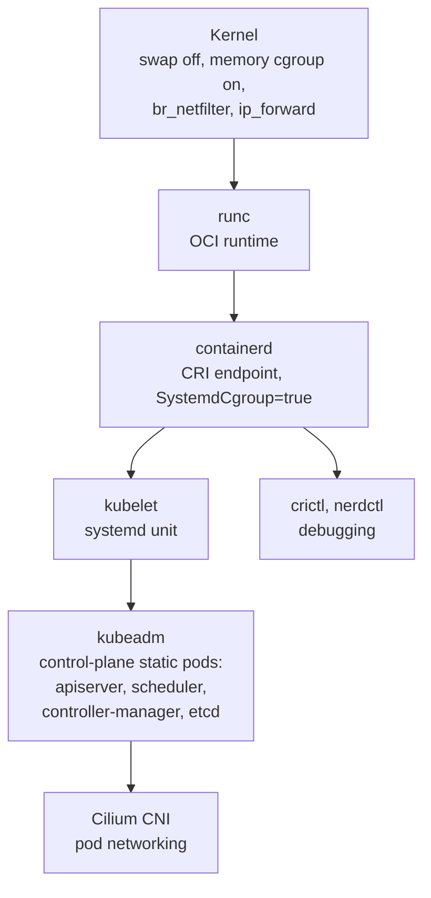
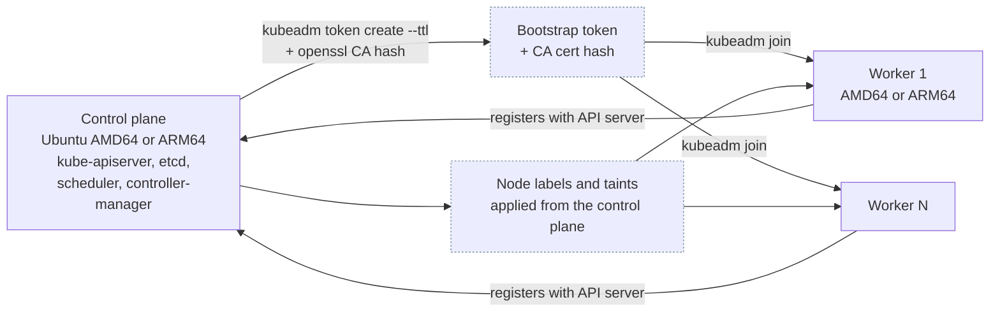
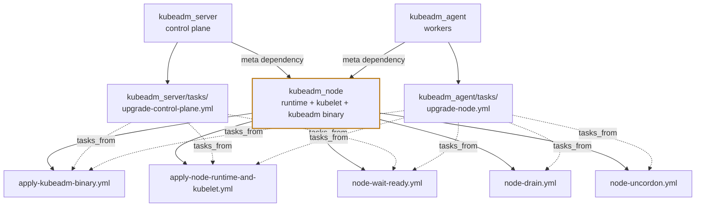

# Cluster architecture

## The node stack

Stage 1 builds this from the bottom up. Every layer must be in place before the one above it will start, which is why the role ordering in [`site.yml`](playbook.md) is not negotiable.



!!! warning "Two kernel settings are non-negotiable"

    **Swap must be off.** The kubelet refuses to start with swap enabled unless explicitly configured otherwise. `host_setup` disables it in `/etc/fstab` and at runtime.

    **Memory cgroups must be enabled.** On Raspberry Pi in particular they are off by default and have to be turned on via the kernel command line, which requires a reboot. `host_setup` handles this and notifies the reboot handler, and play 2 flushes handlers so the reboot happens *before* the kubeadm plays need a working kubelet.

## Control plane and workers

The cluster is a single control-plane node plus zero or more workers. Workers are optional; with an empty `worker_hosts_json` the `agent` group is empty and every worker play is a no-op.



The control plane should be **AMD64** if you want GitLab: that module has no ARM64 image and is skipped otherwise, while the rest of the platform deploys normally. Workers may be either architecture. [`kubeadm_node`](roles/kubeadm-node.md) detects it per host and downloads the matching binaries.

The join credentials are generated on the control plane at join time, written to the worker, used, and then removed. They are never stored in the repository.

## The `kubeadm_node` reuse graph

This is the least obvious part of Stage 1. **`kubeadm_node` is never named in `site.yml`.** It is a `meta/main.yml` dependency of both `kubeadm_server` and `kubeadm_agent`, so it runs implicitly before either role's own tasks. Its individual task files are then re-entered during upgrades via `include_role` + `tasks_from:`.



Eight `tasks_from:` call sites in total: three from `upgrade-control-plane.yml`, five from `upgrade-node.yml`. The payoff is that installing a node and upgrading a node execute the *same* task files, so the two paths cannot drift apart.

!!! danger "The control plane is never drained"

    Notice that `upgrade-control-plane.yml` does not reach for `node-drain.yml`, while `upgrade-node.yml` does. Draining a single-node control plane evicts every workload in the cluster: it is a full outage, not a rolling one. Workers are safe to drain one at a time, which is what `serial: 1` on the worker play guarantees.

## Networking

- **Cilium** is the CNI for kubeadm. k3s and minikube use their built-in networking instead.
- **MetalLB** is installed from localhost in play 6, giving `LoadBalancer` services a real IP on the LAN so the Stage 2 NGINX ingress controller can be reached.
- **UFW** runs on every host in the `cluster` group. It rate-limits port 22 and opens the actual `ansible_port`, so a non-standard SSH port keeps working.

Cilium carries two independent pins, `cilium_version` and `cilium_cli_version`. See [Version pins](../reference/versions.md) for why they must not be compared to each other.

### Extra Helm arguments

`cilium_helm_args` in `stage1/inventories/inventory.yml` is appended to both `cilium install` and `cilium upgrade`. `envoy.xdsMode=split` holds the cluster on the pre-1.20 per-resource-type xDS server, because the 1.20 chart default of `ads` deadlocks the agent against Envoy ([cilium#47624](https://github.com/cilium/cilium/issues/47624)). The two `maxUnavailable=1` settings roll one Cilium pod and one Envoy pod at a time so node networking survives the roll.

Drop `envoy.xdsMode=split` once cilium#47624 ships a fix. The `maxUnavailable` settings are independent of it and stay.

!!! warning "A values-only change does not reconcile"

    Both task files that pass these arguments are gated on version, not on values: `install-cilium.yml` runs only when Cilium is absent, and `upgrade-cilium.yml` only when the running agent is older than `cilium_version`. Editing `cilium_helm_args` without also bumping `cilium_version` is a silent no-op, and a cluster already on the target version never receives them. Apply such a change by hand with `cilium upgrade --version <cilium_version> --wait <args>`.

### MTU and the Cilium pin

`cilium_mtu` in `stage1/inventories/inventory.yml` is pinned at `1500`, the LAN NIC MTU, from which Cilium derives a 1450-byte pod route MTU. It is pinned rather than auto-detected, and the reason is specific.

Detection follows the lowest-MTU device on the host and re-runs at runtime. `tailscale0` is 1280, so the moment the [`tailscale_node`](roles/tailscale-node.md) role runs, detection would drag every pod in the cluster down to 1230, whether or not any worker is actually reached over Tailscale. Pods could then no longer emit cloudflared's 1308-byte QUIC Initial, and every tunnel handshake would time out.

The value is cluster-wide, so the lowest path between any two nodes wins.

!!! warning "Unresolved: a tailnet-reached worker does not fit the pin"

    A [Stage 0 cloud worker](../stage0/index.md) is reached over the tailnet, where the path is 1280. Pod traffic to it above roughly 1230 bytes therefore has nowhere to go, and the failure mode is a stall rather than an error.

    Dropping `cilium_mtu` to `1230` cluster-wide is not available: that is the exact breakage the pin exists to prevent. The remaining options are to raise the Tailscale MTU above 1280 and set `cilium_mtu` to match, which depends on the real path MTU between home and the cloud provider and is unverified here, or to keep the cloud node off any path carrying large pod-to-pod payloads.

    **Neither is chosen yet. Decide before relying on a cloud node for real traffic.** How to provoke the failure deliberately is step 7 of the [Oracle free tier worker](../operations/oracle-free-tier-worker.md#7-check-mtu-across-the-tunnel) runbook.

Cilium reads MTU once at agent start, and `cilium upgrade` carries an existing value forward but never introduces a new one. Changing it on a live cluster therefore takes both of these:

```bash
cilium upgrade --version <cilium_version> --wait --helm-set MTU=<value>
kubectl -n kube-system rollout restart ds/cilium
```
