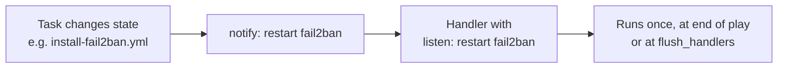

# Handlers

Handlers live in `stage1/handlers/` as six standalone task files. Plays pull them in with
`import_tasks` under their own `handlers:` key, so a handler is only reachable from a play that
imports it.

Every handler except `reboot.yml` uses `listen:` rather than being notified by name, which is why
the notify strings below are lowercase and do not match the task names.



## The six handler files

| File | Handler | `listen` | Imported by |
|---|---|---|---|
| `apt-cache.yml` | Clean apt cache | `clean apt cache` | play 2 |
| `apt-cache.yml` | Update package cache | `update package cache` | play 2 |
| `fail2ban.yml` | Restart fail2ban | `restart fail2ban` | play 2 |
| `reboot.yml` | Reboot host | (by name) | play 2 |
| `sysctl.yml` | Reload sysctl | `reload sysctl` | plays 3, 4 |
| `systemd.yml` | Reload systemd daemon | `reload systemd daemon` | plays 3, 4 |
| `minikube.yml` | Enable/Start minikube, Enable/Start minitunnel | `enable minikube`, `start minikube`, `enable minitunnel`, `start minitunnel` | play 3 |

!!! note "There is no multipathd handler"

    `stage1/roles/host_setup/tasks/update-multipath.yml` stops, disables and **masks**
    `multipathd.service` and `multipathd.socket` so Longhorn's environment check clears. A masked
    unit cannot be restarted, so the task notifies nothing and no handler exists to receive it.

    Do not add one back.

## The reboot barrier

`reboot.yml` is the only handler with a hard ordering requirement. Play 2 ends with:

```yaml
post_tasks:
  - name: Flush handlers
    ansible.builtin.meta: flush_handlers
```

Handlers normally run at the end of a play, which would still be before play 3. The explicit flush
exists so the ordering is stated rather than inferred, and so it survives anyone adding further
`post_tasks` later.

The reboot is triggered by `enable-memory-cgroup.yml` when it has to edit the kernel command line,
common on Raspberry Pi, where memory cgroups are off by default. Without the reboot, `kubeadm init`
fails on the cgroup preflight check.

## Debugging

Handlers are skipped when nothing notifies them, which reads identically to "no change was needed".
To force them:

```bash
cd stage1
ansible-playbook -i inventories/inventory.yml site.yml --force-handlers
```

`--force-handlers` also runs handlers for hosts that failed later in the play, which is occasionally
what you want after a partial failure.
