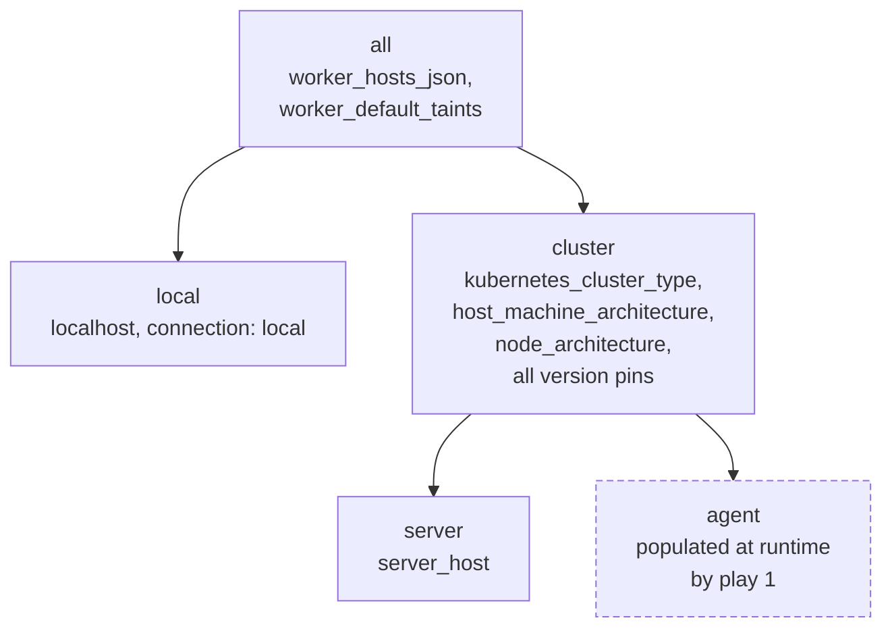

# Inventory and groups

`stage1/inventories/inventory.yml` defines the host groups and pins every component version. Almost
every value is a `lookup("env", ...)` with a fallback, so the real configuration lives in
[Bitwarden](../operations/bitwarden-secrets.md) and reaches Ansible as environment variables.

## Group tree



| Group | Members | Used by |
|---|---|---|
| `local` | `localhost` | plays 1 and 6 |
| `server` | `server_host`, the control plane | plays 3 and 5 |
| `agent` | workers, added at runtime | play 4 |
| `cluster` | `server` + `agent` | play 2 |

!!! note "Why worker vars sit on `all`, not `cluster`"

    The `add_host` play that consumes `worker_hosts_json` runs on `localhost`, which is **not** a
    member of `cluster`. Declaring the variable on `cluster` would put it out of reach of the very
    play that reads it.

    Equally, `agent` must be declared under `cluster` even though it starts empty. `add_host` alone
    would create the group outside that hierarchy, and workers would not inherit
    `kubernetes_cluster_type` or `node_architecture`.

## Control plane

```yaml
server_host:
  ansible_host: '{{ lookup("env", "server_ssh_host") or "192.168.1.100" }}'
  ansible_user: '{{ lookup("env", "server_ssh_user") or "ubuntu" }}'
  ansible_port: '{{ lookup("env", "server_ssh_port") or 22 }}'
  ansible_python_interpreter: "/usr/bin/python3.12"
```

The interpreter is pinned explicitly here. Workers deliberately do **not** pin it:
`stage1/ansible.cfg` sets `interpreter_python = auto_silent`, which discovers the right one per host.
That matters when an ARM64 Raspberry Pi worker ships a different Python than the control plane.

## Declaring workers

`worker_hosts_json` is a JSON array, one object per worker, read from the environment:

```json
[
  {
    "name": "worker-01",
    "host": "192.168.1.203",
    "port": "2222",
    "user": "ubuntu",
    "taints": [],
    "labels": {"node.homelab/role": "storage"}
  }
]
```

| Key | Required | Default |
|---|---|---|
| `name` | yes | n/a (becomes the Kubernetes node name) |
| `host` | yes | n/a |
| `user` | no | `ubuntu` |
| `port` | no | `22` |
| `taints` | no | `worker_default_taints` |
| `labels` | no | `{}` |

Unset or `[]` leaves the cluster single-node.

!!! warning "`taints: []` means schedulable, and that is fragile"

    The playbook uses `item.taints | default(worker_default_taints)`, **without** the boolean
    second argument. That form substitutes only when the key is *absent*, so an explicit
    `"taints": []` survives and means "schedulable".

    Passing `true` as the second argument would treat the empty list as falsey and silently
    reimpose the default, making an untainted worker inexpressible. Do not "tidy" that filter.

The default taint, when a worker declares none, is:

```json
[{"key": "node.homelab/class", "value": "low-power", "effect": "NoSchedule"}]
```

Override it wholesale with the `worker_default_taints` environment variable.

## Architecture handling

Two distinct variables, easy to confuse:

| Variable | Scope | Purpose |
|---|---|---|
| `host_machine_architecture` | one value for the cluster | The control plane's architecture. Drives the Stage 2 GitLab module, which has no ARM64 image. |
| `node_architecture` | per host, from gathered facts | Maps `x86_64`→`amd64`, `aarch64`→`arm64`. Every binary download keys off it, so an ARM64 worker joining an AMD64 control plane gets ARM64 binaries automatically. |

!!! note

    `node_architecture` is a direct dictionary lookup, so a host reporting an architecture outside
    `{x86_64, aarch64}` fails with a Jinja `KeyError` rather than a readable message.

## Version pins

The rest of the file is version pins for kubeadm, kubectl, containerd, runc, CNI, crictl, nerdctl,
Cilium, pluto, minikube and k3s. These are a source of truth. See
[Version pins](../reference/versions.md), which is generated from them.

## Verifying connectivity

```bash
task stage1:ansible:ping
```

Failures here are SSH or inventory problems, never Kubernetes ones. See
[Troubleshooting](../operations/troubleshooting.md).
