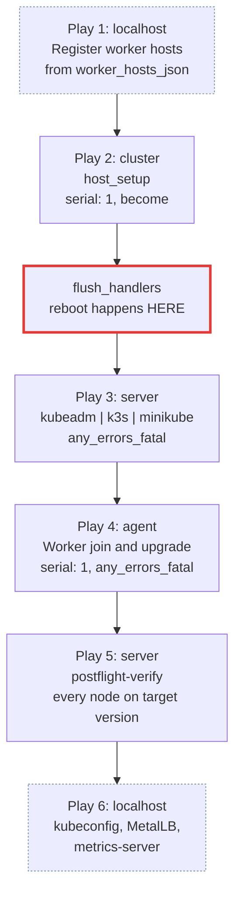

# The site.yml playbook

`stage1/site.yml` is six plays. Reading them in order is the fastest way to understand Stage 1,
because the ordering encodes every safety property the automation has.



## Play by play

### 1. Register worker hosts from environment

`hosts: localhost`, `connection: local`, `gather_facts: false`, `tags: [always]`

Reads `worker_hosts_json` and `add_host`s each entry into the `agent` group. Workers are therefore
*not* static inventory entries: the fleet scales by editing one Bitwarden secret.

An unset or empty list adds no hosts, leaving `agent` empty and play 4 a no-op. Play 5 targets
`server`, so postflight verification still runs. That is the single-node cluster.

### 2. Server setup on cluster

`hosts: cluster`, `serial: 1`, `become: true`, role [`host_setup`](roles/host-setup.md), tag `host_setup`

Everything that is not Kubernetes: packages, snapd removal, `/etc/hosts`, multipath blacklist,
sysctl, fail2ban, UFW, swap, memory cgroups.

Handlers imported: `fail2ban.yml`, `apt-cache.yml`, `reboot.yml`.

!!! info "Why `serial: 1` here"

    Parallel host forks collide on the shared AnsiballZ module cache
    ([ansible/ansible#16489](https://github.com/ansible/ansible/issues/16489)), so any play with
    more than one host needs `serial: 1`.

!!! danger "The `flush_handlers` barrier"

    `post_tasks` ends with `meta: flush_handlers`. Handlers normally run at the end of a play, but
    this play's handlers include a **reboot**, the one that applies a memory-cgroup kernel command
    line change.

    Forcing the flush here means the reboot happens before play 3 needs a working kubelet. Remove
    this and a first run on a Raspberry Pi fails at kubeadm init with a cgroup error.

### 3. Kubernetes setup

`hosts: server`, `any_errors_fatal: true`, `become: true`

A `service_facts` pre-task, then three mutually exclusive blocks keyed on `kubernetes_cluster_type`:

| Value | Roles | Tag |
|---|---|---|
| `kubeadm` | [`kubeadm_pre_setup`](roles/kubeadm-pre-setup.md), [`kubeadm_server`](roles/kubeadm-server.md) | `kubeadm` |
| `minikube` | [`minikube_pre_setup`](roles/minikube-pre-setup.md), [`minikube_server`](roles/minikube-server.md) | `minikube` |
| `k3s` | [`k3s_pre_setup`](roles/k3s-pre-setup.md), [`k3s_server`](roles/k3s-server.md) | `k3s` |

Handlers imported: `sysctl.yml`, `systemd.yml`, `minikube.yml`.

`any_errors_fatal: true` stops the entire run on the first failure. A half-upgraded control plane
must never be followed by worker plays. Aborting keeps the cluster at a known version instead of a
mixed one.

### 4. Kubernetes worker setup

`hosts: agent`, `serial: 1`, `any_errors_fatal: true`, `become: true`, tag `kubeadm_agent`

Runs [`kubeadm_pre_setup`](roles/kubeadm-pre-setup.md) then
[`kubeadm_agent`](roles/kubeadm-agent.md), kubeadm only. Skipped entirely when `agent` is empty
("skipping: no hosts matched").

!!! danger "`serial: 1` is the rolling-upgrade contract"

    On this play `serial: 1` carries two meanings. It serialises the join, so only one bootstrap
    token exists on the control plane at a time, and it guarantees **exactly one worker is drained
    at a time**.

    Raising it drains N workers simultaneously and can evict every replica of a workload. Combined
    with `any_errors_fatal`, a worker that fails to drain, upgrade or come back Ready stops the run
    before the next worker is touched.

### 5. Verify the cluster converged

`hosts: server`, `any_errors_fatal: true`, tags `[kubeadm, k8s_upgrade]`

Includes `kubeadm_server` with `tasks_from: postflight-verify.yml`, gated on
`kubeadm_upgrade_enabled`.

This is a separate play, after play 4, deliberately. It asserts that *every* node reports the target
version. Run from inside `kubeadm_server` it would fire while the workers were still on the old
kubelet and abort the run before they were ever upgraded.

!!! note "Why `apply:` and not just `tags:`"

    A tag on a **dynamic** include (`include_role`, `include_tasks`) selects only the include task
    itself, never the tasks it pulls in. `apply: tags: [...]` propagates the tags down. Every tagged
    dynamic include in Stage 1 uses this form; dropping it silently makes `--tags k8s_upgrade` a
    no-op.

### 6. Post setup on local

`hosts: localhost`, role [`localhost_post_setup`](roles/localhost-post-setup.md), tag `post_setup`

Renames the fetched kubeconfig into `container/root/.kube/config`, installs MetalLB, installs
metrics-server.

## Dry runs

```bash
task stage1:ansible:playbook:check     # --check --diff, connects over SSH, applies nothing
task stage1:ansible:syntax             # parses every play and role, no connection
task stage1:test                       # static assertion of the kubeadm upgrade ordering
```

Bootstrap tasks may report false errors under `--check`, because later tasks depend on files earlier
tasks would have created.
