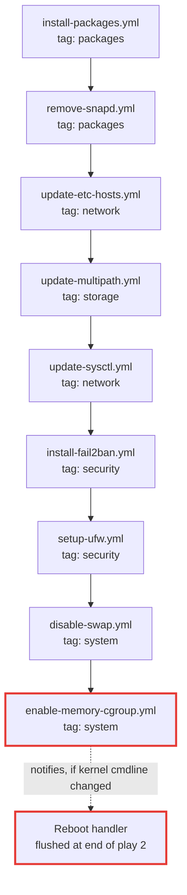

# host_setup

Everything that is not Kubernetes. Runs on **every** host in the `cluster` group, control plane and workers alike.

**Invoked by** play 2 (`hosts: cluster`, `serial: 1`, `become: true`), tag `host_setup`.

## Task files, in execution order

`tasks/main.yml` includes nine files. The order matters: packages before anything that uses them, and the two reboot-capable tasks last.

| File | Does |
|---|---|
| `install-packages.yml` | Installs the `host_setup_install_packages` list: curl, jq, vim, rsync, socat, conntrack, ethtool, ipvsadm and friends |
| `remove-snapd.yml` | Removes snaps via `uninstall-snaps.yml`, purges snapd, then blocks reinstallation |
| `update-etc-hosts.yml` | Writes entries from `host_setup_etc_hosts_json` |
| `update-multipath.yml` | Blacklists devices so multipathd does not claim Longhorn's block devices |
| `update-sysctl.yml` | Kernel networking parameters for Kubernetes: bridge-nf-call, IP forwarding |
| `install-fail2ban.yml` | Installs and configures fail2ban with exponential backoff |
| `setup-ufw.yml` | Enables UFW with `host_setup_ufw_rules` |
| `disable-swap.yml` | Swaps off now and removes the fstab entry |
| `enable-memory-cgroup.yml` | Edits the kernel command line if memory cgroups are off; notifies the reboot handler |

## Variables

39 defaults, all prefixed `host_setup_`. The ones you are most likely to change:

| Variable | Purpose |
|---|---|
| `host_setup_sshd_port` | The SSH port UFW must keep open |
| `host_setup_install_packages` | Package list |
| `host_setup_ufw_rules` | Firewall rules |
| `host_setup_ufw_tailnet_ports` | Kubernetes ports opened inbound on `tailscale0`. Empty unless `tailscale_node_enable` is true |
| `host_setup_snapd_purge` | `false` keeps a cloud provider's agent snap. See the snapd gotcha below |
| `host_setup_etc_hosts_json` | Static `/etc/hosts` entries |
| `host_setup_boot_cmdline_paths` | Where to look for the kernel command line, differs between Pi and generic Ubuntu |
| `host_setup_cgroup_kernel_args` | The arguments appended to enable memory cgroups |
| `host_setup_fail2ban_bantime`, `_bantime_factor`, `_bantime_maxtime` | Exponential ban backoff |
| `host_setup_fail2ban_ignoreips` | Never ban these, put your own subnet here |
| `host_setup_docker_default_data_path` | Docker data root, for the minikube path |

Full list in `stage1/roles/host_setup/defaults/main.yml`. Values come from the environment via [Bitwarden](../../operations/bitwarden-secrets.md).

## Handlers notified

`restart fail2ban`, `clean apt cache`, `update package cache`, and `Reboot host`.

!!! note "multipathd is masked, not restarted"

    `update-multipath.yml` stops, disables and masks `multipathd.service` and `multipathd.socket` so Longhorn's environment check clears. It notifies nothing: a masked unit cannot be restarted. See [Handlers](../handlers.md).

## Re-run behaviour

Idempotent. A second run reports no changes unless a package upgrade is available or a config value changed.

The exception is `enable-memory-cgroup.yml`: once the kernel command line contains the arguments it stops notifying, so the reboot happens exactly once.

## Gotchas

!!! danger "UFW and your SSH port"

    `setup-ufw.yml` runs on every `cluster` host and enables the firewall. It rate-limits port 22 and opens the host's actual `ansible_port`. If a worker's `port` in `worker_hosts_json` does not match its real sshd port, UFW will lock you out of that host mid-play.

    Fix the inventory before running, not after.

!!! danger "The tailnet rules are not the security boundary"

    With `tailscale_node_enable` true, `setup-ufw.yml` opens 6443/tcp, 10250/tcp, 8472/udp and 4240/tcp inbound on `tailscale0`. That interface carries traffic from every device on the tailnet, not only cluster nodes, and 8472 is Cilium's VXLAN, which authenticates nothing and hands the decapsulated frame straight to the pod network.

    The tailnet policy file scoping `tag:k8s-node` is what actually decides which devices can reach those ports. A tailnet with no policy is flat. See [`tailscale_node`](tailscale-node.md).

    The rules are add-only. Setting `tailscale_node_enable` back to `false` stops new hosts getting them but leaves them on hosts that already have them, matching `tailscale_node`, which also never un-joins a node.

!!! warning "Memory cgroups need a reboot"

    On Raspberry Pi, memory cgroups are off by default. Enabling them requires a kernel command line change and a reboot, which is why play 2 ends with `meta: flush_handlers`. A first run on a Pi will reboot the host. Plan for it.

!!! note "snapd removal is aggressive"

    `remove-snapd.yml` uninstalls every snap, purges snapd, and installs an APT preference blocking reinstallation. It frees memory and removes a source of unattended restarts, but it is not something you want on a host you also use as a desktop.

    It is gated at the include, not inside the file: the file's own purge blocks check `host_setup_snapd_purge`, but its "Shutdown services, sockets and timers" step does not, and would stop and disable `snapd.service` regardless. Set `snapd_purge: false` in `worker_hosts_json` for a cloud node. On OCI the Oracle Cloud Agent is a snap, and it reports the memory metric that A1 idle reclamation measures. Keeping it also means OCI IAM is a command-execution path onto the node, via the agent's Run Command plugin.
