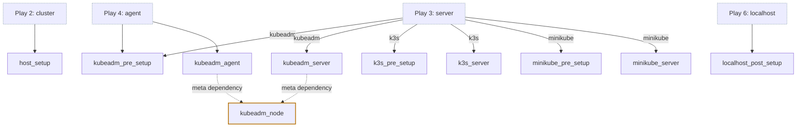

# Roles

Ten roles under `stage1/roles/`. Nine are named directly in [`site.yml`](../playbook.md); `kubeadm_node` is not. It arrives as a `meta` dependency.

## Catalog

| Role | Invoked by | Tags | Task files excl. `main.yml` | Defaults |
|---|---|---|---|---|
| [`host_setup`](host-setup.md) | play 2 | `host_setup`, `packages`, `network`, `storage`, `security`, `system` | 10 | 38 |
| [`kubeadm_pre_setup`](kubeadm-pre-setup.md) | plays 3, 4 | `bootstrap`, `system_upgrade` | 1 | 0 |
| [`kubeadm_node`](kubeadm-node.md) | **meta dependency** of `kubeadm_server` and `kubeadm_agent` | `always`, `container_runtime`, `container_tools`, `k8s_install` | 11 | 3 |
| [`kubeadm_server`](kubeadm-server.md) | play 3, play 5 | `kubeadm`, `k8s_upgrade`, `k8s_install`, `cni`, `k8s_config`, `kubeconfig` | 14 | 2 |
| [`kubeadm_agent`](kubeadm-agent.md) | play 4 | `kubeadm_agent`, `k8s_upgrade` | 1 | 5 |
| [`localhost_post_setup`](localhost-post-setup.md) | play 6 | `post_setup`, `kubeconfig`, `network`, `monitoring` | 3 | 0 |
| [`k3s_pre_setup`](k3s-pre-setup.md) | play 3 | `k3s` | 0 | 3 |
| [`k3s_server`](k3s-server.md) | play 3 | `k3s` | 0 | 8 |
| [`minikube_pre_setup`](minikube-pre-setup.md) | play 3 | `minikube`, `container_runtime` | 1 | 0 |
| [`minikube_server`](minikube-server.md) | play 3 | `minikube` | 3 | 1 |

Only the kubeadm path supports workers, rolling upgrades and Cilium. The k3s and minikube roles provision a control plane and stop there.

## Reading a role page

Each page follows the same shape:

- **Purpose**: what the role owns
- **Invoked by**: which play, under which tag and condition
- **Task files**: in execution order, which is not alphabetical order
- **Variables**: from `defaults/main.yml`, overridable through the environment
- **Handlers notified**
- **Re-run behaviour**: what happens on a second run
- **Gotchas**: the things that will bite you
