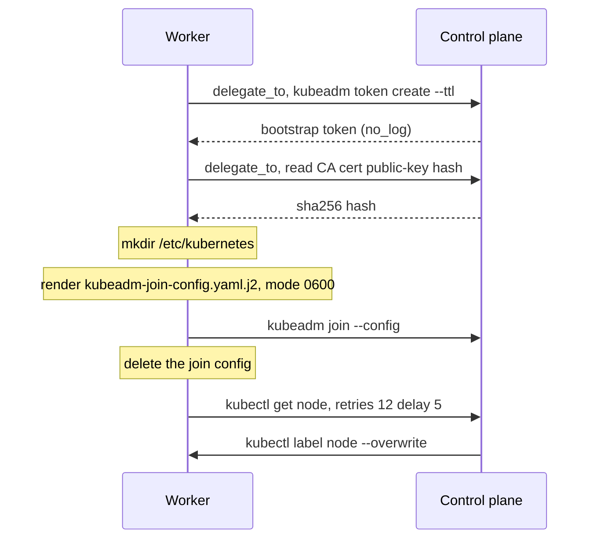
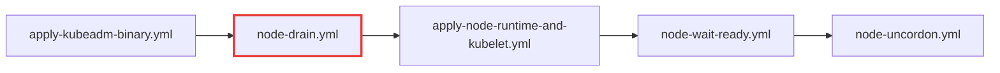

# kubeadm_agent

Joins worker nodes to the cluster and rolls them onto the target Kubernetes version.

**Invoked by** play 4 (`hosts: agent`, `serial: 1`, `any_errors_fatal: true`), tag `kubeadm_agent`. Skipped entirely when `worker_hosts_json` is empty.

**Depends on** [`kubeadm_node`](kubeadm-node.md) via `meta/main.yml`.

## The join handshake

Guarded by a `stat` on `/etc/kubernetes/kubelet.conf`, so the whole block is skipped on a node that has already joined.



Both credential steps run with `delegate_to: groups['server'][0]`, so they execute *on* the control plane, not the worker.

!!! note "The join config is deleted immediately"

    It holds the bootstrap token, a cluster-join credential, so it is not left on disk past the handshake. The deletion sits inside the join block, so a re-run on an already-joined node skips it rather than failing on a missing file.

    Token creation and the `set_fact` that stores it are both `no_log: true`.

## Labels and taints take different routes

This asymmetry is easy to misread:

| | Applied via | Why |
|---|---|---|
| **Taints** | the join config | No admission restriction; the kubelet may self-set them |
| **Labels** | `kubectl label` from the control plane | Labels in the `kubernetes.io` namespace **cannot** be self-set by the kubelet. NodeRestriction admission blocks it |

Labelling runs on **every** pass, not just on join, so relabelling an existing worker is a matter of editing `worker_hosts_json` and re-running. `node-role.kubernetes.io/worker` is always merged in.

The `changed_when` keys off `kubectl label` printing `not labeled` when the value is already set, which keeps re-runs honest.

## The node IP is pinned, not detected

`kubeadm_node_node_ip` is written into the join config as `kubeletExtraArgs: node-ip`. The reconcile into `/etc/default/kubelet` lives in [`kubeadm_node`](kubeadm-node.md), so the control plane gets the same pin. The join config alone would only cover the join, so a node that joined before the value existed keeps whatever kubelet detected and re-detects on every kubelet restart.

A cloud worker sets `node_ip` in `worker_hosts_json`, because its tailnet address is the only one other nodes can route to. A LAN worker falls back to `ansible_facts.default_ipv4.address`, pinning the address it already uses.

Confirm the pin took by reading the flag kubelet is actually running with, on the node:

```bash
sudo tr '\0' '\n' < /proc/$(pidof kubelet)/cmdline | grep -- --node-ip
kubectl get node <name> -o jsonpath='{.status.addresses}'
```

!!! warning "`alpha.kubernetes.io/provided-node-ip` is not the check"

    kubelet sets that annotation only when a cloud provider is configured, and deletes it otherwise. This cluster configures none, so it is absent on every node whether or not the pin is in place, and reading it during an incident points at a problem that is not there.

!!! danger "Detection picks the tailnet address when the two names collide"

    With no `--node-ip`, kubelet resolves its own node name through the host resolver to choose an address. MagicDNS answers for tailnet machine names, so this bites whenever a node's Kubernetes name and its tailnet name are the same string. They are independent today, `<prefix>-<suffix>` against the `name` from `worker_hosts_json`, but nothing keeps them apart and a cloud worker named after its tailnet machine is the obvious collision.

    Cilium reads its VXLAN tunnel endpoint from the Node's `InternalIP`, so the whole cross-node pod datapath moves onto a 1280-MTU tunnel with nothing in the cluster changed to explain it. Small packets keep flowing, which is what makes it hard to spot: DNS answers fit, large responses and TLS handshakes do not.

    The pin is the guard. `tailscale_node_accept_dns: false` removes the trigger, but only from the next `tailscale up`, so do not rely on it alone.

!!! warning "The task owns the `KUBELET_EXTRA_ARGS` line"

    It replaces the line rather than merging into it. Anything else that needs a kubelet flag has to go through `kubeadm_node_node_ip` or a second, differently-named variable, not a hand edit of `/etc/default/kubelet`.

## The rolling upgrade

`upgrade-node.yml` is included last, so a worker that joined during this same run is already registered and labelled before anything considers draining it. It reaches into [`kubeadm_node`](kubeadm-node.md) five times:



Unlike the control plane, workers **are** drained, one at a time, because `serial: 1` on play 4 guarantees exactly one worker is in this sequence at any moment. Combined with `any_errors_fatal`, a worker that fails to drain, upgrade or come back Ready stops the run before the next worker is touched.

Before draining, the worker reads `kubeadm_server_preflight_passed` off the control plane's `hostvars`, and gates on its own `kubeadm_node_upgrade_pending`.

## Variables

| Variable | Purpose |
|---|---|
| `kubeadm_agent_token_ttl` | Lifetime of the bootstrap token. Short by design. |
| `kubeadm_agent_join_config_path` | Where the join config is written, then deleted |
| `kubeadm_agent_cri_socket` | containerd's CRI socket path |
| `kubeadm_agent_taints` | Per-node, from `worker_hosts_json`'s `taints` key |
| `kubeadm_agent_labels` | Per-node, from `worker_hosts_json`'s `labels` key |

`kubeadm_node_node_ip` and `kubeadm_node_kubelet_env_path` are read from here but owned by [`kubeadm_node`](kubeadm-node.md).

## Re-run behaviour

Idempotent. The join block is skipped once `kubelet.conf` exists; labelling re-applies harmlessly; the upgrade no-ops when the node is already on the target version.

## Gotchas

!!! danger "Raising `serial` breaks the drain guarantee"

    `serial: 1` on play 4 is the only thing preventing N workers draining simultaneously, which can evict every replica of a workload. It is a correctness constraint, not a performance tuning knob.

!!! warning "`--tags k8s_upgrade` needs `apply:`"

    The `upgrade-node.yml` include carries both `tags:` and `apply: tags:`. Without `apply:`, a tag-scoped run would execute the include task and skip the entire roll, reporting success while doing nothing. Tag inheritance then carries through the nested `include_role` calls.

!!! note "Join waits for registration, not for Ready"

    The `kubectl get node` retry loop confirms the node has *registered* with the API server. It does not wait for `Ready`. On a first join the CNI may still be starting when the play moves on; postflight verification in play 5 is what actually confirms convergence.
