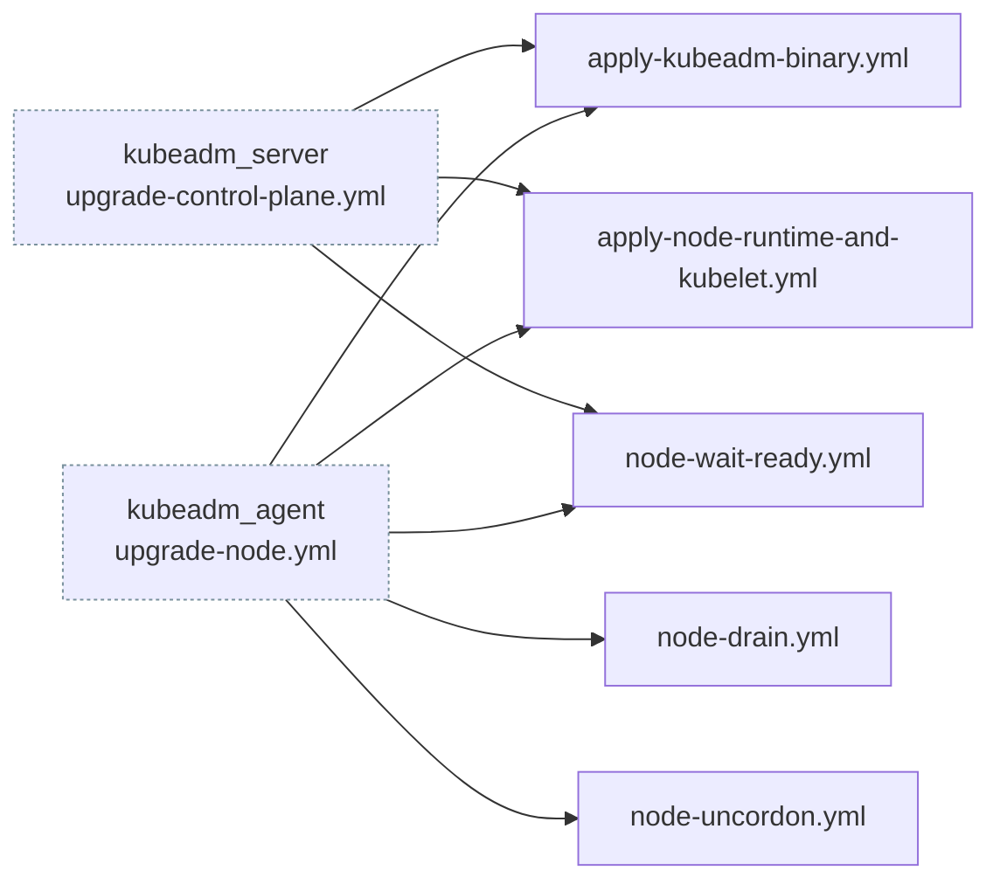

# kubeadm_node

The shared node role: container runtime, kubelet, kubeadm binary, and the drain/uncordon/wait
primitives. Everything a Kubernetes node needs regardless of whether it is a control plane or a
worker.

!!! important "This role is never named in `site.yml`"

    It is a `meta/main.yml` dependency of both [`kubeadm_server`](kubeadm-server.md) and
    [`kubeadm_agent`](kubeadm-agent.md), so it runs implicitly before either role's own tasks. Its
    individual task files are then re-entered during upgrades with `include_role` + `tasks_from:`.

    If you are looking for "where does containerd get installed" and grepping `site.yml`, this is
    why you find nothing. See [Architecture](../architecture.md#the-kubeadm_node-reuse-graph).

## Task files

`tasks/main.yml` is short: three steps and an assertion:

| Step | File | Tags | Condition |
|---|---|---|---|
| Assert architecture is supported | inline | none | always |
| Detect installed versions and node state | `detect-versions.yml` | `always` | always |
| Install container runtime and kubelet | `apply-node-runtime-and-kubelet.yml` | `container_runtime`, `container_tools`, `k8s_install` | `not kubeadm_node_bootstrapped` |
| Install the kubeadm binary | `apply-kubeadm-binary.yml` | `k8s_install` | `not kubeadm_node_bootstrapped` |

The remaining eight files are not entered from `main.yml`. Five are pulled in by
`apply-node-runtime-and-kubelet.yml`; three are reachable only through `tasks_from:`:

| File | Called from |
|---|---|
| `configure-containerd.yml` | `apply-node-runtime-and-kubelet.yml` |
| `install-runc.yml` | `apply-node-runtime-and-kubelet.yml` |
| `install-cni.yml` | `apply-node-runtime-and-kubelet.yml` |
| `install-crictl.yml` | `apply-node-runtime-and-kubelet.yml` |
| `install-nerdctl.yml` | `apply-node-runtime-and-kubelet.yml` |
| `node-drain.yml` | `kubeadm_agent/tasks/upgrade-node.yml` |
| `node-uncordon.yml` | `kubeadm_agent/tasks/upgrade-node.yml` |
| `node-wait-ready.yml` | both upgrade paths |

## `detect-versions.yml` and the facts it sets

This runs on every host, every time, under the `always` tag. Every gate in `kubeadm_server` and
`kubeadm_agent` reads its output.

| Fact | Meaning |
|---|---|
| `kubeadm_node_bootstrapped` | The node has already joined a cluster |
| `kubeadm_node_upgrade_pending` | The installed version is behind the pinned target |

A fresh node has both false-ish, which is what makes the whole preflight and upgrade machinery
no-op on a first install without needing a separate code path.

## The eight `tasks_from:` call sites

Three from the control plane, five from the worker. The payoff: installing a node and upgrading a
node run the *same* task files, so the two paths cannot drift apart. The difference between them is
exactly the drain and uncordon pair, which is the difference that matters.

## Variables

| Variable | Purpose |
|---|---|
| `kubeadm_node_drain_timeout` | How long `kubectl drain` may take before failing |
| `kubeadm_node_wait_ready_retries` | Polls for the node to report `Ready` after an upgrade |
| `kubeadm_node_wait_ready_delay` | Seconds between polls |

## Architecture detection

The role asserts the node architecture is supported, then keys every binary download off
`node_architecture` (`x86_64`→`amd64`, `aarch64`→`arm64`). An ARM64 worker joining an AMD64 control
plane gets ARM64 binaries automatically: containerd, runc, CNI, crictl, nerdctl, kubeadm and
kubelet all resolve per host.

## Re-run behaviour

Idempotent. `apply-node-runtime-and-kubelet.yml` and `apply-kubeadm-binary.yml` are gated on
`not kubeadm_node_bootstrapped`, so on an existing node they are skipped entirely and only the
upgrade path can touch them.

## Gotchas

!!! warning "containerd needs `SystemdCgroup = true`"

    `configure-containerd.yml` sets it. If containerd and the kubelet disagree on the cgroup driver
    the kubelet starts and then fails to run pods, with an error that does not obviously point at
    cgroups.

!!! note "`detect-versions.yml` is tagged `always`"

    That is deliberate. A tag-scoped run like `--tags k8s_upgrade` still needs the detection facts,
    so they must not be filtered out by the tag selector.
