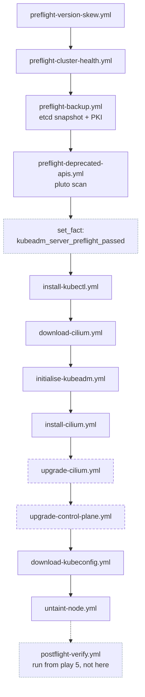
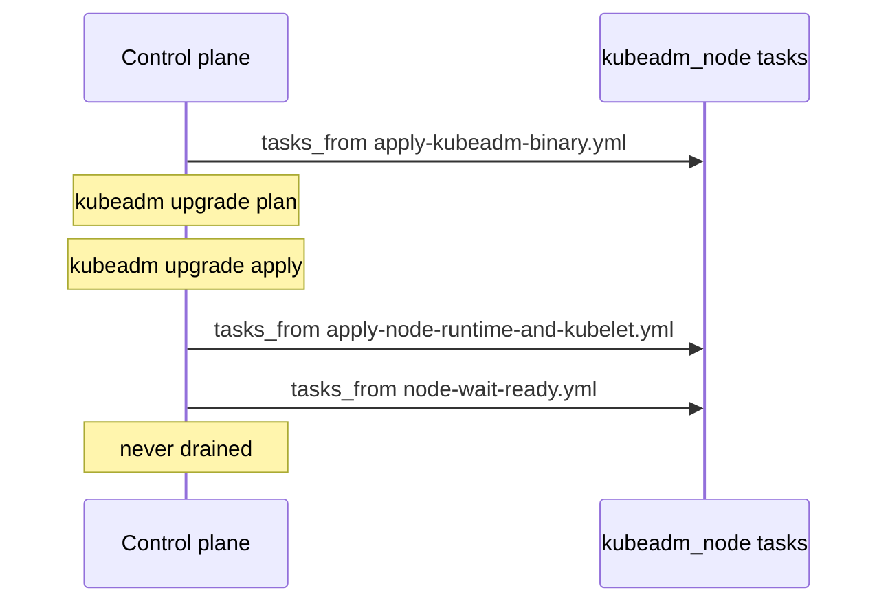

# kubeadm_server

Owns the control plane: preflight gates, `kubeadm init`, Cilium, control-plane upgrades, and the kubeconfig.

**Invoked by** play 3 (`hosts: server`, when `kubernetes_cluster_type == 'kubeadm'`), tag `kubeadm`. Play 5 re-enters it with `tasks_from: postflight-verify.yml`.

**Depends on** [`kubeadm_node`](kubeadm-node.md) via `meta/main.yml`, which installs the container runtime and kubelet and sets the `kubeadm_node_*` detection facts every gate below reads.

## Order is the contract

Four properties are encoded in that order:

1. Every preflight runs before anything mutates the cluster.
2. Cilium moves before the control plane.
3. Install and initialise stay ahead of the Cilium tasks, because both drive `kubectl` against a cluster that only exists once `kubeadm init` has run.
4. Postflight verification is last, and lives in a different play entirely.

On a fresh node the preflight and upgrade steps no-op: `kubeadm_node_upgrade_pending` is false until the node has joined a cluster.

## The preflight gates

| Preflight | Condition | Protects |
|---|---|---|
| `preflight-version-skew.yml` | `kubeadm_upgrade_enabled` and `kubeadm_node_bootstrapped` | An unsupported jump across minor versions |
| `preflight-cluster-health.yml` | `kubeadm_upgrade_enabled` and `kubeadm_node_bootstrapped` | Upgrading an already-degraded cluster |
| `preflight-backup.yml` | `kubeadm_upgrade_enabled` and `kubeadm_node_upgrade_pending` | `kubeadm upgrade apply`, via an etcd snapshot and PKI copy |
| `preflight-deprecated-apis.yml` | `kubeadm_upgrade_enabled` and `kubeadm_node_upgrade_pending` | Workloads using APIs removed in the target version, scanned with `pluto` |

!!! note "Why the first two gate differently from the last two"

    The first two gate on `kubeadm_node_bootstrapped`, **not** on this node's `kubeadm_node_upgrade_pending`, so they still run when the control plane is current but a worker is behind. Without that, a worker could drain itself after a run in which no health check executed at all.

    They cannot gate on `kubeadm_upgrade_enabled` alone either: both need a reachable API server, and on a fresh host they run before `install-kubectl.yml` and `kubeadm init`, so they would abort the build of a cluster that does not exist yet.

    The last two stay tied to a pending control plane. The etcd snapshot and the removed-API scan protect `kubeadm upgrade apply`, and a worker roll touches neither etcd nor the served API surface.

### `kubeadm_server_preflight_passed`

Set unconditionally after the four preflights. Workers read it off the control plane's `hostvars` before draining themselves.

It is unconditionally `true` because every preflight aborts the play on failure. Reaching the task at all *is* the proof. Deriving it from `kubeadm_node_upgrade_pending` instead would make it false on any run where the control plane is already current, which silently skips every worker on exactly the retry the recovery procedure tells you to run. Each worker still gates on its own `kubeadm_node_upgrade_pending`.

## Control-plane upgrade

`upgrade-control-plane.yml` reaches back into [`kubeadm_node`](kubeadm-node.md) three times:

!!! danger "The control plane is never drained"

    There is no `node-drain.yml` call here, and adding one would be a serious regression. Draining a single-node control plane evicts every workload in the cluster: a full outage, not a rolling one. `kubeadm upgrade apply` works fine regardless of cordon state.

## Variables

| Variable | Purpose |
|---|---|
| `kubeadm_server_postflight_retries` | How many times postflight polls for convergence |
| `kubeadm_server_postflight_delay` | Seconds between polls |

The template `templates/kubeadm-config.yaml.j2` renders the `ClusterConfiguration` passed to `kubeadm init`.

## Re-run behaviour

Safe to re-run. `initialise-kubeadm.yml` detects an already-initialised control plane and skips; the upgrade path no-ops when `kubeadm_node_upgrade_pending` is false.

`untaint-node.yml` removes the control-plane `NoSchedule` taint so a single-node cluster can actually run workloads. It is idempotent.

## Gotchas

!!! warning "Two Cilium versions, and they are not comparable"

    `cilium_version` is the agent and operator release in the cluster. `cilium_cli_version` is only the local binary driving Helm. Gating an agent upgrade on the CLI version compares unrelated numbers. See [Version pins](../../reference/versions.md).

!!! warning "`--tags k8s_upgrade` needs `apply:` to work"

    Every tagged dynamic include in this file carries `apply: tags: [...]` as well as `tags: [...]`. A tag on a dynamic include selects the include task and nothing it pulls in, so dropping `apply:` would make `--tags k8s_upgrade` walk this file and run none of the work, while reporting success.

!!! note "postflight-verify.yml is not included here"

    It asserts that *every* node runs the target version, and workers are upgraded by a later play. `site.yml` runs it from a final `hosts: server` play once the agent play has finished. Moving it back into this role would abort the run before any worker was ever upgraded.
