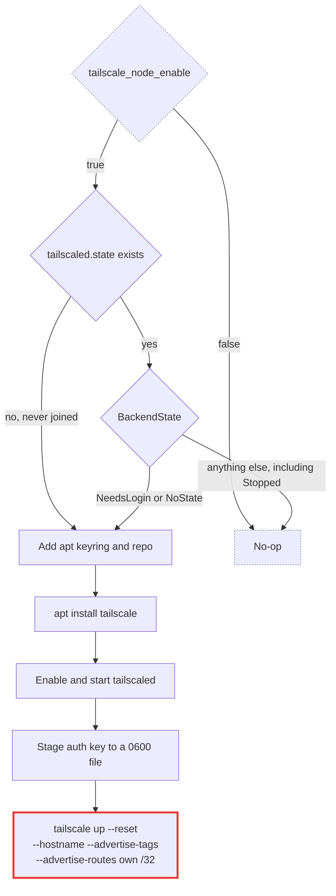

# tailscale_node

Host-level Tailscale, so cluster nodes can reach each other across the internet. This is what makes a cloud worker possible: home is behind CGNAT, so an Oracle node cannot dial in and the control plane cannot dial out to it.

Distinct from the `vpn` module's Tailscale pod in [stage 2](../../stage2/tailscale.md), which does LAN access and exit-node duty and is untouched by this role.

**Invoked by** play 2 (`hosts: cluster`, `serial: 1`, `become: true`), tag `tailscale_node`, after `host_setup`.

**Off by default.** With `tailscale_node_enable` false the role installs nothing and a LAN-only cluster is byte-for-byte unchanged.

## What it does



Runs on **every** node in `cluster`, not only the ones being reached remotely. Cilium is a full node-to-node VXLAN mesh, so an existing LAN worker needs a path to a cloud node as much as the control plane does.

## The /32 self-advertisement

Each node advertises its own address as a `/32`, for example `192.168.1.202/32` from a host at that address. The `vpn` pod already advertises the whole LAN `/24`, and WireGuard picks the longest matching prefix, so the `/32` wins and traffic reaches the node directly instead of being forwarded through the pod.

That matters because a forwarded path is asymmetric: the reply leaves the node over its own interface rather than back through the pod, and `rp_filter` drops it. It also means the node keeps its existing IP, so no API server certificate has to be regenerated.

## Variables

| Variable | Default | Purpose |
|---|---|---|
| `tailscale_node_enable` | `false`, from the environment | Master toggle. Off installs nothing |
| `tailscale_node_auth_key` | `""`, from the environment | Pre-approved key, read only on a node's first join |
| `tailscale_node_tags` | `tag:k8s-node` | Tailnet ACL scope for this device |
| `tailscale_node_hostname_prefix` | `homelab`, from the environment | Shared with stage 0 and stage 2 |
| `tailscale_node_hostname_suffix` | `""`, per host | `cp-01` for the control plane, `worker-NN` for workers |
| `tailscale_node_advertise_self` | `true` | Advertise the host's own address as a `/32` |
| `tailscale_node_accept_routes` | `false` | See the danger admonition below before turning this on |
| `tailscale_node_accept_dns` | `false` | Tailscale defaults this on. See the danger admonition below |
| `tailscale_node_keyring_path` | `/usr/share/keyrings/tailscale-archive-keyring.gpg` | Fixed by the repo list file, see below |
| `tailscale_node_repo_list_path` | `/etc/apt/sources.list.d/tailscale.list` | apt source |
| `tailscale_node_auth_key_path` | `/run/tailscale-authkey` | Where the key is staged so it never enters a command line. tmpfs, and removed after the join either way |
| `tailscale_node_state_path` | `/var/lib/tailscale/tailscaled.state` | tailscaled's `--state` file. Its absence is what the role reads as "never joined" |

Values come from the environment via [Bitwarden](../../operations/bitwarden-secrets.md).

## Machine names

The name is `<prefix>-<suffix>`, passed explicitly with `--hostname` rather than left to the OS hostname. The stage 2 `vpn` pod is a second Linux device registering from the same tailnet, and whichever device registers second is [permanently suffixed `-1`](https://tailscale.com/kb/1098/machine-names) if the names collide. That suffix is not reclaimed when the other device is renamed later.

The suffix is per host: `inventory.yml` sets it for the control plane, `worker_hosts_json` for each worker. It has no default, and the role fails before joining rather than registering a node as a bare `<prefix>-`.

Renaming a node that has already joined is manual, since the role joins once and never reconciles:

```bash
sudo tailscale set --hostname=<prefix>-<suffix>
```

## Generating the auth key

Do this **before** the first run against a node. Requires an Owner, Admin, IT admin or Network admin role on the tailnet.

**1. Define the tag first.** Key creation rejects a tag the policy does not define, so this is not optional and not last. Either editor works, on the [Access controls](https://console.tailscale.com/admin/acls) page:

- **Visual editor**: **Tags** tab, then **Create tag**. Enter the name as `k8s-node`, **without** the `tag:` prefix, which the editor adds itself. Leave **Tag owner** empty unless you want to narrow it: an unowned tag is implicitly owned by tailnet owners, admins and network admins.
- **JSON editor**: add the entry to `tagOwners` directly. An empty owner list means the same as leaving the visual editor's field blank.

If you reach step 2 and find the tag missing, the generate dialog has a **Manage tags in Access Controls** link that goes straight back here.

```jsonc
"tagOwners": {
  "tag:k8s-gateway": [],  // the stage 2 vpn pod
  "tag:k8s-node":    []   // this role
}
```

**2. Open the [Keys](https://console.tailscale.com/admin/settings/keys) page** of the admin console and select **Generate auth key**.

**3. Fill the form.** The dialog has three fields, then a **Device settings** section with two more:

| Field | Set to | Why |
|---|---|---|
| Description | `homelab k8s node` | Optional, but keys are otherwise indistinguishable in the list |
| Reusable | **off** | A reusable key authenticates any number of devices and is dangerous if it leaks. One key per node |
| Expiration | **1** day | The field is prefilled with 90 and the range is 1 to 90. The key only has to survive one Ansible run |
| Ephemeral | **off** | Ephemeral devices are removed once they go offline. A cluster node that reboots must come back as the same node |
| Tags | on, `tag:k8s-node` | The whole ACL scope hangs off this. An untagged node lands under the personal-device policy |

There is no **Pre-approved** toggle unless [device approval](https://tailscale.com/kb/1099/device-approval) is enabled on the tailnet. If you do not see one, approval is off and every key is effectively pre-approved.

The **Tags** toggle's own help text confirms the expiry behaviour covered below: "This will also disable node key expiry for the device."

**4. Select Generate key**, then copy the `tskey-auth-...` value immediately.

**5. Store it** as the `tailscale_auth_key` Bitwarden secret, not `TF_VAR_tailscale_auth_key`, which is the stage 2 vpn pod's key and carries a different tag:

```bash
bws secret create tailscale_auth_key "tskey-auth-..." "$BWS_PROJECT_ID"
bws secret create tailscale_node_enable "true" "$BWS_PROJECT_ID"
```

Provisioning several nodes in one run needs a reusable key. Prefer one node at a time with a one-off key; if you do use a reusable one, set the expiry to 1 day, the minimum the console form accepts, and revoke it afterwards.

## Re-run behaviour

Idempotent, by skipping rather than by reconciling. A node that has a `tailscaled.state` and is not logged out is left completely alone, whatever its daemon is currently doing.

## Gotchas

!!! danger "The tailnet ACL is the real security control"

    A tailnet with no policy is flat: every device reaches every other device on every port. Without an ACL scoping `tag:k8s-node`, your phone has a route to the kubelet API on port 10250.

    Define `tag:k8s-node` in `tagOwners` and restrict it to `6443`, `10250`, `8472/udp` and `4240` between nodes, plus `22` from your own devices for Ansible. Port `8472` needs its own rule with `proto: udp`; a port list without a protocol does not cover UDP, and getting this wrong drops VXLAN silently.

    The visual editor writes access rules in [grants](https://tailscale.com/docs/features/access-control/grants) syntax rather than the older `acls` array. Both are supported and you can switch editors freely, so match whichever your policy already uses instead of mixing styles for one rule.

!!! danger "`--accept-dns` hands kubelet the wrong node IP when the two names collide"

    kubelet with no `--node-ip` resolves its own node name through the host resolver to choose an address, and MagicDNS answers for tailnet machine names. So this bites whenever a node's Kubernetes name and its tailnet name are the same string, and kubelet registers the tailnet address as the Node `InternalIP`.

    The two names are independent here: the tailnet name is `<prefix>-<suffix>`, while kubeadm registers `inventory_hostname` for a worker and the OS hostname for the control plane. Nothing enforces that they stay apart, and a cloud worker named after its tailnet machine is the obvious collision.

    Cilium takes its VXLAN tunnel endpoint from that field. Every cross-node pod packet then leaves over `tailscale0` at MTU 1280 instead of the LAN, while pods still believe they have the cluster-wide MTU. Small packets keep flowing, so DNS answers and health checks look fine and only large responses and TLS handshakes fail, intermittently and with nothing in the cluster changed to explain it.

    A node that hits this shows the tailnet address in `kubectl get nodes -o wide` and in `cilium-dbg node list`, and has no `alpha.kubernetes.io/provided-node-ip` annotation. Cluster nodes have no use for MagicDNS, so the role passes `--accept-dns=false` explicitly rather than taking Tailscale's default.

    That only removes the trigger, and only from the next `tailscale up`. [`kubeadm_agent`](kubeadm-agent.md) pinning `--node-ip` on every pass is the actual guard.

!!! danger "`--accept-routes` cuts the LAN path of any node inside the advertised subnet"

    The stage 2 `vpn` pod advertises the whole LAN `/24`. A node that sits inside that `/24` and accepts routes will send traffic for its own directly-connected subnet into the tunnel, to a subnet router running on the node itself. The node stays fully reachable over the tailnet while every LAN address, including the API server endpoint every other node uses, goes dark. Workers lose the control plane within a lease period.

    Tailscale describes the same failure under [subnet routers, high availability](https://tailscale.com/kb/1019/subnets), using `192.168.1.0/24` as its example, and recommends `--advertise-routes` alone.

    `tailscale_node_accept_routes` is therefore `false`, which is also the Linux default. Only a node outside the advertised subnet, meaning a cloud worker consuming the home nodes' `/32`s, has any reason to set it, and those join from their own cloud-init rather than through this role. Recovery, if it is ever turned on by mistake, is `sudo tailscale set --accept-routes=false` over the tailnet; `set` changes only the flags you name, unlike `up`.

!!! warning "The role never changes an existing node's flags"

    `tailscale up` treats a changed flag set as a conflict, not a merge, and cloud workers are brought up by their own cloud-init with a flag set of their own. The state gate is what keeps the role off them: a node that has joined is never touched again unless it is logged out.

    The gate reads `BackendState` from `tailscale status --json`, not the exit code of bare `tailscale status`. That command exits 1 for `Stopped` and `NeedsMachineAuth` as well as `NeedsLogin`, so an exit-code gate would send `tailscale up --reset` at a cloud worker that merely happens to be stopped or is waiting on device approval, and wipe the flags its cloud-init set.

    Changing tags or advertised routes on a joined node is therefore a deliberate manual `tailscale up --reset` on that host.

!!! warning "The join uses `--reset`, because a failed join leaves prefs behind"

    `tailscale up` applies its prefs to the local daemon before it authenticates. A join that fails at the auth key therefore leaves those prefs on disk while the node stays logged out, and the next run aborts with "changing settings via 'tailscale up' requires mentioning all non-default flags" rather than joining.

    `--reset` sends every unmentioned setting back to its default, so the flags the role passes are the whole of the node's configuration. That also defuses a stale `--accept-routes` from an earlier attempt, which would otherwise take effect the moment the node finally authenticates. The reset is safe only because the state gate means this runs on a node that is not logged in.

!!! warning "The auth key goes through a file, not the command line"

    `/proc/<pid>/cmdline` is world readable on a stock Ubuntu host, so a key passed as `--auth-key=tskey-...` is readable by `ps`, by any unprivileged process, and by any agent that records command lines. `no_log` does not help: it redacts Ansible's output, not the kernel's.

    The role writes the key to a `0600` file and passes Tailscale's documented `file:` form instead. The write is removed in an `always:` block, so a failed join does not leave it behind, and `/run` is tmpfs so nothing survives a reboot either.

!!! note "Node key expiry is already off, because the nodes are tagged"

    Node keys expire every 180 days by default, and for a cluster node that would mean a surprise `NotReady` months later with nothing in the cluster to explain it.

    It does not apply here: [key expiry for tagged devices is disabled by default](https://tailscale.com/kb/1085/auth-keys#key-expiry-for-tagged-devices), and this role always joins with `--advertise-tags`. Confirm it on the [Machines](https://console.tailscale.com/admin/machines) page after the first join rather than assuming, and note that re-authenticating a tagged device leaves the setting as it was.

    The security trade is therefore made by default, not by you. It is acceptable only because the ACL narrowly scopes what `tag:k8s-node` can reach.

!!! note "Routes need approving once, or auto-approving"

    An advertised `/32` is inert until approved. Either approve each one in the admin console, or add the LAN prefix to `autoApprovers.routes` for `tag:k8s-node`, which covers every `/32` inside it because auto-approval permits advertising a subnet of the specified route.

    That cuts both ways. Auto-approving the `/24` also lets any device carrying `tag:k8s-node` advertise the whole LAN and become a subnet router for it, with no admin in the loop. List each node's `/32` instead if you would rather not grant that.

!!! note "UFW rules land before the interface exists"

    The role runs after `host_setup`, so `setup-ufw.yml` writes `allow in on tailscale0` rules for an interface that does not exist yet. iptables accepts that and the rules activate when the interface appears. The ordering is deliberate: the firewall should be in a known state before the host joins a mesh.
