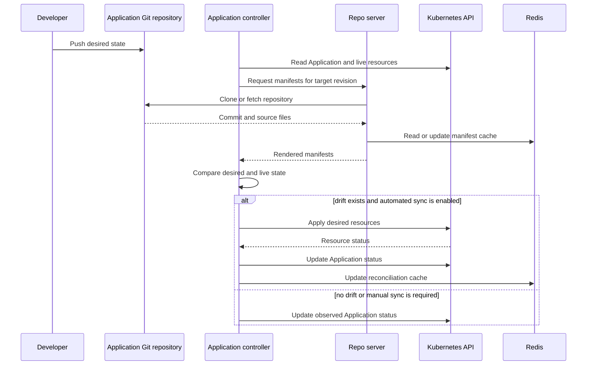
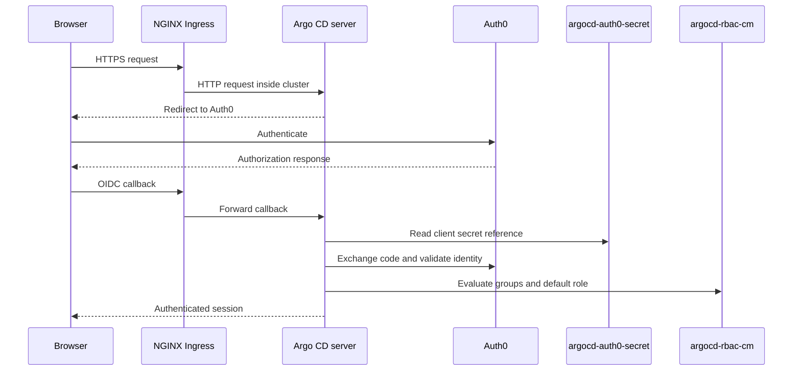

# ArgoCD Module

Deploys [Argo CD](https://argo-cd.readthedocs.io/) as the Stage 2 GitOps controller with Auth0 OIDC, RBAC, Prometheus monitoring, ingress, and an optional root Application.

## Architecture

```mermaid
flowchart TB
    Admin["Administrator browser"]:::external
    Developer["Developer"]:::external
    GitRepo["Application Git repositories"]:::external
    AppsRepo["argocd-apps Git repository"]:::external
    Auth0["Auth0 OIDC provider"]:::external
    Prometheus["Prometheus"]:::external

    subgraph Cluster["Kubernetes cluster"]
        Terraform["Stage 2 Terraform<br/>module.argocd"]:::control
        Namespace["argocd namespace<br/>prevent_destroy"]:::resource
        OIDCSecret["argocd-auth0-secret<br/>OIDC client secret"]:::secret
        RBACConfig["argocd-rbac-cm<br/>default role and group policy"]:::resource
        HelmRelease["argo-cd Helm release<br/>chart 10.3.3"]:::control
        CRDs["Argo CD CRDs<br/>Application, ApplicationSet, AppProject"]:::resource
        Ingress["argocd-server Ingress<br/>NGINX class and TLS"]:::network
        TLSSecret["cert-manager TLS Secret"]:::secret
        Nginx["NGINX Ingress controller"]:::network
        Server["argocd-server<br/>API and Web UI"]:::component
        Controller["application-controller<br/>desired and live state reconciliation"]:::component
        RepoServer["repo-server<br/>clone and manifest generation"]:::component
        AppSetController["applicationset-controller<br/>Application generation"]:::component
        Notifications["notifications-controller"]:::component
        Redis["Redis<br/>shared cache"]:::data
        RootApplication["argocd-apps-root Application<br/>optional Terraform resource"]:::resource
        ApplicationSets["ApplicationSet resources"]:::resource
        Applications["Application resources"]:::resource
        KubernetesAPI["Kubernetes API server"]:::control
        Workloads["Managed application workloads"]:::resource
        ServiceMonitors["ServiceMonitors<br/>controller, server, repo, Redis, ApplicationSet"]:::monitoring
        PrometheusRule["PrometheusRule<br/>missing and unsynced applications"]:::monitoring
    end

    Terraform -->|creates first| Namespace
    Terraform -->|stores Auth0 secret| OIDCSecret
    Terraform -->|owns RBAC data| RBACConfig
    Terraform -->|installs| HelmRelease
    Terraform -->|creates when repo URL is set| RootApplication
    Namespace --> HelmRelease
    OIDCSecret -->|clientSecret reference| Server
    RBACConfig -->|authorization policy| Server
    HelmRelease --> CRDs
    HelmRelease --> Ingress
    HelmRelease --> Server
    HelmRelease --> Controller
    HelmRelease --> RepoServer
    HelmRelease --> AppSetController
    HelmRelease --> Notifications
    HelmRelease --> Redis
    HelmRelease --> ServiceMonitors
    HelmRelease --> PrometheusRule

    Admin -->|HTTPS| Nginx
    Nginx -->|route argocd host| Ingress
    TLSSecret -->|certificate| Ingress
    Ingress -->|HTTP inside cluster| Server
    Server -->|authorization request| Auth0
    Auth0 -->|OIDC callback| Server
    Server -->|API operations| KubernetesAPI
    Server -->|cache| Redis

    Developer -->|push desired state| GitRepo
    Developer -->|push ApplicationSets| AppsRepo
    RootApplication -->|watches applicationsets path| AppsRepo
    RootApplication -->|syncs| ApplicationSets
    ApplicationSets --> AppSetController
    AppSetController -->|generates| Applications
    Applications --> Controller
    Controller -->|requests manifests| RepoServer
    RepoServer -->|clone and fetch| GitRepo
    Controller -->|read and apply resources| KubernetesAPI
    KubernetesAPI --> Workloads
    Controller -->|cache| Redis
    RepoServer -->|cache| Redis

    Server -->|metrics| ServiceMonitors
    Controller -->|metrics| ServiceMonitors
    RepoServer -->|metrics| ServiceMonitors
    AppSetController -->|metrics| ServiceMonitors
    Redis -->|metrics| ServiceMonitors
    ServiceMonitors -->|scraped by| Prometheus
    PrometheusRule -->|evaluated by| Prometheus

    classDef external fill:#ecf0f1,color:#2c3e50,stroke:#2c3e50
    classDef control fill:#2c3e50,color:#ffffff,stroke:#1a252f
    classDef component fill:#0b5394,color:#ffffff,stroke:#073763
    classDef resource fill:#38761d,color:#ffffff,stroke:#274e13
    classDef network fill:#741b47,color:#ffffff,stroke:#4c1130
    classDef secret fill:#783f04,color:#ffffff,stroke:#4f2a03
    classDef data fill:#674ea7,color:#ffffff,stroke:#351c75
    classDef monitoring fill:#990000,color:#ffffff,stroke:#660000
```



## GitOps Flow



## Authentication Flow

Argo CD handles OIDC directly. OAuth2 Proxy is not in the Argo CD request path.



## Values Ownership

`stage2/argocd/templates/argocd-values.tftpl` contains only repository-owned overrides; omitted keys inherit the pinned chart defaults.

Keep the template reference and `helm_release.argo_cd.version` on the same chart tag. For upgrades, review that tag's `values.yaml`, the Argo CD upgrade guide, and the rendered manifest. Copying chart defaults into the template pins them.

## Resources Created

- `kubernetes_namespace_v1.argocd`: Dedicated namespace guarded by `prevent_destroy`.
- `kubernetes_secret_v1.argocd_auth0_oidc_secret`: Auth0 OIDC client secret.
- `kubernetes_config_map_v1.argocd_rbac_cm`: Default RBAC role, group policy, scopes, and matching mode.
- `helm_release.argo_cd`: Argo CD CRDs, workloads, Services, Ingress, ServiceMonitors, and PrometheusRule.
- `kubernetes_manifest.argocd_apps_root`: Optional root Application for the `applicationsets` path in the central GitOps repository.
- `data.kubernetes_secret_v1.argocd_initial_admin_secret`: Initial administrator password output.

## Variables

| Name | Description | Default |
|------|-------------|---------|
| `prometheus_namespace` | ServiceMonitor and PrometheusRule namespace | `monitoring` |
| `global_ingress_enable_tls` | Enable ingress TLS | `true` |
| `nginx_frontend_basic_auth_base64` | Basic auth credentials; currently unused | required, sensitive |
| `argocd_domain` | Argo CD hostname | `argocd.chrislee.local` |
| `argocd_ingress_class_name` | Ingress class | `nginx` |
| `argocd_ssh_known_hosts_base64` | SSH repository host keys; currently unused | `""` |
| `argocd_config_repositories` | Repository credentials rendered into `configs.repositories`; empty in this deployment | `[]` |
| `argocd_rbac_policy_default` | Fallback RBAC role for non-admin identities | `""` |
| `argocd_rbac_policy_csv` | RBAC policy CSV | `""` |
| `argocd_apps_repo_url` | GitOps repository for the optional root Application | `""` |
| `auth_oauth2_proxy_host` | Auth0 group claim namespace | `auth.chrislee.local` |
| `argocd_auth0_domain` | Auth0 tenant domain | `chrislee.auth0.com` |
| `argocd_auth0_client_id` | Auth0 client ID | `""` |
| `argocd_auth0_client_secret` | Auth0 client secret | required, sensitive |

## Usage

### 1. Configure Auth0 OIDC

Create an Auth0 Regular Web Application:

- Allowed Callback URL: `https://argocd.chrislee.local/auth/callback`
- Allowed Logout URL: `https://argocd.chrislee.local`

Configure `TF_VAR_argocd_domain`, `TF_VAR_auth_auth0_domain`, `TF_VAR_auth_auth0_client_id`, and `TF_VAR_auth_auth0_client_secret` in [Bitwarden Secrets Manager](../operations/bitwarden-secrets.md).

### 2. Configure RBAC

`argocd_rbac_policy_default` controls the fallback role and is empty by default, so non-admin SSO and local identities may authenticate but receive no resource access unless `argocd_rbac_policy_csv` grants it explicitly. The built-in `admin` remains the unrestricted break-glass account. The CSV maps Auth0 groups and other subjects to Argo CD roles or direct policies.

```text
g, my-group, role:admin
```

On an existing cluster an already-exported `TF_VAR_argocd_rbac_policy_default` overrides this default and keeps the old `role:readonly` grant. See [Stage 2: ArgoCD](../operations/bitwarden-secrets.md#stage-2-argocd) before applying.

### 3. Configure the Root Application

Set `TF_VAR_argocd_apps_repo_url` to create `argocd-apps-root`, which syncs ApplicationSets from the repository's `applicationsets` directory. Leave it empty to skip the root Application.

### 4. Configure Repository Credentials

!!! warning
    Only `[]` is supported. The input's Secret selectors cannot be encoded as scalar repository Secret values. Manage credentials as direct [Argo CD repository Secrets](https://argo-cd.readthedocs.io/en/stable/operator-manual/declarative-setup/#repositories).

### 5. Get the Initial Administrator Password

```bash
kubectl -n argocd get secret argocd-initial-admin-secret -o jsonpath="{.data.password}" | base64 -d
```

### 6. Access the Dashboard

Navigate to `https://argocd.chrislee.local` and authenticate through Auth0.

## Helm Chart

| Property | Value |
|----------|-------|
| Repository | <https://argoproj.github.io/argo-helm> |
| Chart | `argo-cd` |
| Version | `10.3.3` |
| App Version | `v3.5.1` |

## Application Example

```yaml
apiVersion: argoproj.io/v1alpha1
kind: Application
metadata:
  name: my-app
  namespace: argocd
spec:
  project: default
  source:
    repoURL: git@gitlab.chrislee.local:group/repo.git
    targetRevision: HEAD
    path: manifests
  destination:
    server: https://kubernetes.default.svc
    namespace: my-app
  syncPolicy:
    automated:
      prune: true
      selfHeal: true
```

## Verification

Plan before applying:

```bash
task stage2:terraform:plan
```

After applying, verify the release, rollouts, and Applications:

```bash
helm -n argocd list --filter '^argocd$'
kubectl -n argocd rollout status statefulset/argocd-application-controller --timeout=5m
kubectl -n argocd rollout status deployment/argocd-server --timeout=5m
kubectl -n argocd rollout status deployment/argocd-repo-server --timeout=5m
kubectl -n argocd rollout status deployment/argocd-applicationset-controller --timeout=5m
kubectl -n argocd rollout status deployment/argocd-notifications-controller --timeout=5m
kubectl -n argocd rollout status deployment/argocd-redis --timeout=5m
kubectl -n argocd get pods
kubectl -n argocd get applications.argoproj.io
```

## Troubleshooting

| Symptom | Check |
|---------|-------|
| Auth0 redirect loop or rejected callback | Confirm the Auth0 callback URL, inspect `argocd-cm`, and read `argocd-server` logs. |
| Login succeeds but applications are hidden | Expected when `argocd_rbac_policy_csv` grants the user nothing, because `argocd_rbac_policy_default` is empty. Confirm the CSV first, then the token group claim and the RBAC scopes in `argocd-rbac-cm`. |
| Repository connection fails | Inspect the repository Secret data keys and `argocd-repo-server` logs. |
| Application remains OutOfSync | Compare desired and live manifests, then inspect application-controller and repo-server logs before syncing. |
| Metrics or alerts are absent | Verify the ServiceMonitors and PrometheusRule in the `monitoring` namespace and confirm Prometheus selected them. |

## References

- [Argo CD documentation](https://argo-cd.readthedocs.io/)
- [Argo CD 3.4 to 3.5 upgrade guide](https://argo-cd.readthedocs.io/en/stable/operator-manual/upgrading/3.4-3.5/)
- [Argo CD tested Kubernetes versions](https://argo-cd.readthedocs.io/en/stable/operator-manual/installation/)
- [Argo CD Helm chart 10.3.3](https://github.com/argoproj/argo-helm/tree/argo-cd-10.3.3/charts/argo-cd)
- [Argo CD Helm values 10.3.3](https://github.com/argoproj/argo-helm/blob/argo-cd-10.3.3/charts/argo-cd/values.yaml)
- [Auth0 OIDC setup](https://argo-cd.readthedocs.io/en/stable/operator-manual/user-management/auth0/)
- [RBAC configuration](https://argo-cd.readthedocs.io/en/stable/operator-manual/rbac/)
