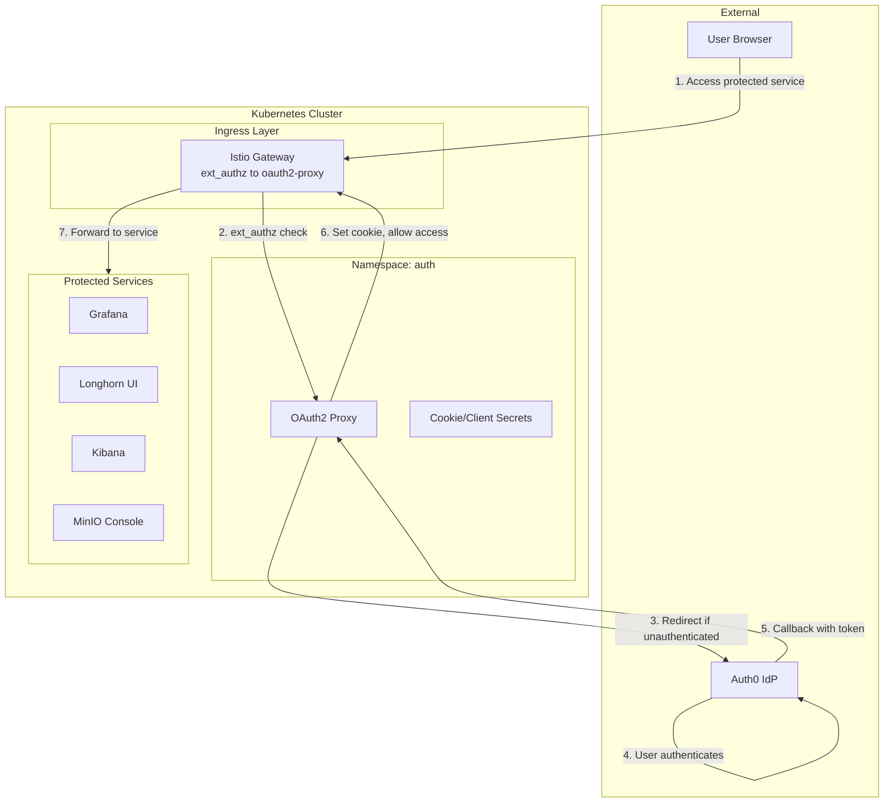
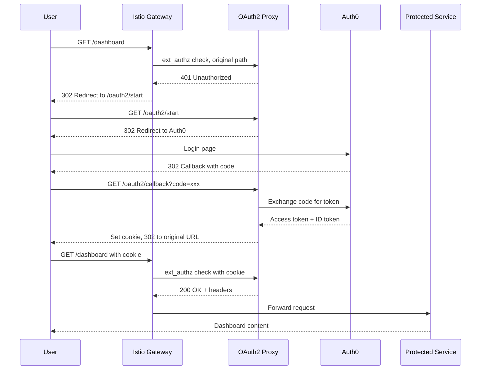

# OAuth2 Proxy Authentication Module

Terraform module for deploying [OAuth2 Proxy](https://oauth2-proxy.github.io/oauth2-proxy/) with Auth0 integration to Kubernetes. Provides centralized authentication for all protected services using OIDC.

## Architecture



## Authentication Flow



## Resources Created

- `kubernetes_namespace.auth_namespace` - Dedicated namespace
- `random_password.oauth2_proxy_cookie_secret` - Cookie encryption secret
- `kubernetes_secret.oauth2_proxy_cookie_secret` - Credentials secret
- `helm_release.oauth2_proxy` - OAuth2 Proxy Helm chart
- `kubectl_manifest.listener` - ListenerSet contributing this host's HTTPS listener to the shared Gateway
- `kubectl_manifest.certificate` - DNS-01 Certificate, reusing the Secret name the Ingress used
- `kubectl_manifest.route` - HTTPRoute to `oauth2-proxy:80`, carrying the header filters

This host has no `AuthorizationPolicy` and must never gain one. oauth2-proxy is the ext_authz provider every gated host calls, so gating it would make the authenticator depend on itself.

## Variables

| Name | Description | Default |
|------|-------------|---------|
| `prometheus_namespace` | Namespace for ServiceMonitor | `monitoring` |
| `auth_oauth2_proxy_host` | Proxy hostname | `auth.chrislee.local` |
| `auth_oauth2_proxy_cookie_domains` | Cookie domains (JSON array) | `[".chrislee.local"]` |
| `auth_oauth2_proxy_whitelist_domains` | Allowed redirect domains | `["*.chrislee.local"]` |
| `auth_auth0_domain` | Auth0 tenant domain | `chrislee.auth0.com` |
| `auth_auth0_client_id` | Auth0 application client ID | `""` |
| `auth_auth0_client_secret` | Auth0 application client secret | (required, sensitive) |
| `istio_gateway_name` | Shared Istio Gateway the listener is added to | `public` |
| `istio_gateway_namespace` | Namespace of that Gateway, named by the ListenerSet `parentRef` | `istio-ingress` |

## Usage

### 1. Configure Auth0 Application

1. Create a Regular Web Application in Auth0
2. Set Allowed Callback URLs: `https://auth.chrislee.local/oauth2/callback`
3. Set Allowed Logout URLs: `https://auth.chrislee.local`
4. Copy Client ID and Client Secret

### 2. Configure Variables

```bash
TF_VAR_auth_auth0_domain="your-tenant.auth0.com"
TF_VAR_auth_auth0_client_id="your-client-id"
TF_VAR_auth_auth0_client_secret="your-client-secret"
TF_VAR_auth_oauth2_proxy_host="auth.chrislee.local"
TF_VAR_auth_oauth2_proxy_cookie_domains='[".chrislee.local"]'
```

### 3. Protect a Service

Declare a CUSTOM `AuthorizationPolicy` naming the shared Gateway. `action: CUSTOM` hands the decision to the `oauth2-proxy` ext_authz provider declared in mesh config, so the gate is enforced at the gateway rather than by the backend:

```yaml
apiVersion: security.istio.io/v1
kind: AuthorizationPolicy
metadata:
  name: myapp-require-auth
  # Beside the Gateway it targets, not beside the workload: Istio requires a policy to sit in the
  # namespace of the resource its targetRefs names.
  namespace: istio-ingress
spec:
  targetRefs:
    - group: gateway.networking.k8s.io
      kind: Gateway
      name: public
  action: CUSTOM
  provider:
    name: oauth2-proxy
  rules:
    - to:
        - operation:
            # Both forms: the authority carries the port when a client sends one.
            hosts:
              - myapp.example.com
              - "myapp.example.com:*"
```

Add `paths` to gate only part of a host, or `notPaths` to gate everything except a named set. `stage2/omniroute-gateway/httproute.tf` and `stage2/litellm/httproute.tf` are the two worked examples, gating by exclusion and by inclusion respectively.

## Helm Chart

| Property | Value |
|----------|-------|
| Repository | <https://oauth2-proxy.github.io/manifests> |
| Chart | oauth2-proxy |

## References

- [OAuth2 Proxy Documentation](https://oauth2-proxy.github.io/oauth2-proxy/)
- [Auth0 Integration](https://oauth2-proxy.github.io/oauth2-proxy/configuration/providers/auth0)
- [Istio external authorization](https://istio.io/latest/docs/tasks/security/authorization/authz-custom/)
