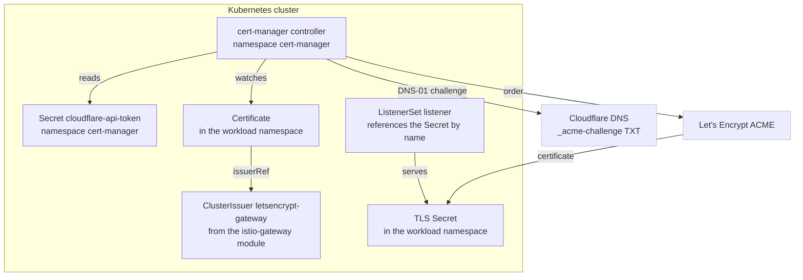

# Cert-Manager and Let's Encrypt Module

Terraform module that installs [cert-manager](https://cert-manager.io/) and the Cloudflare API token its ACME solver needs. Defined in `stage2/cert-manager-letsencrypt/cert-manager.tf`.

The module installs the controller only. It creates no ClusterIssuer and no Certificate: the `letsencrypt-gateway` issuer lives in `stage2/istio-gateway/certificates.tf`, and each per-host Certificate is created by the module that owns the workload, so a host's certificate appears and disappears with its service.

## Architecture



## Why DNS-01 and not HTTP-01

HTTP-01 needs the challenge to arrive on port 80 at a listener the solver controls. Cloudflare Tunnel delivers every request to the origin on 443, where the listener comes from an app module's ListenerSet and only that module's route is attached, so the app answers the challenge path with its own page. DNS-01 sidesteps the data path entirely by proving control through a TXT record.

The token Secret is created here rather than in the istio-gateway module because a ClusterIssuer may only read Secrets from cert-manager's cluster resource namespace. Its name, `cloudflare-api-token`, is part of the contract between the two modules.

## Resources created

| Resource | Name | Notes |
|---|---|---|
| `kubernetes_namespace_v1.cert_manager` | `cert-manager` | Carries `prevent_destroy = true` |
| `helm_release.cert_manager` | `cert-manager` | Chart `v1.21.2` from <https://charts.jetstack.io>, `wait = true` |
| `kubernetes_secret_v1.cloudflare_api_token` | `cloudflare-api-token` | The root rejects an empty token, so it always exists |

The values file also turns on the chart's ServiceMonitor. Expiry is the one failure mode of DNS-01 renewal that is otherwise silent, because nothing serves an error and the certificate simply runs out; the ServiceMonitor is what feeds `certmanager_certificate_expiration_timestamp_seconds` to the `CertificateExpiringSoon` alert in [monitoring](monitoring.md). The chart rejects having both its ServiceMonitor and its PodMonitor enabled, so only the former is on.

cert-manager's Gateway API support is deliberately off. It exists to run the gateway-shim controller and the HTTP-01 `gatewayHTTPRoute` solver, and this cluster uses neither: every Certificate is declared directly by the module that owns the workload, and the solver is DNS-01.

## Variables

| Name | Description | Default |
|---|---|---|
| `cert_manager_cloudflare_api_token` | Cloudflare token for the DNS-01 solver | (required, sensitive) |

`cert_manager_acme_email` is a root variable consumed by the [istio-gateway](istio-gateway.md) module, which owns the issuer. It is not an input to this module.

## Usage

Set the token, which needs Zone-DNS-Edit and Zone-Zone-Read on all zones:

```bash
TF_VAR_cert_manager_cloudflare_api_token="..."
TF_VAR_cert_manager_acme_email="you@example.com"
```

A workload module requests a certificate by creating one in its own namespace:

```yaml
apiVersion: cert-manager.io/v1
kind: Certificate
metadata:
  name: myapp-tls
  namespace: myapp
spec:
  secretName: myapp-tls
  issuerRef:
    name: letsencrypt-gateway
    kind: ClusterIssuer
  dnsNames:
    - myapp.example.com
```

## Gotchas

!!! warning "A `.local` name can never be issued"

    DNS-01 proves control by writing a TXT record into a Cloudflare zone. Cloudflare holds no zone for a `.local` name, so the challenge cannot be answered and the Certificate stays `Ready=False`. This is repo-wide, not specific to any module.

!!! warning "cert-manager does not adopt a Secret across issuers"

    Pointing an existing Certificate at a different `issuerRef` makes cert-manager re-issue with `IncorrectIssuer` rather than adopt what is there. The old certificate stays in the Secret and the listener keeps serving it while the new order runs, so there is no TLS gap and nothing to copy by hand.

## References

- [cert-manager Documentation](https://cert-manager.io/docs/)
- [DNS-01 Challenge](https://cert-manager.io/docs/configuration/acme/dns01/)
- [Cloudflare DNS-01 solver](https://cert-manager.io/docs/configuration/acme/dns01/cloudflare/)
- [ACME Protocol](https://datatracker.ietf.org/doc/html/rfc8555)
