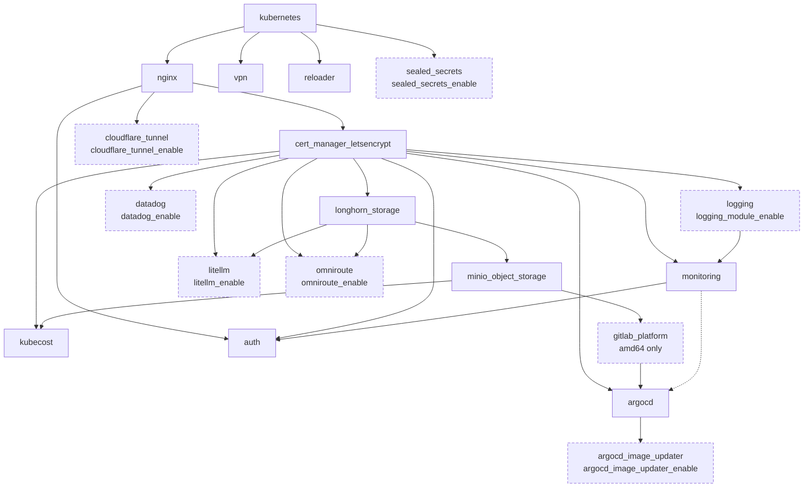

# Module dependency graph

Terraform infers ordering from data flow, but these modules mostly exchange no outputs. They race for the same cluster. `stage2/main.tf` therefore declares ordering explicitly with `depends_on`.

One edge is implicit rather than declared: `argocd` reads `module.monitoring.monitoring_namespace`, which Terraform enforces exactly like a `depends_on`. It is drawn dotted below.

Dashed nodes are gated by an enable flag and may be absent from the plan entirely.

## Why each edge exists

| Edge | Reason |
|---|---|
| `kubernetes → *` | Installs the Prometheus CRDs and CoreDNS config that later modules' manifests reference. A CRD must exist before a CR that uses it. |
| `nginx → cert_manager_letsencrypt` | The HTTP-01 solver needs a working ingress controller to answer the ACME challenge. |
| `cert_manager_letsencrypt → *` | Anything terminating TLS needs the `ClusterIssuer` to exist before it requests a `Certificate`. |
| `longhorn_storage → minio_object_storage` | MinIO's PVCs bind against Longhorn's StorageClass. Without it they stay `Pending`. |
| `minio_object_storage → gitlab_platform` | GitLab stores artifacts, LFS, uploads and backups in MinIO buckets. |
| `minio_object_storage → kubecost` | Kubecost federates its cost data into a MinIO bucket. |
| `logging → monitoring` | Grafana provisions an Elasticsearch datasource pointing at the ECK stack. |
| `monitoring → auth`, `nginx → auth` | OAuth2 Proxy protects the Grafana and AlertManager ingresses, so both must exist first. |
| `gitlab_platform → argocd` | ArgoCD's initial `Application` set points at repositories hosted on the in-cluster GitLab. |
| `monitoring → argocd` (implicit) | ArgoCD reads `module.monitoring.monitoring_namespace` for its ServiceMonitor. Data flow, not `depends_on`. |
| `argocd → argocd_image_updater` | The updater writes back to Applications ArgoCD owns. |

!!! note "The `auth` edge is the awkward one"

    `auth` depends on `monitoring`, and `monitoring` depends on `logging`, so enabling OAuth2 pulls the whole observability stack into the critical path of the apply. That is why the first `terraform apply` on a fresh cluster takes so long: cert issuance and Longhorn volume creation both sit upstream of it.

## Gated modules and the DAG

`count = 0` removes a module from the plan but **not** its `depends_on` edges. The dependency simply resolves against an empty resource set. The practical consequences:

- On ARM64, `gitlab_platform` has `count = 0`, so `argocd` loses its GitLab ordering edge. It still waits on `cert_manager_letsencrypt` and on `monitoring`, which in turn waits on `logging`.
- Disabling `logging_module_enable` drops the Elasticsearch datasource from Grafana but leaves `monitoring` otherwise intact.
