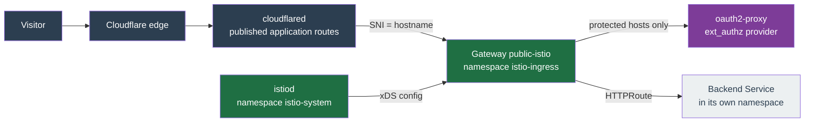

# Istio Gateway Module

Terraform module for [Istio](https://istio.io/) in gateway-only mode on the [Kubernetes Gateway API](https://gateway-api.sigs.k8s.io/). It owns the control plane, the Gateway API CRDs and one shared Gateway. Each app module contributes its own listener, certificate and route for the host it exposes, so a host is served once its module declares those three and its Cloudflare Tunnel route points at the gateway Service.

Gateway-only means no sidecars, no `istio-cni` and no mTLS mesh. The injection webhook only acts on namespaces or pods that opt in, and nothing in this cluster does.

## Architecture



## What it installs

| Resource | Detail |
|---|---|
| Gateway API CRDs | Five types only, fetched from upstream at apply time and pinned by sha256: `gatewayclasses`, `gateways`, `httproutes`, `listenersets`, `referencegrants`, plus upstream's `safe-upgrades` admission policy. Applied server-side because the larger schemas exceed the 262144 byte annotation limit |
| `istio-base`, `istiod` | Charts from `blob.istio.io`. The `storage.googleapis.com` mirror stops at 1.30.4 |
| Gateway | One Gateway named by `istio_gateway_name`, carrying only the port 80 listener. `allowedListeners` accepts ListenerSets from any namespace, which is how app modules add the HTTPS listeners. Istio auto-provisions its Deployment and Service as `<name>-istio` |
| ClusterIssuer `letsencrypt-gateway` | DNS-01 through Cloudflare. HTTP-01 cannot work here, see Known gaps |
| HTTPRoute `https-redirect` | Port 80 to 443, with no hostnames, so it covers every host the gateway serves without an edit when a module joins |
| Per host | Nothing here. The owning module declares a `ListenerSet`, a `Certificate` and an `HTTPRoute` in its own namespace, plus an `AuthorizationPolicy` in the Gateway's namespace for a gated host. Worked example: `stage2/monitoring-kubecost/httproute.tf` |

## Behaviour that is not the default

Four settings exist because Istio's defaults are not what this setup needs.

`X-Real-IP` needs both halves. Mesh config sets `gatewayTopology.numTrustedProxies`, so the trusted address is the visitor rather than the cloudflared pod, and every route sets `X-Real-IP` from it. A route without that filter forwards a client-supplied `X-Real-IP` untouched, so a caller can forge it.

The `server` header needs the route filter. Mesh `proxyHeaders.server.disabled` only stops Envoy overwriting the header, which leaves the backend's own value exposed. Removing it at the route is what matches `server-tokens=false`.

oauth2-proxy must answer 200, not 404. ext_authz forwards the original request path rather than calling `/oauth2/auth`, so an authenticated check reaches oauth2-proxy's own upstream. The chart default `upstreams = ["file:///dev/null"]` answers Go's `404 page not found`, which Envoy reads as deny, so a logged-in user sees a 404. `stage2/auth` sets `upstreams = ["static://200"]`.

The login redirect needs `X-Auth-Request-Redirect`. ext_authz has no way to pass a return URL, and without it oauth2-proxy stores a bare path, so the Auth0 callback returns the browser to `auth.chrislee.kr` rather than the original host. The provider injects `https://%REQ(:AUTHORITY)%%REQ(:PATH)%`. Envoy does evaluate those operators, despite `includeAdditionalHeadersInCheck` being documented as "fixed headers", because it parses the value through the same `Router::HeaderParser` used for route `request_headers_to_add`.

## Inputs

| Variable | Default | Notes |
|---|---|---|
| `istio_gateway_name` | `public` | Root variable, also passed to every module that exposes a host, which names it in its ListenerSet `parentRef` |
| `istio_gateway_namespace` | `istio-ingress` | Root variable. Also where each module puts its `AuthorizationPolicy`, because Istio requires a policy beside the resource its `targetRefs` names |
| `istio_gateway_version` | `1.31.0` | Both charts |
| `istio_gateway_chart_repository` | `https://blob.istio.io/istio-release/charts` | The `storage.googleapis.com` mirror stops at 1.30.4 |
| `istio_gateway_control_plane_namespace` | `istio-system` | istiod, and the Istio root namespace that mesh-wide config is read from |
| `istio_gateway_api_version` | `v1.6.2` | CRD bundle |
| `istio_gateway_num_trusted_proxies` | `1` | Cloudflare Tunnel is the only hop. Raising it without a real hop lets clients forge their address |
| `istio_gateway_istiod_requests` | `100m` / `128Mi` | Sized for a gateway-only control plane. The chart default of `500m` / `2048Mi` is mesh sizing |
| `istio_gateway_proxy_requests` | `50m` / `160Mi` | Set above steady state deliberately: the kubelet evicts by usage relative to request, and this pod is the ingress path for every host |
| `istio_gateway_ext_authz_service` | `oauth2-proxy.auth.svc.cluster.local` | oauth2-proxy Service used as the ext_authz provider for gated hosts |
| `istio_gateway_ext_authz_port` | `80` | Port of that Service |
| `istio_gateway_acme_email` | `""` | ACME account contact. Root passes `cert_manager_acme_email` |
| `istio_gateway_acme_server` | production directory | Point at staging to rehearse a cutover. Rarely needed: cert-manager self-checks the challenge before asking Let's Encrypt to validate, so a misconfigured solver fails locally and consumes no rate limit |
| `istio_gateway_acme_cloudflare_secret` | `cloudflare-api-token` | Secret in cert-manager's namespace holding the DNS-01 token, created by `stage2/cert-manager-letsencrypt` |

## Adding a hostname

Every hostname this repo serves is already on the gateway, so this is the path for a new one rather than a cutover.

1. Add `httproute.tf` to the module that owns the workload. It declares four objects: a `ListenerSet` contributing this host's HTTPS listener, a `Certificate` naming `letsencrypt-gateway`, an `HTTPRoute` attached to that ListenerSet and carrying both header filters, and, for a gated host, an `AuthorizationPolicy` in the Gateway's namespace. Copy `stage2/monitoring-kubecost/httproute.tf` for a wholly gated host, or `stage2/litellm/httproute.tf` for one that gates only some paths.
2. Wire it in `stage2/main.tf`: pass `istio_gateway_name` and `istio_gateway_namespace`, and name `module.istio_gateway` in the module's `depends_on` so the Gateway API CRDs exist before the module applies.
3. If other pods in the cluster call this host, add it to `kubernetes_gateway_domains`. Without an entry the name still resolves, by leaving the cluster and returning through Cloudflare, which works but takes the long way round.
4. Apply, then confirm the Certificate reaches `Ready=True` and the listener programs. A `.local` name never will, because Cloudflare holds no zone for it:

    ```bash
    kubectl run tls-probe --rm -i --restart=Never --image=alpine/openssl:latest --command -- \
      sh -c 'echo | openssl s_client -connect public-istio.istio-ingress.svc:443 -servername <host> 2>/dev/null | openssl x509 -noout -subject -issuer -dates'
    ```
5. In the Cloudflare dashboard, add a published application route for the hostname pointing at `https://<name>-istio.istio-ingress.svc:443`, then set `No TLS Verify` and `Origin Server Name` to the hostname. Without Origin Server Name no filter chain matches and TLS fails before any routing happens.
6. Smoke test what the host actually does: login, uploads, WebSocket, SSE.

Removing a hostname is the same list reversed, starting with the Cloudflare route.

## Hosts that are ungated on purpose

Most hosts carry a CUSTOM `AuthorizationPolicy`. These do not, and none of them should gain one:

| Host | Why |
|---|---|
| `auth` | It is the ext_authz provider itself. Gating it would make the authenticator depend on itself and deadlock every login |
| `gitlab`, `registry` | GitLab runs its own session login and the registry authenticates with JWT bearer tokens. A login redirect would break git over HTTPS, the API, CI and every `docker pull` |
| `minio` | The S3 api host. Clients authenticate with signed requests, which a redirect would break |
| `argocd` | ArgoCD runs its own Auth0 login |
| `mcp`, `sre`, `sre-api` | Each enforces Auth0 in the application. Declared in the `argocd-apps` repository |
| `github` | A GitHub App webhook receiver, authenticated by signature |

## Verification

```bash
kubectl -n istio-ingress get gateway public -o wide
kubectl get listenerset -A
kubectl get httproute -A
kubectl get certificate -A
kubectl -n istio-ingress exec deploy/public-istio -c istio-proxy -- curl -s localhost:15000/config_dump | grep -oE '<host>[a-z.-]*' | sort -u
```

The last command reads Envoy's admin config dump rather than using `istioctl`, which is not installed in the tooling container. An `istioctl` call there fails silently when stderr is suppressed and looks identical to a host having no filter chain.

## Known gaps

Request size caps are not implemented, and nothing in the migration path needs them. Six hosts carry a cap today and all six sit outside this repo: `github`, `mcp`, `sre`, `sre-api`, `binance`, `sofia`. The repo-managed hosts set no limit, which is already what the gateway does: Envoy streams request bodies, and the buffer filter is absent from the gateway's filter chain. Adding a cap later still needs a tested design, because the buffer filter applies to every route once it is in the chain unless each other route disables it.

LAN entry is unsolved, but in-cluster entry is not, and the two are separate problems. Pods reach a migrated host through `kubernetes_gateway_domains` in `stage2/kubernetes`, which rewrites the name to the gateway's own Service, so that half needs no address. Genuine LAN clients are what remains: they reach `*.chrislee.kr` at the MetalLB address, and the pool is a single `/32` holding only that address, so the gateway cannot be given one while it is allocated elsewhere. A LAN client is also not behind Cloudflare, so `numTrustedProxies` would read its `X-Forwarded-For` wrongly.

Metrics come from two PodMonitors in this module, one for the gateway and one for istiod. The gateway pod carries `prometheus.io` scrape annotations that this Prometheus ignores, so the PodMonitor is what puts the data in front of the alert rules in `stage2/monitoring/prometheus-rules/istio-rules.tftpl`. Datadog does read the annotations, so with `datadog_enable` the same metrics arrive there independently.

The first apply installs the Gateway API CRDs and creates Gateway API objects in the same run. If the provider has already cached API discovery without those types, that apply fails on the Gateway or HTTPRoute; re-running it succeeds.

Nothing is vendored. The five CRDs and the admission policy are fetched from `raw.githubusercontent.com` at the tag in `istio_gateway_api_version` and each is pinned by sha256, so a moved tag or a tampered response fails the apply rather than installing different schemas. An apply therefore needs network access to GitHub, the same dependency `stage2/longhorn-storage` already carries.

The unused Gateway API types are left out deliberately. istiod starts an informer for every Gateway API CRD that exists, so GRPCRoute, TLSRoute, TCPRoute and BackendTLSPolicy would cost watches for nothing, and Istio 1.31 does not watch UDPRoute at all. ListenerSet is installed because each app module needs one. Adding one back is a map entry and its checksum in `gateway-api-crds.tf`. There is no official Gateway API Helm chart yet; [kubernetes-sigs/gateway-api#4809](https://github.com/kubernetes-sigs/gateway-api/issues/4809) tracks one.

The header filters are copied into every module that declares a route. They are what the backends expect, so a module that omits them forwards a forged `X-Real-IP` and leaks the backend `Server` header with nothing failing. `scripts/check-gateway-routes.py` is the gate: it asserts that every HTTPRoute rule under `stage2/` carrying `backendRefs` references both filter locals, and that those locals still contain the header mutations. A rule with no backend, such as the redirect above, is exempt. The ArgoCD-managed hosts declare the same filters inline in chart values in the `argocd-apps` repository, which this gate cannot see.

HTTP-01 cannot solve a challenge for a host on this gateway, which is why the issuer uses DNS-01. cert-manager attaches its solver HTTPRoute to the Gateway, so it lands on the port 80 listener, but Cloudflare Tunnel delivers every request to the origin on 443, where the listener comes from an app module's ListenerSet and only that module's route is attached. The app answers the challenge path with its own page: a 200 with the wrong body, which is worse than a failure because a status-only check looks healthy. Pointing the solver at the ListenerSet does not help either, because cert-manager only supports the experimental `XListenerSet` behind an unset feature gate and silently ignores a standard-channel `ListenerSet` parentRef.

The DNS-01 self-check needs public resolvers, set in `stage2/cert-manager-letsencrypt`. CoreDNS here carries a server block per public hostname holding only `hosts` and `cache` with no `forward`, and a zone block captures everything beneath it, so `_acme-challenge.<host>` dead-ends with SERVFAIL for those names while resolving normally for every other host. Without `dns01RecursiveNameserversOnly` the self-check would pass on some hostnames and hang on others.
