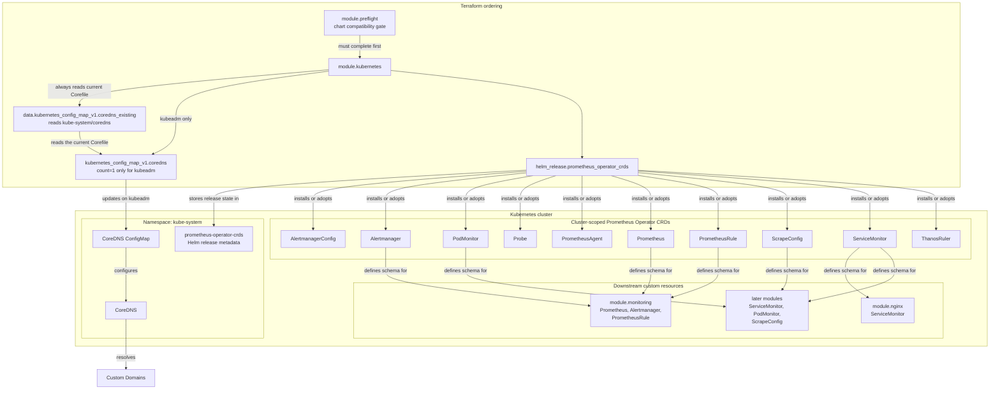
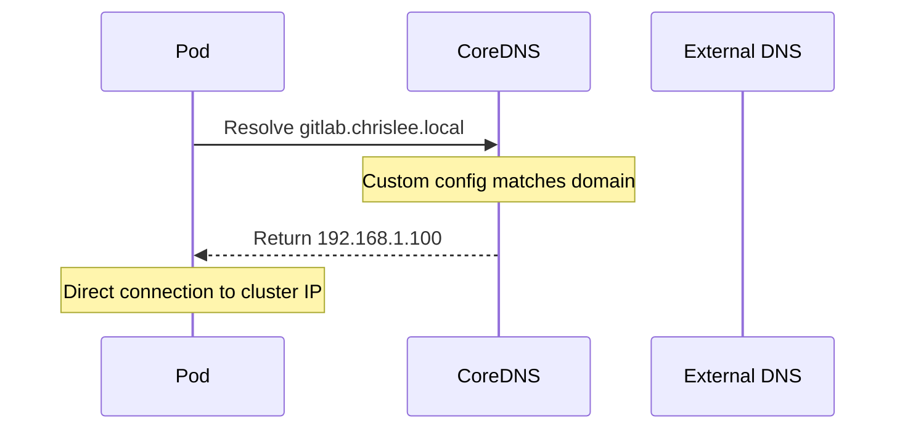

# Kubernetes Module

Terraform module for core Kubernetes configuration including custom CoreDNS settings and the standalone Prometheus Operator CRD release. The preflight module gates this module, and the remaining cluster modules depend on it directly or through the Stage 2 dependency chain.

## Architecture



## Components

### CoreDNS Custom Configuration

Resolves hairpin NAT issues by configuring CoreDNS to route specific domains directly to the cluster IP instead of through external DNS.



### Prometheus Operator CRDs

The `prometheus-operator-crds` Helm release installs all ten cluster-scoped Prometheus Operator CRDs before any module that creates ServiceMonitor, PrometheusRule, or related resources.

The release runs in `kube-system`. `take_ownership=true` allows it to adopt existing CRDs, and each CRD receives `helm.sh/resource-policy=keep` so replacing or removing the release does not delete the CRDs and their stored custom resources.

kube-prometheus-stack sets `crds.enabled=false`, making this standalone release the sole CRD owner.

`keep` also survives teardown: a Stage 2 `terraform destroy` leaves the ten CRDs and their stored custom resources on the cluster, and a later chart release that drops a CRD orphans it rather than deleting it. Removing them is a deliberate manual step.

Reverting to stack-managed CRDs is likewise not a plain revert. Setting `crds.enabled=true` again fails with an ownership metadata error until `meta.helm.sh/release-name` and `meta.helm.sh/release-namespace` are rewritten on each of the ten CRDs.

## Resources Created

- `kubernetes_config_map_v1.coredns` - Modified CoreDNS configuration (kubeadm only)
- `helm_release.prometheus_operator_crds` - Standalone Prometheus Operator CRD chart in `kube-system`

## Variables

| Name | Description | Default |
|------|-------------|---------|
| `kubernetes_cluster_type` | Cluster type (kubeadm, k3s, minikube) | `kubeadm` |
| `kubernetes_override_domains` | Space-delimited domains for CoreDNS | `gitlab.chrislee.local registry.chrislee.local minio.chrislee.local` |
| `kubernetes_override_ip` | IP address for custom domain resolution | `192.168.1.100` |

## Usage

### Initial Setup (New Cluster)

For a new cluster, the CoreDNS ConfigMap must be imported first:

```bash
cd stage2
terraform import 'module.kubernetes.kubernetes_config_map_v1.coredns[0]' kube-system/coredns
```

### Configure Custom Domains

Set in Terraform Cloud or `.env`:

```bash
TF_VAR_kubernetes_override_domains="gitlab.chrislee.local registry.chrislee.local minio.chrislee.local"
TF_VAR_kubernetes_override_ip="192.168.1.100"
```

## Prometheus CRDs Installed

| CRD | Purpose |
|-----|---------|
| `alertmanagerconfigs.monitoring.coreos.com` | AlertManager configuration |
| `alertmanagers.monitoring.coreos.com` | AlertManager instances |
| `podmonitors.monitoring.coreos.com` | Pod metrics scraping |
| `probes.monitoring.coreos.com` | Blackbox probing |
| `prometheusagents.monitoring.coreos.com` | Prometheus agents |
| `prometheuses.monitoring.coreos.com` | Prometheus instances |
| `prometheusrules.monitoring.coreos.com` | Alerting rules |
| `scrapeconfigs.monitoring.coreos.com` | Scrape configurations |
| `servicemonitors.monitoring.coreos.com` | Service metrics scraping |
| `thanosrulers.monitoring.coreos.com` | Thanos rulers |

## References

- [CoreDNS Documentation](https://coredns.io/manual/toc/)
- [Prometheus Operator](https://prometheus-operator.dev/)
- [prometheus-operator-crds chart](https://github.com/prometheus-community/helm-charts/tree/main/charts/prometheus-operator-crds)
- [Helm resource keep policy](https://helm.sh/docs/howto/charts_tips_and_tricks/#tell-helm-not-to-uninstall-a-resource)
