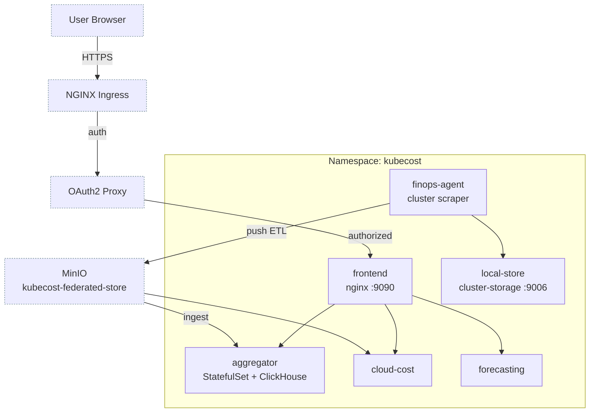

# Kubecost Module

Terraform module for deploying [Kubecost](https://www.kubecost.com/) to Kubernetes. Provides real-time cost visibility and insights for Kubernetes workloads, helping optimize resource allocation and reduce cloud spending.

Kubecost 3.x has no Prometheus dependency. The FinOps agent scrapes the cluster and pushes ETL files to a MinIO bucket, and the aggregator reads that bucket back to answer queries.

## Architecture



## Features

- Real-time Kubernetes cost monitoring
- Cost allocation by namespace, deployment, label
- Savings recommendations and optimization insights
- OAuth2 proxy protection

## Resources Created

- `kubernetes_namespace_v1.kubecost` - Dedicated namespace
- `kubernetes_secret_v1.federated_store` - S3 credentials for the federated store bucket
- `helm_release.kubecost` - Kubecost Helm chart deployment

## Variables

| Name | Description | Default |
|------|-------------|---------|
| `minio_endpoint` | In-cluster S3 endpoint for MinIO | (required) |
| `minio_access_key` | MinIO tenant user access key | (required) |
| `minio_secret_key` | MinIO tenant user secret key | (required, sensitive) |
| `minio_bucket_name` | Bucket holding federated ETL data | `kubecost-federated-store` |
| `kubecost_cluster_id` | Identity stamped on this cluster's ETL records | `cluster-one` |
| `kubecost_storage_class_name` | Storage class for the Kubecost volumes | `longhorn` |
| `kubecost_ingress_enable_tls` | Enable TLS for ingress | `true` |
| `kubecost_ingress_class_name` | Ingress class name | `nginx` |
| `kubecost_ingress_host` | Ingress hostname | `cost.chrislee.local` |
| `auth_oauth2_proxy_host` | OAuth2 proxy host for authentication | `auth.chrislee.local` |

## Usage

The bucket named by `minio_bucket_name` must exist before apply. It is provisioned by the MinIO tenant via `minio_tenant_default_buckets` in `stage2/variables.tf`.

```bash
task stage2:terraform:apply
```

Then browse to `https://cost.chrislee.local` (or your configured `kubecost_ingress_host`).

### Verify

```bash
kubectl -n kubecost get deploy,sts
```

Six workloads should be Ready: the `aggregator` StatefulSet plus the `cloud-cost`, `frontend`, `local-store`, `forecasting`, and `finopsagent` Deployments. A `cloud-cost` or `aggregator` crash loop citing `federated-store.yaml` means the S3 credentials or endpoint are wrong.

## Helm Chart

| Property | Value |
|----------|-------|
| Repository | <https://kubecost.github.io/kubecost> |
| Chart | kubecost |

The pre-3.0 `cost-analyzer` chart lives at a different repository and is not interchangeable. The module directory is deliberately not named `kubecost`: the Helm provider resolves a chart name to a local path before consulting the repository, so a sibling directory of that name shadows the remote chart.

## References

- [Kubecost Documentation](https://docs.kubecost.com/)
- [Kubecost Helm Chart](https://github.com/kubecost/kubecost)
- [Cost Allocation Guide](https://docs.kubecost.com/using-kubecost/cost-allocation)
