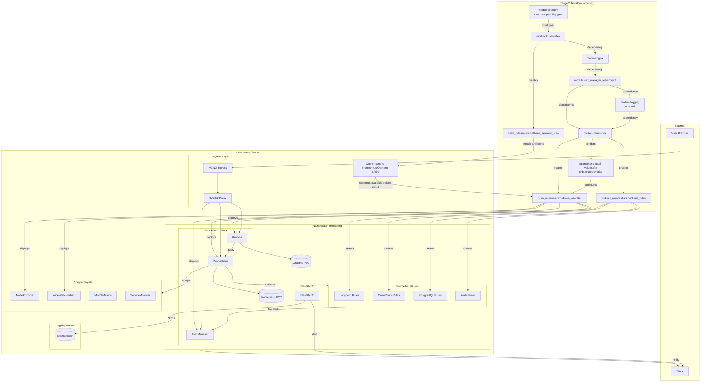
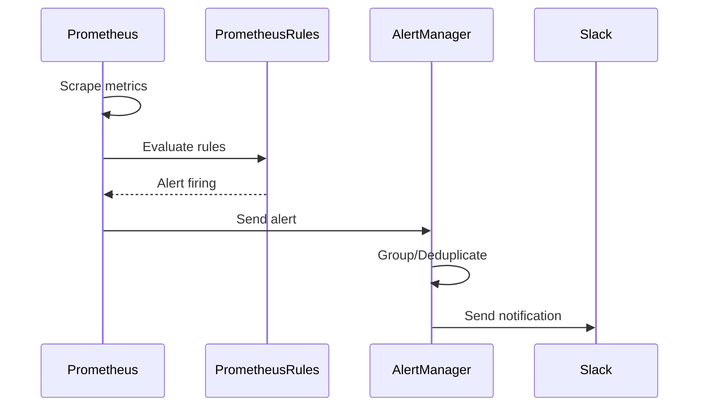

# Monitoring Module

Terraform module for deploying the [Prometheus Stack](https://prometheus.io/) (Prometheus, Grafana, AlertManager) and [ElastAlert2](https://elastalert2.readthedocs.io/) to Kubernetes. Prometheus Operator CRDs are owned by the standalone chart in the [Kubernetes module](kubernetes.md); this module disables the stack chart's CRD installation.

## Architecture



## Alert Flow



## CRD Ownership

`module.kubernetes.helm_release.prometheus_operator_crds` is the only Terraform resource that installs and owns Prometheus Operator CRDs. The preflight gate verifies that its chart and this module's `kube-prometheus-stack` chart package the same Prometheus Operator version before Terraform can begin the cluster dependency chain.

The stack values set `crds.enabled=false`. Do not enable it while the standalone release exists, because that would create two Helm releases claiming responsibility for the same cluster-scoped objects.

## Resources Created

- `kubernetes_namespace_v1.monitoring_namespace` - Dedicated namespace
- `kubernetes_secret_v1.frontend_basic_auth` - Basic auth for UIs
- `random_password.grafana_admin_password` - Grafana admin password
- `kubectl_manifest.prometheus_rules` - Custom PrometheusRules
- `helm_release.prometheus_operator` - kube-prometheus-stack
- `kubernetes_secret_v1.elastalert2_credentials` - ElastAlert2 credentials
- `kubernetes_secret_v1.elastalert2_config` - ElastAlert2 configuration
- `helm_release.elastalert2` - ElastAlert2 chart

## Variables

### Prometheus Stack

| Name | Description | Default |
|------|-------------|---------|
| `nginx_frontend_basic_auth_base64` | Basic auth credentials | (required, sensitive) |
| `prometheus_alertmanager_domain` | AlertManager hostname | `alertmanager.chrislee.local` |
| `prometheus_grafana_domain` | Grafana hostname | `grafana.chrislee.local` |
| `prometheus_grafana_storage_class` | Grafana storage class | `longhorn` |
| `prometheus_ingress_class_name` | Ingress class | `nginx` |
| `prometheus_ingress_enable_tls` | Enable TLS | `true` |
| `prometheus_prometheus_domain` | Prometheus hostname | `prometheus.chrislee.local` |
| `prometheus_persistence_storage_class_name` | Storage class | `longhorn` |
| `prometheus_persistence_size` | Prometheus storage size | `10Gi` |
| `prometheus_alertmanager_slack_channel` | Slack channel for alerts | (required) |
| `prometheus_alertmanager_slack_credentials` | Slack bot token (`xoxb-`) with the `chat:write` scope | (required, sensitive) |
| `prometheus_minio_job_bearer_token` | MinIO metrics token | (required, sensitive) |

### ElastAlert2

| Name | Description | Default |
|------|-------------|---------|
| `elastalert2_elasticsearch_enabled` | Enable ElastAlert2 | `true` |
| `elastalert2_elasticsearch_host` | Elasticsearch host | (from logging module) |
| `elastalert2_elasticsearch_port` | Elasticsearch port | (from logging module) |
| `elastalert2_elasticsearch_username` | Elasticsearch username | (from logging module) |
| `elastalert2_elasticsearch_password` | Elasticsearch password | (from logging module, sensitive) |

## Usage

### Configure Slack Alerts

Alertmanager posts through the Slack Web API (`chat.postMessage`), not an incoming webhook, so the credential is a bot token and the bot has to be a member of the target channel. Give the channel name without a leading `#`, the template adds it.

```bash
TF_VAR_prometheus_alertmanager_slack_channel="alerts"
TF_VAR_prometheus_alertmanager_slack_credentials="xoxb-..."
```

Each alert group keeps one Slack message. The first notification posts it, and every later notification for the same group rewrites it via `chat.update`, so the resolve and the 12h repeat both land as edits rather than new messages. An edit does not ping. Two gaps follow and are accepted deliberately: a second instance of the same alert in the same namespace joins the group and arrives as a silent edit, and an alert that resolves and re-fires while the message reference is still held is edited back to red without pinging. `alertname` is in the group key so that different rules at least never collide this way. Alertmanager holds the reference in its notification log for twice the repeat interval, on an `emptyDir` volume that is lost when the pod is replaced, and either expiry starts a fresh message. Deleting an alert message in Slack stops that group notifying until the reference expires, because the failed edit is not retried and never falls back to posting.

### Access Dashboards

| Service | URL | Authentication |
|---------|-----|----------------|
| Grafana | <https://grafana.chrislee.local> | OAuth2 + Admin password |
| Prometheus | <https://prometheus.chrislee.local> | OAuth2 |
| AlertManager | <https://alertmanager.chrislee.local> | OAuth2 |

### Get Grafana Admin Password

```bash
kubectl -n monitoring get secret kube-prometheus-stack-grafana -o jsonpath="{.data.admin-password}" | base64 -d
```

## Helm Charts

| Component | Repository | Chart |
|-----------|------------|-------|
| Prometheus Stack | prometheus-community | kube-prometheus-stack |
| ElastAlert2 | jertel | elastalert2 |

## PrometheusRules

Custom alerting rules are defined in `prometheus-rules/`:

| File | Purpose |
|------|---------|
| `longhorn-rules.tftpl` | Longhorn storage alerts |
| `omniroute-rules.tftpl` | OmniRoute AI gateway alerts |
| `postgres-rules.tftpl` | PostgreSQL database alerts |
| `redis-rules.tftpl` | Redis cache alerts |

## Pre-configured Dashboards

Grafana includes dashboards for:

- Kubernetes cluster overview
- Node metrics
- Pod resources
- Persistent volumes
- NGINX Ingress
- CoreDNS
- GitLab (if enabled)

## References

- [Prometheus Documentation](https://prometheus.io/docs/)
- [Grafana Documentation](https://grafana.com/docs/)
- [AlertManager Documentation](https://prometheus.io/docs/alerting/latest/alertmanager/)
- [kube-prometheus-stack Chart](https://github.com/prometheus-community/helm-charts/tree/main/charts/kube-prometheus-stack)
- [ElastAlert2 Documentation](https://elastalert2.readthedocs.io/)
