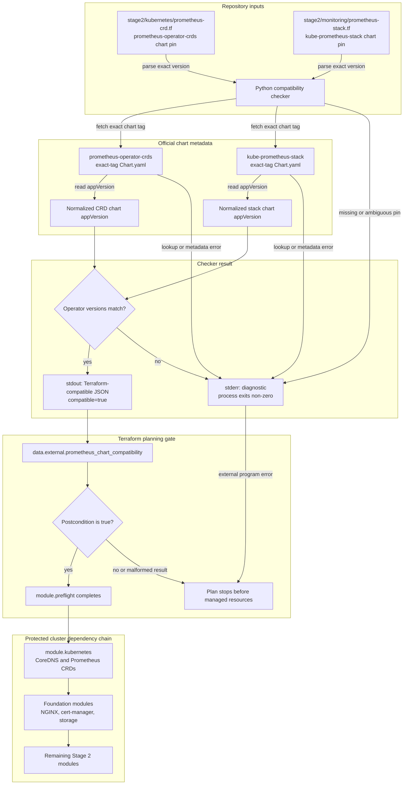

# Preflight Module

Terraform module for checking cross-module compatibility before Stage 2 creates or changes cluster resources. It currently verifies that the standalone Prometheus CRD chart and kube-prometheus-stack package the same Prometheus Operator version.

## Architecture



## How It Works

The checker reads the chart pins from `stage2/kubernetes/prometheus-crd.tf` and `stage2/monitoring/prometheus-stack.tf`, fetches the official `Chart.yaml` for each exact chart release, removes an optional leading `v` from each `appVersion`, and requires the resulting Prometheus Operator versions to match.

Terraform invokes the checker through `data.external.prometheus_chart_compatibility`. Its postcondition accepts only a successful result containing `compatible=true`. `module.kubernetes` depends on this module, so a failed external program or postcondition stops the plan before the CRD release or any downstream module can change the cluster.

The metadata lookup requires outbound HTTPS access to GitHub. Failure to resolve either exact chart tag is a hard failure because compatibility cannot be established without both official `appVersion` values.

## Resources Created

This module creates no infrastructure. It declares one read-only Terraform object:

- `data.external.prometheus_chart_compatibility`: Runs the compatibility checker during Terraform planning.

## Variables

This module has no input variables.

## Outputs

| Name | Description |
|---|---|
| `prometheus_operator_version` | Prometheus Operator version packaged by both compatible charts. |

## Usage

The module runs automatically during every normal Stage 2 plan and apply.

Run the same check directly from the repository root:

```bash
task stage2:preflight:check
```

Successful output identifies both charts, their packaged Prometheus Operator versions, and the final compatibility result. A version mismatch, missing pin, ambiguous pin, invalid chart metadata, or failed metadata request exits non-zero.

## Failure Modes

| Failure | Result |
|---|---|
| A chart pin is missing or appears more than once | The checker exits non-zero before any metadata request. |
| An exact chart tag or its `Chart.yaml` cannot be read | The checker exits non-zero because compatibility is unknown. |
| The two normalized `appVersion` values differ | The checker reports both Operator versions and exits non-zero. |
| Terraform mode returns malformed or incompatible JSON | The external data source or its postcondition fails. |
| Both versions match and the result is valid | `module.preflight` completes and releases the Stage 2 dependency chain. |

## References

- [Terraform data sources](https://developer.hashicorp.com/terraform/language/data-sources)
- [Terraform custom conditions](https://developer.hashicorp.com/terraform/language/expressions/custom-conditions)
- [External provider data source](https://registry.terraform.io/providers/hashicorp/external/latest/docs/data-sources/external)
- [Helm `appVersion`](https://helm.sh/docs/topics/charts/#the-appversion-field)
- [prometheus-operator-crds chart](https://github.com/prometheus-community/helm-charts/tree/main/charts/prometheus-operator-crds)
- [kube-prometheus-stack chart](https://github.com/prometheus-community/helm-charts/tree/main/charts/kube-prometheus-stack)
