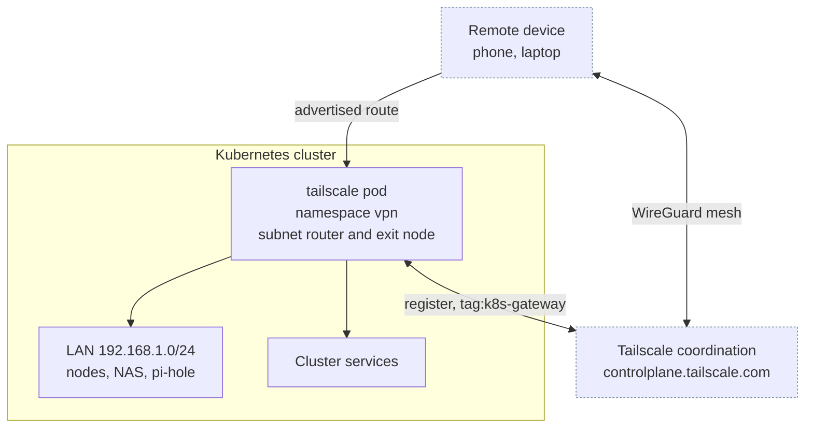

# Tailscale

The [Tailscale](https://tailscale.com/) half of the `stage2/vpn/` module. One pod joins the tailnet as a subnet router and exit node, so a device anywhere can reach the LAN without a port forward. Defined in `stage2/vpn/tailscale.tf`.

Distinct from the stage 1 [`tailscale_node`](../stage1/roles/tailscale-node.md) role, which installs tailscaled on the hosts themselves for node-to-node transport. The two carry different tags and different tailnet access. Do not reuse one's auth key for the other.

The [WireGuard](wireguard.md) backend lives in the same module and the same `vpn` namespace, but the two are gated independently and neither depends on the other.

## Architecture



The pod runs with `TS_USERSPACE=false`, so it uses kernel networking and needs the `/dev/net/tun` host path, `privileged`, and `NET_ADMIN` plus `NET_RAW`. A `sysctler` init container enables IPv4 and IPv6 forwarding, without which a subnet router forwards nothing.

## Resources created

| Resource | Name | Purpose |
|---|---|---|
| `kubernetes_secret_v1.tailscale_auth_key` | `tailscale-auth-key` | Holds the auth key, read by the pod as `TS_AUTH_KEY` |
| `kubernetes_service_account_v1.tailscale` | `tailscale-sa` | Identity for the state secret writes |
| `kubernetes_role_v1.tailscale` | `tailscale` | `create` on secrets, plus `get`, `update`, `patch` on `tailscale-secret` |
| `kubernetes_role_binding_v1.tailscale` | `tailscale` | Binds the two |
| `kubernetes_deployment_v1.tailscale` | `tailscale` | Single replica, `tailscale/tailscale:v1.92.5` |

The `vpn` namespace is created unconditionally in `stage2/vpn/namespace.tf` and carries `prevent_destroy = true`, so it survives even with both backends off.

`tailscale-secret` is not Terraform-managed. The pod creates it itself through the Role above and stores its node key, profile and machine key there, which is what `TS_KUBE_SECRET` selects.

## Variables

Defaults are the ones in `stage2/variables.tf`, since `stage2/main.tf` always passes the root value through to the module.

| Name | Description | Default |
|---|---|---|
| `tailscale_enable` | Create the Tailscale resources | `false` |
| `tailscale_auth_key` | Auth key from the admin console | required, sensitive, no default |
| `tailscale_advertise_routes` | Routes advertised to the tailnet, comma separated | `192.86.0.0/24` |
| `hostname_prefix` | Prefix for the tailnet machine name, no trailing dash | `homelab` |
| `tailscale_timezone` | Container timezone | `Australia/Melbourne`, not settable |

`tailscale_auth_key` has no default and `stage2/main.tf` always evaluates the module, so a value is required even when `tailscale_enable` is `false`.

`tailscale_timezone` exists only in `stage2/vpn/variables.tf`. `stage2/main.tf` does not pass it and `stage2/variables.tf` declares no matching root variable, so `TF_VAR_tailscale_timezone` has no effect. Changing it means editing the module default.

The module's own `tailscale_advertise_routes` default differs from the root's. It is dead, for the same reason: the root value always wins.

## Machine name and tag

The device registers as `<hostname_prefix>-gateway`, fixed by the module rather than separately configurable. Naming it after the host it happens to run on would make the host itself lose that name, since [whichever device registers second is permanently suffixed](https://tailscale.com/kb/1098/machine-names).

`TS_EXTRA_ARGS` supplies the rest:

```text
--advertise-tags=tag:k8s-gateway --accept-routes --advertise-exit-node --advertise-routes=<tailscale_advertise_routes>
```

## Issuing the auth key

Do this before the first apply, and again whenever the key expires or the tag changes. Requires an Owner, Admin, IT admin or Network admin role on the tailnet.

**1. Define the tag first.** Key creation rejects a tag the policy does not define, so this is not optional and not last. On the [Access controls](https://console.tailscale.com/admin/acls) page, add `tag:k8s-gateway` to `tagOwners`. An empty owner list means the tag is implicitly owned by tailnet owners, admins and network admins.

```jsonc
"tagOwners": {
  "tag:k8s-gateway": [],  // this module
  "tag:k8s-node":    []   // the stage 1 tailscale_node role
}
```

Whatever access the gateway needs, grant it against `tag:k8s-gateway`. A device that registers with a tag no rule mentions joins successfully and then reaches nothing, which is harder to diagnose than a failed join.

**2. Open the [Keys](https://console.tailscale.com/admin/settings/keys) page** and select **Generate auth key**.

**3. Fill the form.**

| Field | Set to | Why |
|---|---|---|
| Description | `homelab tailscale gateway` | Optional, but keys are otherwise indistinguishable in the list |
| Reusable | **on** | The pod re-authenticates on every container start, see the warning below. A single-use key breaks the first restart |
| Expiration | **90** days | The maximum. The pod stops being able to start once it lapses, so shorter means more re-issues |
| Ephemeral | **off** | Ephemeral devices are removed once they go offline. A subnet router that reboots must come back as the same device |
| Tags | on, `tag:k8s-gateway` | Must match `--advertise-tags` exactly, see the warning below |

**4. Select Generate key**, then copy the `tskey-auth-...` value immediately.

**5. Store it** as the `TF_VAR_tailscale_auth_key` Bitwarden secret, not `tailscale_auth_key`, which is the stage 1 node key and carries a different tag:

```bash
bws secret create TF_VAR_tailscale_auth_key "tskey-auth-..." "$BWS_PROJECT_ID"
```

**6. Apply stage 2**, then approve the advertised routes and the exit node offer for the new device on the [Machines](https://console.tailscale.com/admin/machines) page. An advertised route is inert until approved.

## Gotchas

!!! danger "The pod logs in again on every restart, so the key is not a one-shot bootstrap credential"

    [`containerboot`](https://github.com/tailscale/tailscale/blob/v1.92.5/cmd/containerboot/main.go) documents `TS_AUTH_ONCE` as "if true, only attempt to log in if not already logged in. If false, the default, for backwards compatibility, forcibly log in every time the container starts." This module does not set it, and `tailscaleUp` appends `--authkey=` whenever the key is non-empty.

    Two consequences. The key must be reusable, and it must still be valid every time the pod restarts. Auth keys cap at 90 days, so a working deployment fails to start at some arbitrary later date with an expired key and no other change to explain it.

    Setting `TS_AUTH_ONCE=true` would confine the key to genuine first logins and let the state in `tailscale-secret` carry the rest. The module does not currently do this.

!!! danger "Renaming the tag needs a new auth key, not just a new `--advertise-tags`"

    [Tailscale's tag documentation](https://tailscale.com/kb/1068/tags) is explicit: "the requested tags must either exactly match the full set of tags on the OAuth client or auth key, or each requested tag must be owned by one of the authenticating entity's tags as defined in the `tagOwners` section." The same page's limitations add that you cannot change tags with `--advertise-tags` on a key-authenticated device, and must generate a new key instead.

    So changing `--advertise-tags` in `stage2/vpn/tailscale.tf` alone produces `requested tags [...] are invalid or not permitted` on every start, and a `CrashLoopBackOff` with the VPN down. Order the change: define the tag in `tagOwners`, migrate the access rules, issue a key carrying the new tag, then edit the Terraform.

!!! warning "`--accept-routes` here is safe only because the pod is not on the advertised subnet"

    The stage 1 role sets `tailscale_node_accept_routes` to `false` because a host inside the advertised `/24` that accepts routes sends its own directly-connected LAN traffic into the tunnel and goes dark. This pod advertises `192.168.1.0/24` while sitting on the cluster pod network, outside that range, so it has no such conflict. Do not read the two settings as a contradiction, and do not copy this one onto a node.

!!! note "Node key expiry is already off, because the device is tagged"

    Node keys otherwise expire every 180 days, which for a subnet router would mean the LAN going dark months later with nothing in the cluster to explain it. [Key expiry for tagged devices is disabled by default](https://tailscale.com/kb/1085/auth-keys#key-expiry-for-tagged-devices) and this module always passes `--advertise-tags`. Confirm it on the Machines page after the first join rather than assuming.

    This is separate from auth key expiry, which still applies and is covered above.

## Verifying

```bash
kubectl -n vpn logs deployment/tailscale
tailscale status
```

A healthy join logs `Startup complete, waiting for shutdown signal` and the device appears on the Machines page carrying `tag:k8s-gateway`.

## References

- [Tailscale on Kubernetes](https://tailscale.com/kb/1185/kubernetes/)
- [Subnet routers](https://tailscale.com/kb/1019/subnets/)
- [Group devices with tags](https://tailscale.com/kb/1068/tags)
- [Auth keys](https://tailscale.com/kb/1085/auth-keys)
