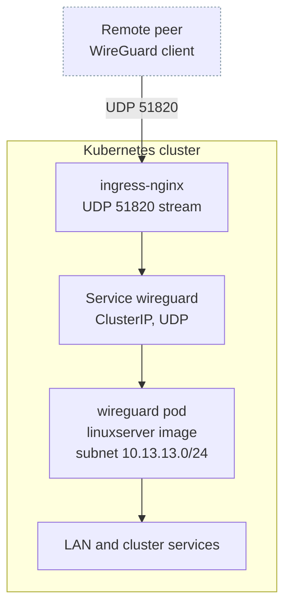

# WireGuard

The [WireGuard](https://www.wireguard.com/) half of the `stage2/vpn/` module. A single server pod hands out peer configurations for full-tunnel remote access. Defined in `stage2/vpn/wireguard.tf`.

Shares the `vpn` namespace with [Tailscale](tailscale.md), but the two are gated independently and neither depends on the other. Tailscale needs no inbound port and is the lower-friction option; WireGuard is the fallback for clients that cannot or should not join the tailnet.

## Architecture



The pod is `privileged` with `NET_ADMIN` and `SYS_MODULE`, and mounts the host's `/lib/modules` read-only so it can load the kernel module. A `sysctler` init container sets `net.ipv4.conf.all.src_valid_mark=1`, which WireGuard's own `wg-quick` requires when the traffic is source-NATed.

## Resources created

| Resource | Name | Notes |
|---|---|---|
| `kubernetes_persistent_volume_claim_v1.wireguard_config` | `wireguard-config` | 1Gi, `ReadWriteOnce`. See the warning below |
| `kubernetes_deployment_v1.wireguard` | `wireguard` | Single replica, `linuxserver/wireguard:1.0.20260223-r0-ls120` |
| `kubernetes_service_v1.wireguard` | `wireguard` | ClusterIP, UDP, `wireguard_port` to container 51820 |

All three are gated on `wireguard_enable`, so a disabled backend leaves no orphaned PVC behind. The `vpn` namespace itself is created unconditionally in `stage2/vpn/namespace.tf` and carries `prevent_destroy = true`.

## Variables

Defaults are the ones in `stage2/variables.tf`, since `stage2/main.tf` always passes the root value through.

| Name | Description | Default |
|---|---|---|
| `wireguard_enable` | Create the WireGuard resources | `false` |
| `wireguard_ingress_host` | Endpoint written into each peer config | `wireguard.chrislee.local` |
| `wireguard_timezone` | Container timezone | `Australia/Melbourne` |
| `wireguard_port` | UDP port, validated as 1 to 65535 | `51820` |
| `wireguard_peers` | Number of peer configs generated, validated as a positive integer | `3` |

Fixed in the module and not exposed: `INTERNAL_SUBNET` is `10.13.13.0`, `ALLOWEDIPS` is `0.0.0.0/0`, `PEERDNS` is `auto`, `PUID` and `PGID` are `1000`.

`ALLOWEDIPS=0.0.0.0/0` makes every generated config a full tunnel, so a connected peer sends all of its traffic here, not just cluster-bound traffic.

## Exposure through ingress-nginx

`stage2/main.tf` passes `wireguard_port` to the nginx module as well, which renders it into the `udp` stream map in `stage2/nginx/templates/nginx-values.tftpl`:

```yaml
udp:
  51820: "vpn/wireguard:51820"
```

One variable therefore moves the Service port and the ingress-nginx listener together. There is no separate port to keep in step.

## Usage

**1. Set the variables.**

```bash
TF_VAR_wireguard_enable=true
TF_VAR_wireguard_ingress_host="vpn.example.com"
TF_VAR_wireguard_peers=5
```

**2. Apply stage 2.**

**3. Read the peer configs out of the pod logs.** `LOG_CONFS=true` makes the image print each peer's configuration and a scannable QR code on startup:

```bash
kubectl -n vpn logs deployment/wireguard
```

## Gotchas

!!! danger "The config PVC is created but never mounted, so peer keys do not survive a restart"

    `stage2/vpn/wireguard.tf` declares the `wireguard-config` volume on the pod and binds the PVC, but the container has only one `volume_mount`, for `/lib/modules`. Nothing mounts the claim at `/config`.

    The image therefore generates its server and peer keys onto the container filesystem. Every restart produces a fresh set, which silently invalidates every peer config already distributed, and the PVC sits bound and empty. Treat distributed configs as valid only until the next restart until this is fixed.

!!! warning "Peer private keys are printed to the pod log"

    `LOG_CONFS=true` is how the configs are retrieved, and it is also how they reach anything scraping pod logs, including the [logging](logging.md) stack. Anyone who can read the log has a working full-tunnel credential.

!!! warning "`wireguard_ingress_host` has to resolve from outside"

    The value becomes the `Endpoint` in each generated peer config. The default `wireguard.chrislee.local` is a LAN name, so a config built with it works only from the LAN, which defeats the point. Set it to a publicly resolvable name or address before generating configs for remote use.

## References

- [WireGuard](https://www.wireguard.com/)
- [LinuxServer WireGuard image](https://docs.linuxserver.io/images/docker-wireguard/)
- [ingress-nginx UDP services](https://kubernetes.github.io/ingress-nginx/user-guide/exposing-tcp-udp-services/)
