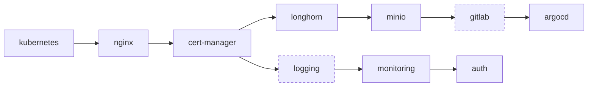

# Stage 2: deploy the platform

Terraform deploys 19 modules onto the cluster Stage 1 built.

## 1. Initialise

```bash
task docker:exec              # from the host, if you are not already in the container
task stage2:terraform:init    # terraform init, then select the homelab-k8s workspace
```

Every command on this page runs inside the container: that is where the pinned Terraform lives and
where `.bashrc` has injected the Bitwarden secrets. See [Task commands](../reference/tasks.md).

State lives in Terraform Cloud. The workspace must exist and your API token must be present before
`init` will succeed.

## 2. Plan

```bash
task stage2:terraform:plan
```

Read it. On a first run this is several hundred resources. Confirm the module set matches what you
expect, in particular that the gated modules you wanted are present and the ones you did not are
absent.

## 3. Apply

```bash
task stage2:terraform:apply
```

!!! warning "The first apply is slow, and that is normal"

    An hour or more. Two things dominate:

    **Certificate issuance.** cert-manager requests certificates from Let's Encrypt over HTTP-01,
    which needs DNS to resolve and the ingress to be reachable. Each certificate is a round trip.

    **Longhorn.** Volume creation and initial replica sync happen before dependent modules can bind
    their PVCs. MinIO waits on Longhorn, GitLab waits on MinIO.

    Re-running after a timeout is safe. Terraform picks up where it stopped.

## What gets deployed

Modules apply in `depends_on` order, not file order:



Full graph and the reason for every edge: [Module dependency graph](../stage2/dependency-graph.md).

## Enabling optional modules

Gated modules use `count = var.<name>_enable ? 1 : 0`, so a disabled module is simply not in the
plan. Set the flag as a `TF_VAR_*` secret in Bitwarden:

| Module | Variable | Default |
|---|---|---|
| Logging (ECK) | `logging_module_enable` | `true` |
| ArgoCD Image Updater | `argocd_image_updater_enable` | `false` |
| Datadog | `datadog_enable` | `false` |
| Cloudflare Tunnel | `cloudflare_tunnel_enable` | `false` |
| Sealed Secrets | `sealed_secrets_enable` | `true` |
| LiteLLM | `litellm_enable` | `false` |
| OmniRoute | `omniroute_enable` | `false` |
| Tailscale | `tailscale_enable` | `false` |
| WireGuard | `wireguard_enable` | `false` |

GitLab is not flag-gated. It deploys when `host_machine_architecture == "amd64"` and is skipped
otherwise.

!!! tip "Start small"

    The always-on set plus GitLab is already a lot of cluster. Get that healthy first, then enable
    optional modules one at a time so a failure is attributable.

## Other commands

```bash
task stage2:terraform:refresh       # reconcile state with reality
task stage2:terraform:init:upgrade  # bump providers within their constraints
task stage2:terraform:init:lock     # regenerate multi-platform provider lock files
```

`init:lock` must run inside the container. It produces `darwin_arm64` and `linux_amd64` hashes so
the same lock file works on macOS and in CI.

## Next

[Verify the install](verify.md)
