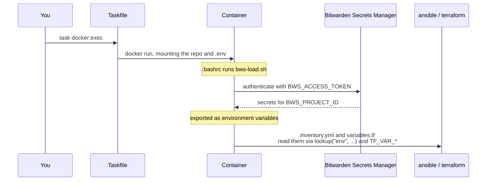

# Stage 0: environment and secrets

No secrets live in this repository. They live in Bitwarden Secrets Manager and are injected into the
tooling container at runtime.



## 1. Create the `.env`

```bash
cp .env.example .env
```

It holds exactly two values:

```bash
BWS_ACCESS_TOKEN=<machine-account access token>
BWS_PROJECT_ID=<id from `bws project list`>
```

!!! danger "`.env` is gitignored and must stay that way"

    `gitleaks` runs as a pre-commit hook and will catch a committed token, but do not rely on it.
    Everything else (SSH hosts, domains, Auth0 credentials, every `TF_VAR_*`) belongs in
    Bitwarden, not here.

## 2. Populate Bitwarden

Follow [Bitwarden secrets](../operations/bitwarden-secrets.md) for the full per-variable reference.
The minimum set to get through Stage 1:

| Secret | Example | Notes |
|---|---|---|
| `kubernetes_cluster_type` | `kubeadm` | or `k3s`; `minikube` is experimental |
| `server_ssh_host` | `192.168.1.100` | |
| `server_ssh_user` | `ubuntu` | |
| `server_ssh_port` | `2222` | must match the sshd port you set |
| `host_machine_architecture` | `amd64` | the control plane's architecture |
| `worker_hosts_json` | `[]` | JSON array; `[]` means single-node |

!!! warning "Values are stored flattened"

    Bitwarden does no `${...}` interpolation. Write the final value, not a template referring to
    another secret.

## 3. Install local dependencies

```bash
task repo:setup
```

Installs pre-commit hooks, Ansible Galaxy collections and the Python requirements. On macOS,
`task repo:setup:mac` handles the Homebrew prerequisites first.

## 4. Build and enter the container

```bash
task docker:build
task docker:exec
```

`docker:exec` starts the container if needed and drops you into bash. On entry, `.bashrc` runs
`bws-load.sh`, which authenticates to Bitwarden and exports every secret in the project.

Verify the injection worked:

```bash
/srv# echo "$kubernetes_cluster_type"    # kubeadm
/srv# echo "$server_ssh_host"            # 192.168.1.100
```

!!! bug "Empty output means the secrets did not load"

    An empty value here will not fail loudly later: `inventory.yml` falls back to hardcoded
    defaults like `192.168.1.100`, port `22` and user `ubuntu`. You will get a confusing SSH failure
    instead of a clear configuration error. Check this before moving on.

## Next

[Stage 1: provision the cluster](provision-cluster.md)
