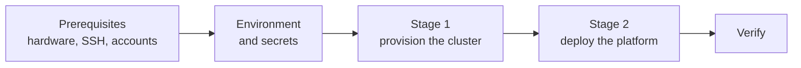

# Get started

Five steps from a bare Ubuntu box to a running platform.

| Step | Roughly | What you end up with |
|---|---|---|
| [Prerequisites](prerequisites.md) | 30 min | A reachable Ubuntu host with key-based SSH on a non-default port |
| [Environment and secrets](environment.md) | 30 min | A working tooling container with secrets injected from Bitwarden |
| [Stage 1: provision the cluster](provision-cluster.md) | 30–60 min | A hardened host running Kubernetes, with a local kubeconfig |
| [Stage 2: deploy the platform](deploy-platform.md) | 60+ min | GitLab, ArgoCD, monitoring, storage, ingress with TLS |
| [Verify the install](verify.md) | 15 min | Confidence that all of the above actually works |

!!! tip "Everything runs in a container"

    You do not install kubectl, helm, terraform or ansible on your machine. `task docker:build` builds an Alpine image with all of them pinned, and `task docker:exec` drops you into it. The only things you need locally are Docker and [Task](https://taskfile.dev/).

!!! warning "Read this before Stage 1"

    Stage 1 hardens hosts: it enables UFW, removes snapd, disables swap and may reboot to enable memory cgroups. Run it against a machine you are willing to have reconfigured, not your daily driver.

## Adding cloud machines later

[Cloud (Stage 0)](../stage0/index.md) is a separate, optional Terraform root that creates machines in a cloud account and joins them to a tailnet. It produces workers rather than a control plane, so it runs against a cluster the five steps above already built, not ahead of them. The order of operations is the [Oracle free tier worker](../operations/oracle-free-tier-worker.md) runbook.
