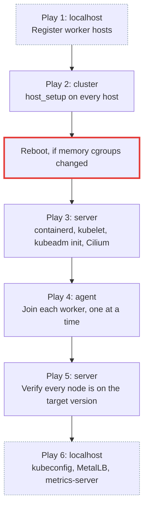

# Stage 1: provision the cluster

Turns a bare Ubuntu host into a Kubernetes control plane, and joins any workers you declared.

!!! danger "This reconfigures the host"

    Stage 1 enables UFW, removes every snap and purges snapd, disables swap, and may **reboot** to enable memory cgroups. Run it against a machine you are willing to have reconfigured.

## 1. Verify connectivity

```bash
task stage1:ansible:ping
```

Every host must answer `pong`. A failure here is SSH or inventory, never Kubernetes. Check that `server_ssh_port` matches the port you configured and that your key is in `authorized_keys`.

## 2. Dry run

```bash
task stage1:ansible:playbook:check
```

Runs with `--check --diff`: connects over SSH, changes nothing, shows what would change.

!!! note "False errors in check mode are expected"

    Bootstrap tasks report errors under `--check` because later tasks read files that earlier tasks would have created. A clean `--check` is not a prerequisite; a clean `task stage1:ansible:syntax` is more informative.

## 3. Run it

```bash
task stage1:ansible:playbook
BECOME password: <the ubuntu user's sudo password>
```

Expect 30–60 minutes on a first run.

## What you will see



| Play | Expect |
|---|---|
| 1 | Instant. `skipping: no hosts matched` in plays 4 and 5 later means `worker_hosts_json` was empty. |
| 2 | The longest non-Kubernetes part. Package installs and snapd removal dominate. **May reboot.** |
| 3 | containerd, runc, CNI, crictl, nerdctl, then `kubeadm init`, then Cilium. |
| 4 | One worker at a time. Skipped for a single-node cluster. |
| 5 | Fast, unless it fails, in which case nothing converged. |
| 6 | Fetches the kubeconfig, installs MetalLB and metrics-server. |

At the end, `.kube/config` is written to `container/root/.kube/config`, which the tooling container mounts. `kubectl` inside `task docker:exec` works with no further setup.

Full detail: [The site.yml playbook](../stage1/playbook.md).

## If it fails

`any_errors_fatal: true` stops the whole run on the first failure, deliberately: a half-upgraded control plane must not be followed by worker plays.

The playbook is idempotent, so the recovery procedure is almost always: fix the cause, re-run the same command. Completed work is detected and skipped.

| Symptom | Look at |
|---|---|
| SSH failures | [Inventory and groups](../stage1/inventory.md), and whether the secrets actually loaded |
| `kubeadm init` cgroup preflight error | The reboot in play 2 did not happen. See [Handlers](../stage1/handlers.md) |
| Locked out of a host after play 2 | UFW opened the wrong port; check `port` in `worker_hosts_json` |
| A worker never becomes Ready | [`kubeadm_agent`](../stage1/roles/kubeadm-agent.md) |
| Anything else | [Troubleshooting](../operations/troubleshooting.md) |

To re-run only part of it, see [Tags and partial runs](../stage1/tags.md).

## Next

[Stage 2: deploy the platform](deploy-platform.md)
