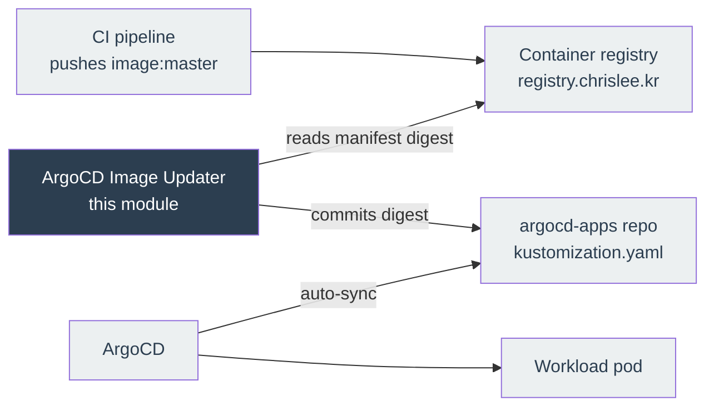
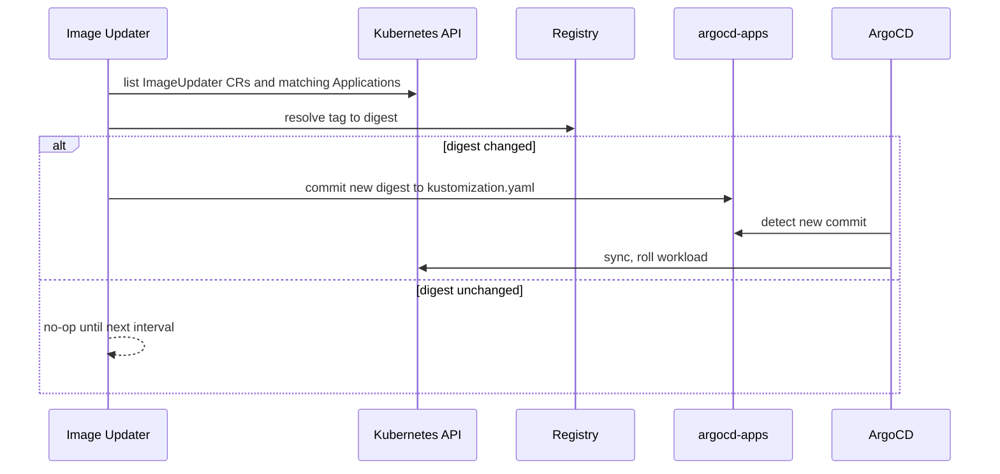

# ArgoCD Image Updater Module

Deploys [ArgoCD Image Updater](https://argocd-image-updater.readthedocs.io/en/stable/) into the ArgoCD namespace.

CI pushes container images under a mutable tag such as `:master`. The rendered ArgoCD manifest still says `:master`, so ArgoCD compares it against the live state, sees no change, and never rolls the workload. Image Updater closes that gap: it polls the registry, resolves the mutable tag to its current digest, and commits that digest back into the GitOps repository. ArgoCD then syncs normally, and the deployed version becomes a git commit that can be reverted.

As of v1.x, Image Updater is a Kubernetes controller driven by the `ImageUpdater` custom resource. The ArgoCD API-server mode of the 0.x line is gone, so no ArgoCD account or token is needed. The CRs themselves live in `argocd-apps`, not here; this module owns only the controller and its credentials.

## Architecture



## How It Works



The default poll interval is 2 minutes. The `digest` update strategy fetches exactly one manifest per cycle, unlike `newest-build`, which fetches one per candidate tag.

## Resources Created

- `helm_release.argocd_image_updater` — the controller, plus the `ImageUpdater` CRD and RBAC
- `kubernetes_secret_v1.container_registry_creds` — registry read credentials, consumed by `registries.conf`
- `kubernetes_secret_v1.argocd_apps_git_creds` — git write-back credentials

The namespace is **not** created here. It is owned by the `argocd` module and passed in, because that module guards it with `prevent_destroy`.

## Variables

| Name | Description | Type | Default |
| --- | --- | --- | --- |
| `argocd_namespace` | Namespace holding ArgoCD, the Application CRs and the ImageUpdater CRs | `string` | required |
| `container_registry_prefix` | Registry host to scan; must match the image prefix in the app manifests | `string` | `registry.chrislee.kr` |
| `container_registry_api_url` | Registry API base URL | `string` | `https://registry.chrislee.kr` |
| `container_registry_credentials` | `username:token`; GitLab deploy token with `read_registry` | `string` (sensitive) | required |
| `argocd_apps_git_username` | Username for the write-back token | `string` | `argocd-image-updater` |
| `argocd_apps_git_password` | GitLab project access token on `argocd-apps` with `write_repository` | `string` (sensitive) | required |

## Usage

Set the credentials in `.env` (gitignored) or as Terraform Cloud workspace variables:

```bash
TF_VAR_container_registry_credentials="<deploy-token-user>:<deploy-token>"
TF_VAR_argocd_apps_git_password="<project-access-token>"
```

Then apply from `stage2`. Per-application image configuration is **not** set here — it lives in `argocd-apps` as `ImageUpdater` custom resources.

`registries.conf` is read only at controller startup, so a change to the registry settings rolls the pod. That is intended.

## Helm Chart

| Field | Value |
| --- | --- |
| Repository | `https://argoproj.github.io/argo-helm` |
| Chart | `argocd-image-updater` |
| Version | `1.2.4` |
| App Version | `v1.2.2` |

`crds.keep` is enabled, so `terraform destroy` leaves the `ImageUpdater` CRD in the cluster. Remove it by hand if a full teardown is wanted.

## References

- <https://argocd-image-updater.readthedocs.io/en/stable/>
- <https://github.com/argoproj-labs/argocd-image-updater>
- <https://github.com/argoproj/argo-helm/tree/main/charts/argocd-image-updater>
