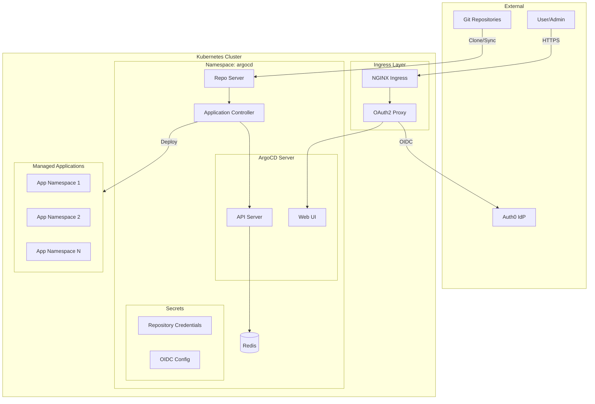
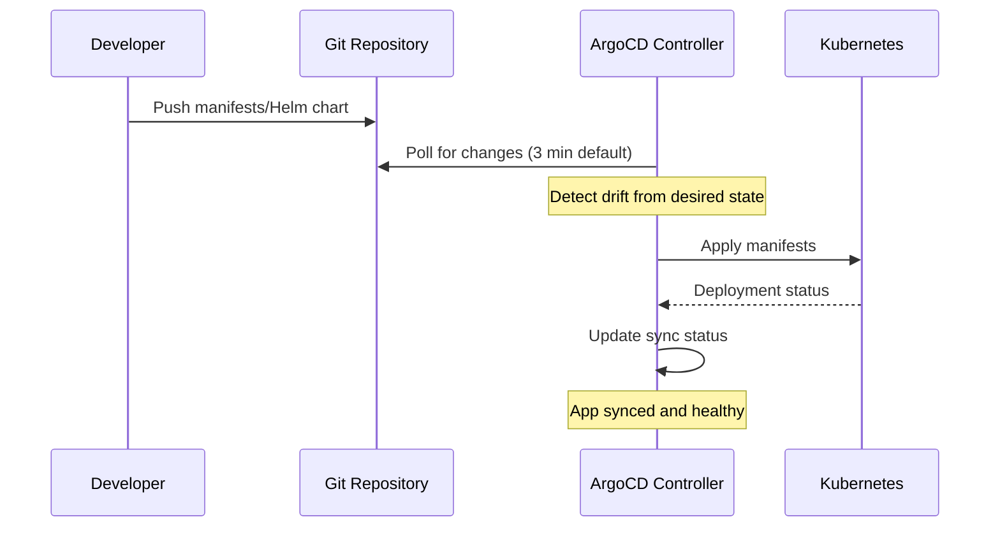

# ArgoCD Module

Terraform module for deploying [ArgoCD](https://argo-cd.readthedocs.io/) GitOps continuous deployment platform to Kubernetes. Enables declarative, version-controlled application deployments with automatic synchronization from Git repositories.

## Architecture



## GitOps Flow



## Resources Created

- `kubernetes_namespace.argocd` - Dedicated namespace
- `kubernetes_secret.argocd_auth0_oidc_secret` - Auth0 OIDC credentials
- `kubernetes_config_map.argocd_rbac_cm` - RBAC configuration
- `helm_release.argo_cd` - ArgoCD Helm chart
- `data.kubernetes_secret.argocd_initial_admin_secret` - Initial admin password

## Variables

| Name | Description | Default |
|------|-------------|---------|
| `prometheus_namespace` | Namespace for ServiceMonitor | `monitoring` |
| `global_ingress_enable_tls` | Enable TLS for ingress | `true` |
| `nginx_frontend_basic_auth_base64` | Basic auth credentials | (required, sensitive) |
| `argocd_domain` | ArgoCD hostname | `argocd.chrislee.local` |
| `argocd_ingress_class_name` | Ingress class | `nginx` |
| `argocd_ssh_known_hosts_base64` | SSH known hosts (base64) | `""` |
| `argocd_config_repositories` | Repository configurations | `[]` |
| `argocd_rbac_policy_default` | Default RBAC policy | `role:readonly` |
| `argocd_rbac_policy_csv` | RBAC policy CSV | `""` |
| `auth_oauth2_proxy_host` | OAuth2 proxy host | `auth.chrislee.local` |
| `argocd_auth0_domain` | Auth0 domain | `chrislee.auth0.com` |
| `argocd_auth0_client_id` | Auth0 client ID | `""` |
| `argocd_auth0_client_secret` | Auth0 client secret | (required, sensitive) |

## Usage

### 1. Configure Auth0 OIDC

Create a Regular Web Application in Auth0:

- Allowed Callback URLs: `https://argocd.chrislee.local/auth/callback`
- Allowed Logout URLs: `https://argocd.chrislee.local`

### 2. Configure Variables

```bash
TF_VAR_argocd_domain="argocd.chrislee.local"
TF_VAR_argocd_auth0_domain="your-tenant.auth0.com"
TF_VAR_argocd_auth0_client_id="your-client-id"
TF_VAR_argocd_auth0_client_secret="your-client-secret"
```

### 3. Configure Repositories

```bash
TF_VAR_argocd_config_repositories_json_encoded='[
  {
    "name": "my-repo",
    "type": "git",
    "url": "git@gitlab.chrislee.local:group/repo.git",
    "usernameSecret": {"key": "username", "name": "repo-credential"},
    "passwordSecret": {"key": "password", "name": "repo-credential"}
  }
]'
```

### 4. Get Initial Admin Password

```bash
kubectl -n argocd get secret argocd-initial-admin-secret -o jsonpath="{.data.password}" | base64 -d
```

### 5. Access Dashboard

Navigate to `https://argocd.chrislee.local`

## Helm Chart

| Property | Value |
|----------|-------|
| Repository | <https://argoproj.github.io/argo-helm> |
| Chart | argo-cd |

## RBAC Configuration

Default policy can be customized:

```bash
# Grant admin to specific group
TF_VAR_argocd_rbac_policy_csv="g, my-group, role:admin"

# Set default role
TF_VAR_argocd_rbac_policy_default="role:readonly"
```

## Application Example

```yaml
apiVersion: argoproj.io/v1alpha1
kind: Application
metadata:
  name: my-app
  namespace: argocd
spec:
  project: default
  source:
    repoURL: git@gitlab.chrislee.local:group/repo.git
    targetRevision: HEAD
    path: manifests
  destination:
    server: https://kubernetes.default.svc
    namespace: my-app
  syncPolicy:
    automated:
      prune: true
      selfHeal: true
```

## References

- [ArgoCD Documentation](https://argo-cd.readthedocs.io/)
- [ArgoCD Helm Chart](https://github.com/argoproj/argo-helm/tree/main/charts/argo-cd)
- [Auth0 OIDC Setup](https://argo-cd.readthedocs.io/en/stable/operator-manual/user-management/auth0/)
- [RBAC Configuration](https://argo-cd.readthedocs.io/en/stable/operator-manual/rbac/)
