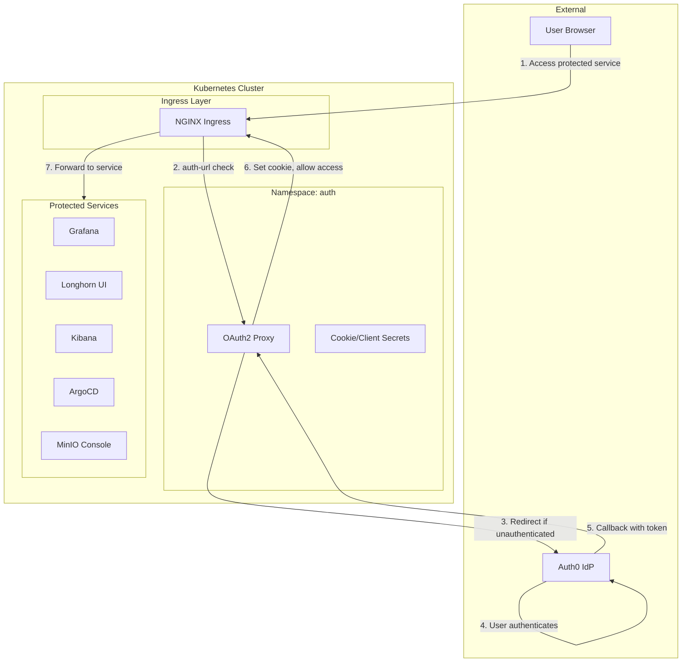
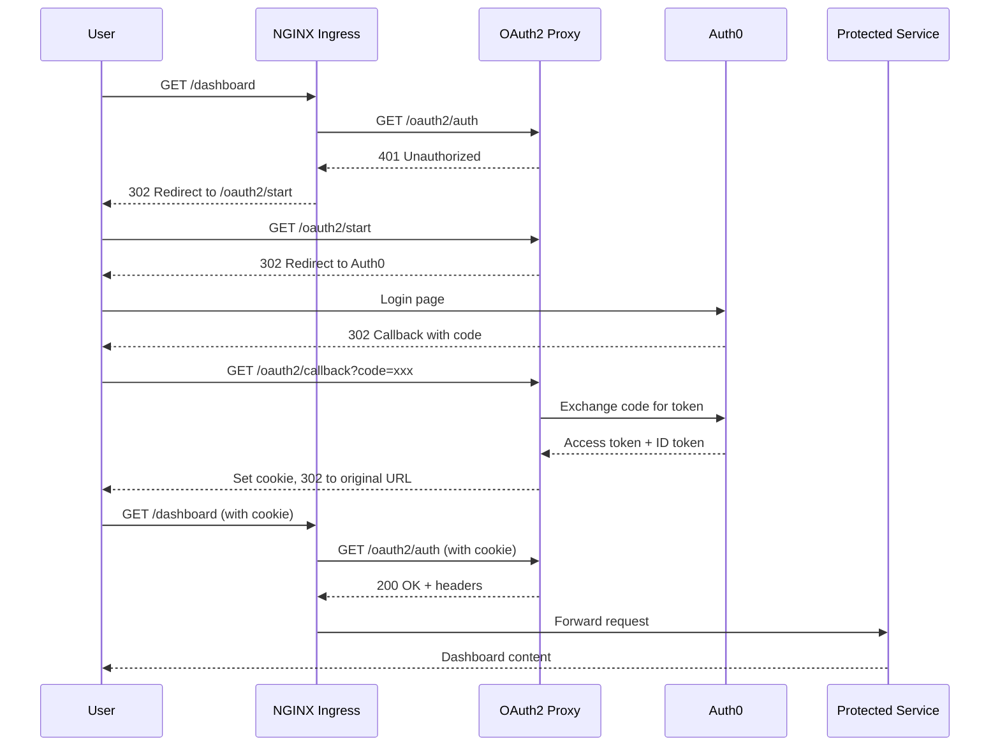

# OAuth2 Proxy Authentication Module

Terraform module for deploying [OAuth2 Proxy](https://oauth2-proxy.github.io/oauth2-proxy/) with Auth0 integration to Kubernetes. Provides centralized authentication for all protected services using OIDC.

## Architecture



## Authentication Flow



## Resources Created

- `kubernetes_namespace.auth_namespace` - Dedicated namespace
- `random_password.oauth2_proxy_cookie_secret` - Cookie encryption secret
- `kubernetes_secret.oauth2_proxy_cookie_secret` - Credentials secret
- `helm_release.oauth2_proxy` - OAuth2 Proxy Helm chart

## Variables

| Name | Description | Default |
|------|-------------|---------|
| `prometheus_namespace` | Namespace for ServiceMonitor | `monitoring` |
| `auth_ingress_class_name` | Ingress class | `nginx` |
| `auth_ingress_enable_tls` | Enable TLS | `true` |
| `auth_oauth2_proxy_host` | Proxy hostname | `auth.chrislee.local` |
| `auth_oauth2_proxy_cookie_domains` | Cookie domains (JSON array) | `[".chrislee.local"]` |
| `auth_oauth2_proxy_whitelist_domains` | Allowed redirect domains | `["*.chrislee.local"]` |
| `auth_auth0_domain` | Auth0 tenant domain | `chrislee.auth0.com` |
| `auth_auth0_client_id` | Auth0 application client ID | `""` |
| `auth_auth0_client_secret` | Auth0 application client secret | (required, sensitive) |
| `auth_host_alias_ip` | Host alias IP for internal resolution | `""` |
| `auth_host_alias_hostnames` | Host alias hostnames | `""` |

## Usage

### 1. Configure Auth0 Application

1. Create a Regular Web Application in Auth0
2. Set Allowed Callback URLs: `https://auth.chrislee.local/oauth2/callback`
3. Set Allowed Logout URLs: `https://auth.chrislee.local`
4. Copy Client ID and Client Secret

### 2. Configure Variables

```bash
TF_VAR_auth_auth0_domain="your-tenant.auth0.com"
TF_VAR_auth_auth0_client_id="your-client-id"
TF_VAR_auth_auth0_client_secret="your-client-secret"
TF_VAR_auth_oauth2_proxy_host="auth.chrislee.local"
TF_VAR_auth_oauth2_proxy_cookie_domains='[".chrislee.local"]'
```

### 3. Protect a Service

Add these annotations to any Ingress:

```yaml
metadata:
  annotations:
    nginx.ingress.kubernetes.io/auth-url: "https://auth.chrislee.local/oauth2/auth"
    nginx.ingress.kubernetes.io/auth-signin: "https://auth.chrislee.local/oauth2/start?rd=$scheme://$host$escaped_request_uri"
    nginx.ingress.kubernetes.io/auth-response-headers: "X-Auth-Request-User,X-Auth-Request-Email,X-Auth-Request-Access-Token"
```

## Helm Chart

| Property | Value |
|----------|-------|
| Repository | <https://oauth2-proxy.github.io/manifests> |
| Chart | oauth2-proxy |

## Protected Services

The following services use OAuth2 Proxy for authentication:

| Service | Ingress Host |
|---------|--------------|
| Grafana | grafana.chrislee.local |
| Longhorn | longhorn.chrislee.local |
| Kibana | kibana.chrislee.local |
| ArgoCD | argocd.chrislee.local |
| MinIO Console | minio-console.chrislee.local |
| Kubecost | cost.chrislee.local |
| LLM Gateway | llm.chrislee.local |

## References

- [OAuth2 Proxy Documentation](https://oauth2-proxy.github.io/oauth2-proxy/)
- [Auth0 Integration](https://oauth2-proxy.github.io/oauth2-proxy/configuration/providers/auth0)
- [NGINX Ingress External Auth](https://kubernetes.github.io/ingress-nginx/examples/auth/oauth-external-auth/)
