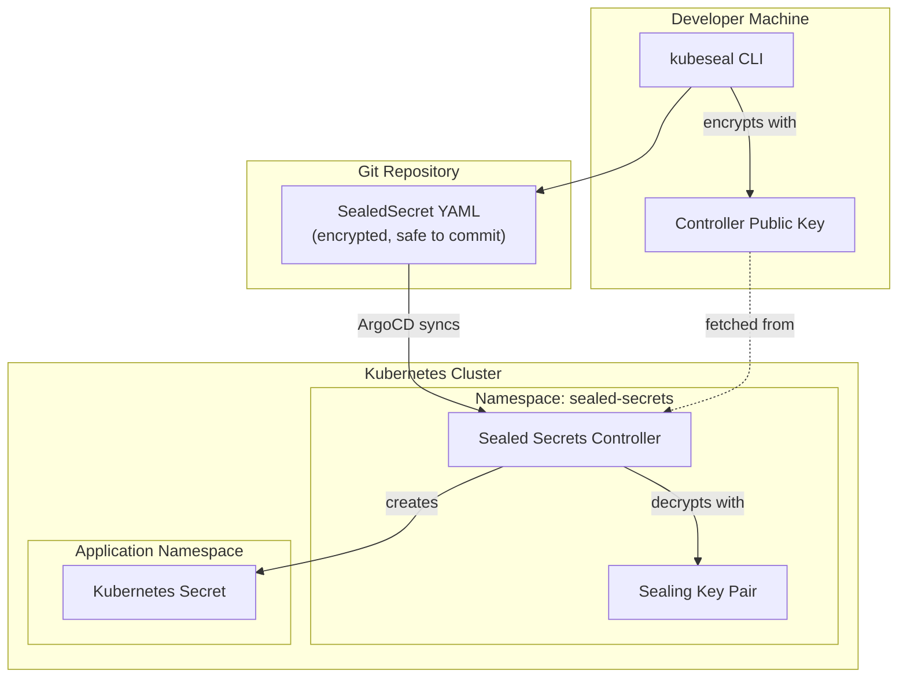
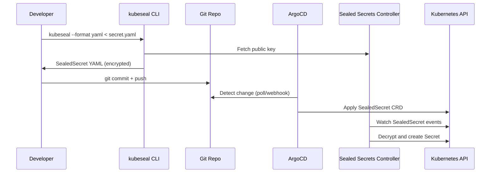

# Sealed Secrets Module

Terraform module for deploying [Bitnami Sealed Secrets](https://github.com/bitnami-labs/sealed-secrets) controller to Kubernetes. Enables GitOps-native secret management by encrypting secrets client-side and decrypting them in-cluster.

## Architecture



## How It Works



## Resources Created

- `kubernetes_namespace_v1.sealed_secrets_namespace` — Dedicated namespace
- `helm_release.sealed_secrets` — Sealed Secrets Helm chart

## Variables

| Name | Description | Default |
|------|-------------|---------|
| `sealed_secrets_key_renewal_period` | Key renewal period | `720h` (30 days) |

## Usage

### Seal a new secret

```bash
# Create a regular secret YAML, then encrypt it
kubectl create secret generic my-secret \
  --namespace=my-app \
  --from-literal=API_KEY=supersecret \
  --dry-run=client -o yaml | \
  kubeseal \
    --controller-namespace sealed-secrets \
    --controller-name sealed-secrets-controller \
    --format yaml > my-sealed-secret.yaml
```

### Seal an existing secret from the cluster

```bash
kubectl get secret my-secret -n my-app -o yaml | \
  kubeseal \
    --controller-namespace sealed-secrets \
    --controller-name sealed-secrets-controller \
    --format yaml > my-sealed-secret.yaml
```

### Backup the sealing key (important!)

```bash
kubectl get secret -n sealed-secrets -l sealedsecrets.bitnami.com/sealed-secrets-key -o yaml > sealed-secrets-key-backup.yaml
```

## Helm Chart

| Property | Value |
|----------|-------|
| Repository | <https://bitnami-labs.github.io/sealed-secrets> |
| Chart | sealed-secrets |
| Version | 2.18.1 |
| App Version | 0.35.0 |

## References

- [Sealed Secrets GitHub](https://github.com/bitnami-labs/sealed-secrets)
- [ArgoCD Secret Management Best Practice](https://argo-cd.readthedocs.io/en/stable/operator-manual/secret-management/)
- [Helm Chart Values](https://github.com/bitnami-labs/sealed-secrets/blob/main/helm/sealed-secrets/values.yaml)
