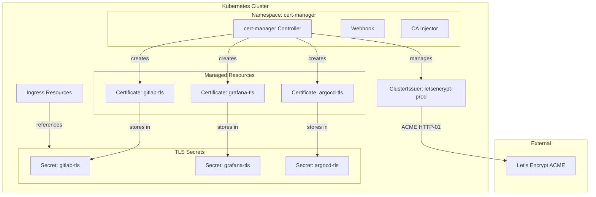
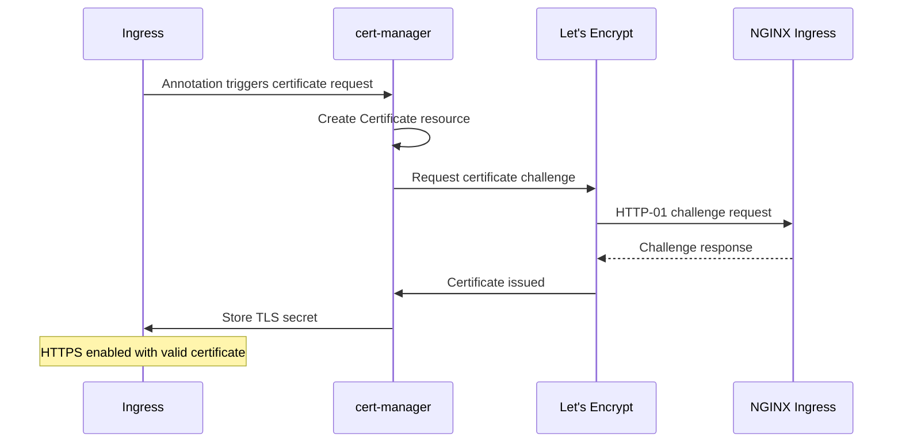

# Cert-Manager Let's Encrypt Module

Terraform module for deploying [cert-manager](https://cert-manager.io/) with Let's Encrypt integration to Kubernetes. Automatically provisions and renews TLS certificates for all ingress resources.

## Architecture



## Certificate Issuance Flow



## Resources Created

- `kubernetes_namespace.cert_manager` - Dedicated namespace
- `helm_release.cert_manager` - cert-manager Helm chart
- `kubectl_manifest.cluster_issuer` - Let's Encrypt ClusterIssuer

## Variables

| Name | Description | Default |
|------|-------------|---------|
| `cert_manager_acme_email` | Email for Let's Encrypt registration | `""` |
| `cert_manager_ingress_class` | Ingress class for HTTP-01 solver | `nginx` |
| `cert_manager_host_alias_ip` | Host alias IP (for internal resolution) | `""` |
| `cert_manager_host_alias_hostnames` | Host alias hostnames (comma-separated) | `""` |

## Usage

### Configure Let's Encrypt Email

Set in Terraform Cloud or `.env`:

```bash
TF_VAR_cert_manager_acme_email="admin@chrislee.local"
```

### Request Certificate via Ingress

Add annotation to any Ingress resource:

```yaml
metadata:
  annotations:
    cert-manager.io/cluster-issuer: "letsencrypt-prod"
spec:
  tls:
    - hosts:
        - myapp.chrislee.local
      secretName: myapp-tls
```

### Manual Certificate Resource

```yaml
apiVersion: cert-manager.io/v1
kind: Certificate
metadata:
  name: myapp-cert
  namespace: myapp
spec:
  secretName: myapp-tls
  issuerRef:
    name: letsencrypt-prod
    kind: ClusterIssuer
  dnsNames:
    - myapp.chrislee.local
```

## Helm Chart

| Property | Value |
|----------|-------|
| Repository | <https://charts.jetstack.io> |
| Chart | cert-manager |

## ClusterIssuer Configuration

| Property | Value |
|----------|-------|
| Name | letsencrypt-prod |
| ACME Server | https://acme-v02.api.letsencrypt.org/directory |
| Challenge Type | HTTP-01 |

## References

- [cert-manager Documentation](https://cert-manager.io/docs/)
- [Let's Encrypt](https://letsencrypt.org/)
- [ACME Protocol](https://datatracker.ietf.org/doc/html/rfc8555)
- [HTTP-01 Challenge](https://cert-manager.io/docs/configuration/acme/http01/)
