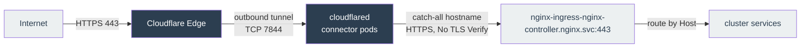

# Cloudflare Tunnel Module

Terraform module for deploying a remotely-managed [Cloudflare Tunnel](https://developers.cloudflare.com/cloudflare-one/connections/connect-networks/) connector (`cloudflared`) to Kubernetes. Exposes in-cluster services through Cloudflare's edge without inbound ports, bypassing ISP CGNAT.

## Architecture

This module runs **only the connector**. The tunnel definition, its public hostnames, DNS records, and Cloudflare Access policies are managed in the **Cloudflare dashboard**, not Terraform. The remotely-managed connector model keeps that config server-side and delivers it to the connector via the tunnel token, so Terraform needs only the token and never holds the routing config.

The single catch-all public hostname points at the ingress-nginx controller Service, and ingress-nginx routes by `Host` as usual.

## Requirements

- The cluster must reach Cloudflare outbound on **TCP 7844** (tunnel) and **443**.
- The NGINX module must be deployed first (`depends_on = [module.nginx]`).
- A tunnel token from the Cloudflare dashboard (see below).

## Configuration

| Variable | Description | Default |
|----------|-------------|---------|
| `cloudflare_tunnel_token` | Tunnel token (sensitive). Cloudflare issues it per tunnel. | *(required when enabled)* |
| `cloudflare_tunnel_chart_version` | `cloudflare-tunnel-remote` Helm chart version (pinned). | `0.1.2` |
| `cloudflare_tunnel_image_tag` | `cloudflared` image tag. Empty uses the chart default. | `""` |
| `cloudflare_tunnel_replica_count` | Number of replicas. HA only; do not autoscale (downscaling drops live connections). | `2` |

Enable the module with `cloudflare_tunnel_enable = true` (top-level variable, default `false`).

### Getting the tunnel token

Dashboard > Zero Trust > Networks > Tunnels > Create a tunnel > `cloudflared` > name it > Save. On the install screen, copy the value after `--token` (the long `eyJ...` string). Set it via `TF_VAR_cloudflare_tunnel_token`.

The token is marked `sensitive` and passed via Helm `set_sensitive`, so it stays out of plan/apply output. It is still written to Terraform state in cleartext — keep state on an encrypted, access-controlled backend.

## Chart

| Property | Value |
|----------|-------|
| Repository | <https://cloudflare.github.io/helm-charts> |
| Chart | cloudflare-tunnel-remote |
| Version | 0.1.2 |

## References

- [Cloudflare Tunnel docs](https://developers.cloudflare.com/cloudflare-one/connections/connect-networks/)
- [cloudflare/helm-charts](https://github.com/cloudflare/helm-charts) (chart: `cloudflare-tunnel-remote`)
- [cloudflared releases](https://github.com/cloudflare/cloudflared/releases)
