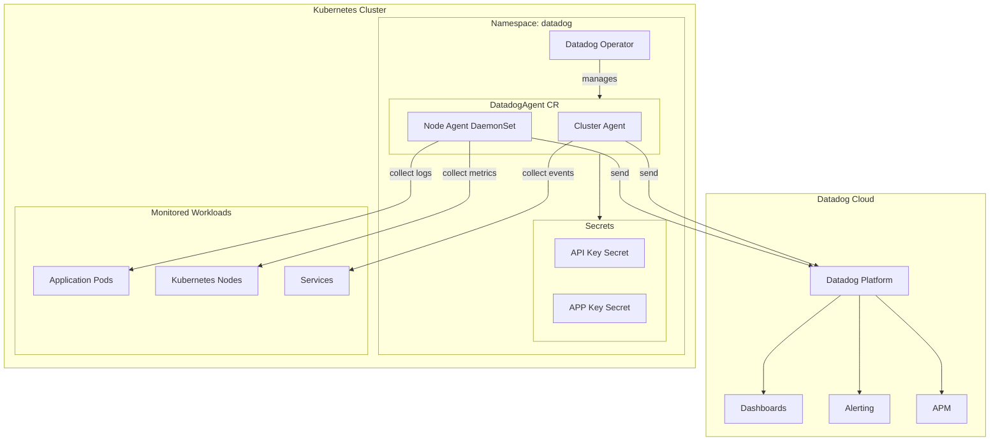
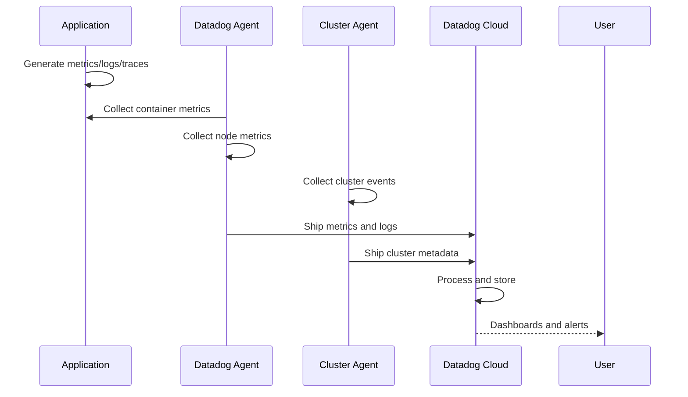

# Datadog Module

Terraform module for deploying [Datadog](https://www.datadoghq.com/) monitoring to Kubernetes using the Datadog Operator. Provides cloud-based infrastructure monitoring, APM, and log management as an alternative to self-hosted observability.

## Architecture



## Data Flow



## Resources Created

- `kubernetes_namespace.datadog` - Dedicated namespace
- `kubernetes_secret.datadog_api_key` - Datadog API key
- `kubernetes_secret.datadog_app_key` - Datadog APP key
- `helm_release.datadog_operator` - Datadog Operator
- `kubectl_manifest.datadog_agent` - DatadogAgent custom resource
- `kubectl_manifest.datadog_dashboard` - Pre-configured dashboard

## Variables

| Name | Description | Default |
|------|-------------|---------|
| `datadog_cluster_name` | Cluster identifier in Datadog | (required) |
| `datadog_site` | Datadog site (e.g., datadoghq.com, datadoghq.eu) | (required) |
| `datadog_api_key` | Datadog API key | (required, sensitive) |
| `datadog_app_key` | Datadog APP key | (required, sensitive) |

## Usage

### 1. Get Datadog Keys

1. Log in to [Datadog](https://app.datadoghq.com/)
2. Go to **Organization Settings** > **API Keys**
3. Create or copy an API key
4. Go to **Application Keys** and create an APP key

### 2. Enable Module

Set in Terraform Cloud or `.env`:

```bash
TF_VAR_datadog_enable=true
TF_VAR_datadog_cluster_name="homelab-k8s"
TF_VAR_datadog_site="datadoghq.com"  # or datadoghq.eu for EU
TF_VAR_datadog_api_key="your-api-key"
TF_VAR_datadog_app_key="your-app-key"
```

### 3. Deploy

```bash
cd stage2
terraform apply
```

### 4. Verify in Datadog Console

1. Go to **Infrastructure** > **Kubernetes**
2. Your cluster should appear within a few minutes
3. Check **Metrics** > **Explorer** for kubernetes.* metrics

## Helm Chart

| Property | Value |
|----------|-------|
| Repository | <https://helm.datadoghq.com> |
| Chart | datadog-operator |

## Features Enabled

| Feature | Description |
|---------|-------------|
| Infrastructure Monitoring | Node, pod, and container metrics |
| Log Collection | Container log aggregation |
| APM | Distributed tracing (requires app instrumentation) |
| Cluster Agent | Kubernetes events and metadata |
| Admission Controller | Auto-injection of tracing libraries |

## Datadog Sites

| Site | URL | Region |
|------|-----|--------|
| US1 | datadoghq.com | US |
| US3 | us3.datadoghq.com | US |
| US5 | us5.datadoghq.com | US |
| EU1 | datadoghq.eu | EU |
| AP1 | ap1.datadoghq.com | Asia-Pacific |

## Cost Considerations

Datadog pricing is based on:

- Number of hosts
- Log ingestion volume
- APM spans
- Custom metrics

For homelab use, consider:
- Free tier: 5 hosts, limited retention
- Reducing log volume with filtering
- Disabling APM if not needed

## References

- [Datadog Kubernetes Documentation](https://docs.datadoghq.com/containers/kubernetes/)
- [Datadog Operator](https://github.com/DataDog/datadog-operator)
- [Datadog Helm Charts](https://github.com/DataDog/helm-charts)
- [Kubernetes Integration](https://docs.datadoghq.com/integrations/kubernetes/)
