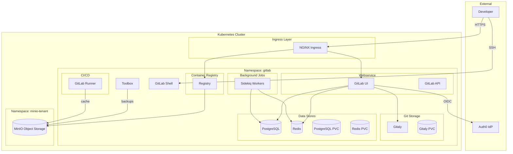
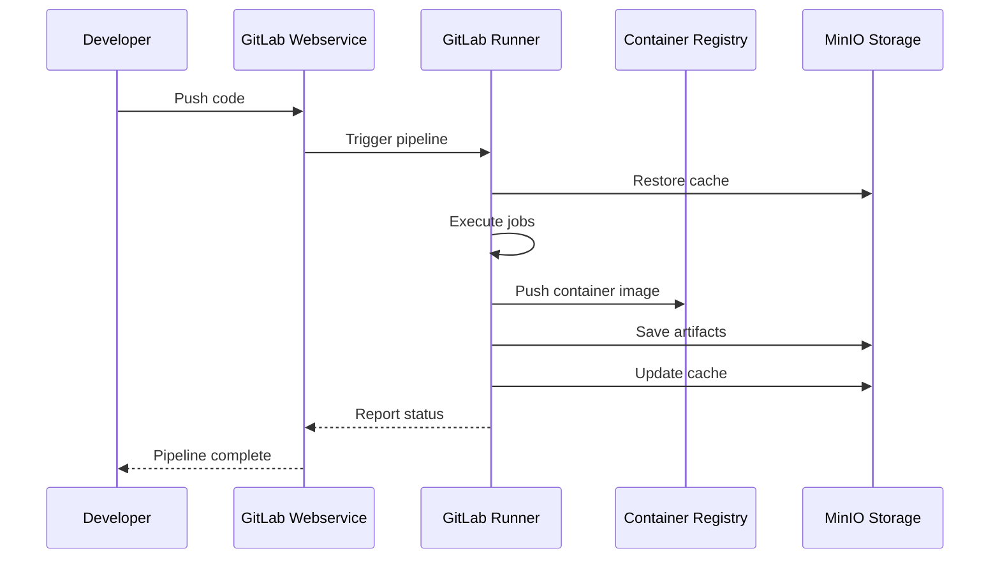

# GitLab Platform Module

Terraform module for deploying [GitLab](https://about.gitlab.com/) CI/CD platform to Kubernetes. Provides a complete DevOps platform including source control, CI/CD pipelines, container registry, and package registry with Auth0 SSO and MinIO object storage integration.

**Note**: GitLab only supports AMD64 architecture. This module is automatically skipped on ARM64 clusters.

## Architecture



## CI/CD Pipeline Flow



## Resources Created

### Namespace and Secrets

- `kubernetes_namespace.gitlab` - Dedicated namespace
- `kubernetes_secret.initial_root_password` - Root admin password
- `kubernetes_secret.redis_password` - Redis authentication
- `kubernetes_secret.postgresql_password` - PostgreSQL credentials
- `kubernetes_secret.rails_secret` - Rails encryption keys
- `kubernetes_secret.gitlab_shell_secret` - Shell authentication
- `kubernetes_secret.gitaly_secret` - Gitaly authentication
- `kubernetes_secret.gitlab_shell_host_keys` - SSH host keys
- `kubernetes_secret.gitlab_object_store_connection` - MinIO connection
- `kubernetes_secret.gitlab_registry_httpsecret` - Registry secret
- `kubernetes_secret.gitlab_registry_storage_secret` - Registry MinIO config
- `kubernetes_secret.gitlab_runner_s3_access` - Runner S3 credentials
- `kubernetes_secret.gitlab_toolbox_s3cmd` - Backup toolbox config
- `kubernetes_secret.gitlab_auth0_provider` - Auth0 OIDC config

### Helm Release

- `helm_release.gitlab` - GitLab Helm chart

## Variables

### Host Configuration

| Name | Description | Default |
|------|-------------|---------|
| `host_machine_architecture` | Architecture (amd64/arm64) | `amd64` |
| `gitlab_global_hosts_domain` | Base domain for GitLab | `chrislee.local` |
| `gitlab_global_hosts_host_suffix` | Subdomain suffix | `""` |
| `gitlab_global_hosts_https` | Use HTTPS | `true` |
| `gitlab_global_hosts_external_ip` | External LoadBalancer IP | `""` |

### Ingress Configuration

| Name | Description | Default |
|------|-------------|---------|
| `gitlab_global_ingress_provider` | Ingress provider | `nginx` |
| `gitlab_global_ingress_class` | Ingress class | `nginx` |
| `gitlab_global_ingress_enable_tls` | Enable TLS | `true` |
| `gitlab_certmanager_issuer_email` | Let's Encrypt email | `""` |

### MinIO Object Storage

| Name | Description | Default |
|------|-------------|---------|
| `gitlab_minio_host` | MinIO hostname | `minio.chrislee.local` |
| `gitlab_minio_endpoint` | MinIO endpoint URL | `http://minio.chrislee.local` |
| `gitlab_minio_use_https` | Use HTTPS for MinIO | `False` |
| `gitlab_minio_access_key` | MinIO access key | `minio-user` |
| `gitlab_minio_secret_key` | MinIO secret key | (from minio module, sensitive) |

### Persistence

| Name | Description | Default |
|------|-------------|---------|
| `gitlab_persistence_storage_class_name` | Storage class | `longhorn` |
| `gitlab_toolbox_backups_cron_persistence_size` | Backup PVC size | `20Gi` |
| `gitlab_toolbox_persistence_size` | Toolbox PVC size | `20Gi` |
| `gitlab_postgresql_primary_persistence_size` | PostgreSQL PVC size | `20Gi` |
| `gitlab_redis_master_persistence_size` | Redis PVC size | `20Gi` |
| `gitlab_gitlay_persistence_size` | Gitaly PVC size | `20Gi` |

### CI/CD Runner

| Name | Description | Default |
|------|-------------|---------|
| `gitlab_runner_authentication_token` | Runner auth token | `""` (sensitive) |

### Auth0 SSO

| Name | Description | Default |
|------|-------------|---------|
| `gitlab_auth0_client_id` | Auth0 client ID | `""` |
| `gitlab_auth0_client_secret` | Auth0 client secret | `""` (sensitive) |
| `gitlab_auth0_domain` | Auth0 domain | `chrislee.auth0.com` |

## Usage

### 1. Configure Auth0 Application

1. Create a Regular Web Application in Auth0
2. Set Allowed Callback URLs: `https://gitlab.chrislee.local/users/auth/auth0/callback`
3. Copy Client ID and Client Secret

### 2. Configure Variables

```bash
TF_VAR_gitlab_global_hosts_domain="chrislee.local"
TF_VAR_gitlab_auth0_domain="your-tenant.auth0.com"
TF_VAR_gitlab_auth0_client_id="your-client-id"
TF_VAR_gitlab_auth0_client_secret="your-client-secret"
```

### 3. Deploy

```bash
cd stage2
terraform apply
```

### 4. Get Root Password

```bash
kubectl -n gitlab get secret initial-root-password -o jsonpath="{.data.password}" | base64 -d
```

### 5. Access GitLab

Navigate to `https://gitlab.chrislee.local`

- Username: `root`
- Password: (from step 4)

### 6. Configure Runner Token

1. Go to **Admin** > **CI/CD** > **Runners**
2. Create a new instance runner
3. Copy the authentication token
4. Set `TF_VAR_gitlab_runner_authentication_token`
5. Run `terraform apply`

## Helm Chart

| Property | Value |
|----------|-------|
| Repository | <https://charts.gitlab.io/> |
| Chart | gitlab |

## Endpoints

| Service | URL |
|---------|-----|
| GitLab UI | <https://gitlab.chrislee.local> |
| Container Registry | <https://registry.chrislee.local> |
| SSH | ssh://git@gitlab.chrislee.local:22 |

## MinIO Buckets Used

| Bucket | Purpose |
|--------|---------|
| `registry` | Container images |
| `git-lfs` | Git LFS objects |
| `runner-cache` | CI runner cache |
| `gitlab-uploads` | User uploads |
| `gitlab-artifacts` | CI artifacts |
| `gitlab-backups` | Automated backups |
| `gitlab-packages` | Package registry |

## Backup and Restore

### Manual Backup

```bash
kubectl -n gitlab exec -it $(kubectl -n gitlab get pod -l app=toolbox -o name) -- backup-utility
```

### Scheduled Backups

Backups are configured to run via CronJob and stored in MinIO `gitlab-backups` bucket.

## Troubleshooting

### Registry Storage Full

Expand MinIO PVCs:

```bash
kubectl edit -n minio-tenant pvc data0-minio-tenant-pool-0-0
```

### Check Component Status

```bash
kubectl -n gitlab get pods
kubectl -n gitlab logs deployment/gitlab-webservice-default
```

## References

- [GitLab Helm Chart Documentation](https://docs.gitlab.com/charts/)
- [GitLab Installation Secrets](https://docs.gitlab.com/charts/installation/secrets.html)
- [GitLab Runner Helm Chart](https://docs.gitlab.com/runner/install/kubernetes.html)
- [Auth0 OmniAuth Provider](https://docs.gitlab.com/ee/integration/auth0.html)
