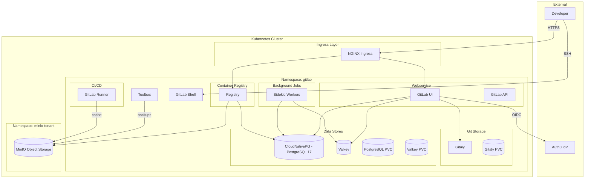
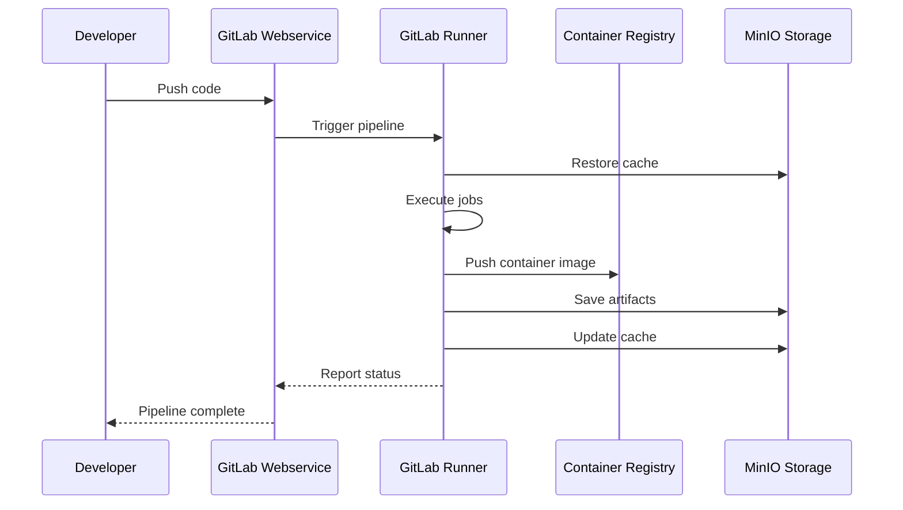

# GitLab Platform Module

Terraform module for deploying [GitLab](https://about.gitlab.com/) CI/CD platform to Kubernetes. Provides a complete DevOps platform including source control, CI/CD pipelines, container registry, and package registry with Auth0 SSO and MinIO object storage integration.

**Note**: GitLab only supports AMD64 architecture. This module is automatically skipped on ARM64 clusters.

## Architecture


```mermaid
flowchart TB
    subgraph external [External]
        User[Developer]
        Auth0[Auth0 IdP]
    end

    subgraph k8s [Kubernetes Cluster]
        subgraph ingress [Ingress Layer]
            Nginx[NGINX Ingress]
        end

        subgraph ns [Namespace: gitlab]
            subgraph webservice [Webservice]
                WebUI[GitLab UI]
                API[GitLab API]
            end

            subgraph sidekiq [Background Jobs]
                Sidekiq[Sidekiq Workers]
            end

            subgraph gitaly [Git Storage]
                Gitaly[Gitaly]
                GitalyPVC[(Gitaly PVC)]
            end

            subgraph registry [Container Registry]
                Registry[Registry]
            end

            subgraph runner [CI/CD]
                Runner[GitLab Runner]
            end

            subgraph data [Data Stores]
                PostgreSQL[(CloudNativePG - PostgreSQL 17)]
                Valkey[(Valkey)]
                PGSQLPVC[(PostgreSQL PVC)]
                ValkeyPVC[(Valkey PVC)]
            end

            Shell[GitLab Shell]
            Toolbox[Toolbox]
        end

        subgraph minio_ns [Namespace: minio-tenant]
            MinIO[(MinIO Object Storage)]
        end
    end

    User -->|HTTPS| Nginx
    Nginx --> WebUI
    Nginx --> Registry
    User -->|SSH| Shell

    WebUI --> PostgreSQL
    WebUI --> Valkey
    WebUI --> Gitaly
    Sidekiq --> PostgreSQL
    Sidekiq --> Valkey
    Registry --> PostgreSQL

    Registry --> MinIO
    Toolbox -->|backups| MinIO
    Runner -->|cache| MinIO

    WebUI -->|OIDC| Auth0
```

## CI/CD Pipeline Flow


```mermaid
sequenceDiagram
    participant Dev as Developer
    participant GitLab as GitLab Webservice
    participant Runner as GitLab Runner
    participant Registry as Container Registry
    participant MinIO as MinIO Storage

    Dev->>GitLab: Push code
    GitLab->>Runner: Trigger pipeline
    Runner->>MinIO: Restore cache
    Runner->>Runner: Execute jobs
    Runner->>Registry: Push container image
    Runner->>MinIO: Save artifacts
    Runner->>MinIO: Update cache
    Runner-->>GitLab: Report status
    GitLab-->>Dev: Pipeline complete
```

## Resources Created

### Namespace and Secrets

- `kubernetes_namespace.gitlab` - Dedicated namespace
- `kubernetes_secret.initial_root_password` - Root admin password
- `kubernetes_secret.valkey_password` - Valkey authentication, key named `default` per the ACL user
- `kubernetes_secret.postgresql_password` - PostgreSQL credentials
- `kubernetes_secret.rails_secret` - Rails encryption keys
- `kubernetes_secret.gitlab_shell_secret` - Shell authentication
- `kubernetes_secret.gitaly_secret` - Gitaly authentication
- `kubernetes_secret.gitlab_shell_host_keys` - SSH host keys
- `kubernetes_secret.gitlab_object_store_connection` - MinIO connection
- `kubernetes_secret.gitlab_registry_httpsecret` - Registry secret
- `kubernetes_secret.gitlab_registry_storage_secret` - Registry MinIO config
- `kubernetes_secret.gitlab_runner_s3_access` - Runner S3 credentials
- `kubernetes_secret.gitlab_toolbox_s3cmd` - Backup toolbox config
- `kubernetes_secret.gitlab_auth0_provider` - Auth0 OIDC config

### Storage

- `kubernetes_storage_class_v1.gitlab_backup_ephemeral` - `Delete`-reclaim class for the nightly backup's ephemeral volume

### Helm Release

- `helm_release.gitlab` - GitLab Helm chart
- `helm_release.cloudnative_pg` - CloudNativePG operator
- `helm_release.valkey` - Valkey, replacing the removed bundled Redis
- `kubectl_manifest.gitlab_postgres` - CNPG `Cluster`, replacing the removed bundled PostgreSQL

## Databases

Chart 10.0 removed the bundled PostgreSQL, Redis and MinIO subcharts, and the chart refuses to
render if `postgresql.install` or `redis.install` is present and truthy. MinIO was already external
via `stage2/minio-object-storage`; PostgreSQL and Redis moved here.

GitLab 19.0 sets `MINIMUM_POSTGRES_VERSION = 17`, so `imageName` is pinned deliberately: the CNPG
operator's own default is an 18.x image, and omitting the field silently provisions PostgreSQL 18.

| Service | Endpoint | Credentials |
|---|---|---|
| PostgreSQL | `gitlab-pg-rw.gitlab.svc.cluster.local:5432` | secret `postgresql-password`, key `postgresql-password` |
| Registry metadata DB | same host, database `registry` | secret `registry-database-password` |
| Valkey | `gitlab-valkey.gitlab.svc.cluster.local:6379` | secret `valkey-password`, key `default` |

The Valkey secret key is `default` rather than `password` because the chart looks up
`auth.aclUsers.<user>.passwordKey`, which defaults to the username, and `AUTH <password>` with no
username authenticates as the `default` ACL user.

### The CNPG Cluster

Defined in `postgres-cluster.tf`, which carries the rationale for the `monolith` import type and the
pinned `imageName`. `bootstrap.initdb.import` runs only once, at bootstrap: re-importing means
deleting the Cluster and its PVC first. `externalClusters` is consulted only during that import and
is inert afterwards.

`postImportApplicationSQL` is unsupported with `monolith`, so extensions must be added by hand after
an import.

### Operating it

`amcheck` is required by GitLab but absent from a fresh monolith import. Recreate it after any
re-import:

```bash
kubectl -n gitlab exec gitlab-pg-1 -- psql -U postgres -d gitlabhq_production \
  -c "CREATE EXTENSION IF NOT EXISTS amcheck;"
```

Before re-importing, scale `sidekiq`, `webservice`, `registry` and `kas` to zero. KAS writes to the
database and is easy to overlook; confirm with `pg_stat_activity`, not the pod list. Then delete the
Cluster and re-apply.

`backup-utility` does **not** cover the `registry` database: Rails' `database.yml` declares only the
`main` and `ci` connections, both on `gitlabhq_production`, and `gitlab-backup` iterates those
connections. Dump `registry` separately before any migration. Restores also abort on a version
mismatch — `lib/backup/restore/preconditions.rb` compares the backup's GitLab version to the running
one by exact string equality — so a backup is only usable against the exact version that produced it.

## Variables

### Host Configuration

| Name | Description | Default |
|------|-------------|---------|
| `gitlab_global_hosts_domain` | Base domain for GitLab | `chrislee.local` |
| `gitlab_global_hosts_host_suffix` | Subdomain suffix | `""` |
| `gitlab_global_hosts_https` | Use HTTPS | `true` |
| `gitlab_global_hosts_external_ip` | External LoadBalancer IP | `""` |
| `gitlab_time_zone` | GitLab application timezone | `Australia/Melbourne` |

### Ingress Configuration

| Name | Description | Default |
|------|-------------|---------|
| `gitlab_global_ingress_provider` | Ingress provider | `nginx` |
| `gitlab_global_ingress_class` | Ingress class | `nginx` |
| `gitlab_global_ingress_enable_tls` | Enable TLS | `true` |
| `gitlab_certmanager_issuer_email` | Let's Encrypt email | `""` |

### MinIO Object Storage

| Name | Description | Default |
|------|-------------|---------|
| `gitlab_minio_host` | MinIO hostname | `minio.chrislee.local` |
| `gitlab_minio_endpoint` | MinIO endpoint URL | `http://minio.chrislee.local` |
| `gitlab_minio_use_https` | Use HTTPS for MinIO | `False` |
| `gitlab_minio_access_key` | MinIO access key | `minio-user` |
| `gitlab_minio_secret_key` | MinIO secret key | (from minio module, sensitive) |

### Persistence

| Name | Description | Default |
|------|-------------|---------|
| `gitlab_persistence_storage_class_name` | Storage class | `longhorn` |
| `gitlab_toolbox_backups_cron_persistence_size` | Backup staging volume size, per-pod ephemeral | `30Gi` |
| `gitlab_toolbox_persistence_size` | Toolbox PVC size | `20Gi` |
| `gitlab_postgres_storage_size` | CloudNativePG cluster data volume size | `20Gi` |
| `gitlab_valkey_persistence_size` | Valkey data volume size | `2Gi` |
| `gitlab_gitaly_persistence_size` | Gitaly PVC size | `50Gi` |

### CI/CD Runner

| Name | Description | Default |
|------|-------------|---------|
| `gitlab_runner_authentication_token` | Runner auth token | `""` (sensitive) |

### Auth0 SSO

| Name | Description | Default |
|------|-------------|---------|
| `gitlab_auth0_client_id` | Auth0 client ID | `""` |
| `gitlab_auth0_client_secret` | Auth0 client secret | `""` (sensitive) |
| `gitlab_auth0_domain` | Auth0 domain | `chrislee.auth0.com` |

## Usage

### 1. Configure Auth0 Application

1. Create a Regular Web Application in Auth0
2. Set Allowed Callback URLs: `https://gitlab.chrislee.local/users/auth/auth0/callback`
3. Copy Client ID and Client Secret

### 2. Configure Variables

```bash
TF_VAR_gitlab_global_hosts_domain="chrislee.local"
TF_VAR_gitlab_auth0_domain="your-tenant.auth0.com"
TF_VAR_gitlab_auth0_client_id="your-client-id"
TF_VAR_gitlab_auth0_client_secret="your-client-secret"
```

### 3. Deploy

```bash
cd stage2
terraform apply
```

### 4. Get Root Password

```bash
kubectl -n gitlab get secret initial-root-password -o jsonpath="{.data.password}" | base64 -d
```

### 5. Access GitLab

Navigate to `https://gitlab.chrislee.local`

- Username: `root`
- Password: (from step 4)

### 6. Configure Runner Token

1. Go to **Admin** > **CI/CD** > **Runners**
2. Create a new instance runner
3. Copy the authentication token
4. Set `TF_VAR_gitlab_runner_authentication_token`
5. Run `terraform apply`

## Helm Chart

| Property | Value |
|----------|-------|
| Repository | <https://charts.gitlab.io/> |
| Chart | gitlab |

## Endpoints

| Service | URL |
|---------|-----|
| GitLab UI | <https://gitlab.chrislee.local> |
| Container Registry | <https://registry.chrislee.local> |
| SSH | ssh://git@gitlab.chrislee.local:22 |

## MinIO Buckets Used

| Bucket | Purpose |
|--------|---------|
| `registry` | Container images |
| `git-lfs` | Git LFS objects |
| `runner-cache` | CI runner cache |
| `gitlab-uploads` | User uploads |
| `gitlab-artifacts` | CI artifacts |
| `gitlab-backups` | Automated backups |
| `gitlab-packages` | Package registry |

## Backup and Restore

### Manual Backup

```bash
kubectl -n gitlab exec -it $(kubectl -n gitlab get pod -l app=toolbox -o name) -- backup-utility
```

### Scheduled Backups

Backups are configured to run via CronJob and stored in MinIO `gitlab-backups` bucket.

Each run stages its tarball on its own generic ephemeral volume, garbage-collected with the pod, so
no shared claim can wedge the schedule. That volume uses a dedicated `Delete`-reclaim StorageClass
(`backup-storageclass.tf`); the shared `longhorn` class is `Retain` and would strand a volume nightly.

Jobs are capped at 3h (`activeDeadlineSeconds: 10800`), generous against a healthy run. Without a
deadline a stuck backup runs indefinitely, and `concurrencyPolicy: Replace` then deletes it on the
next schedule, leaving no failed job behind to notice.

## Troubleshooting

### Registry Storage Full

Expand MinIO PVCs:

```bash
kubectl edit -n minio-tenant pvc data0-minio-tenant-pool-0-0
```

### Check Component Status

```bash
kubectl -n gitlab get pods
kubectl -n gitlab logs deployment/gitlab-webservice-default
```

## References

- [GitLab Helm Chart Documentation](https://docs.gitlab.com/charts/)
- [GitLab Installation Secrets](https://docs.gitlab.com/charts/installation/secrets.html)
- [GitLab Runner Helm Chart](https://docs.gitlab.com/runner/install/kubernetes.html)
- [Auth0 OmniAuth Provider](https://docs.gitlab.com/ee/integration/auth0.html)
