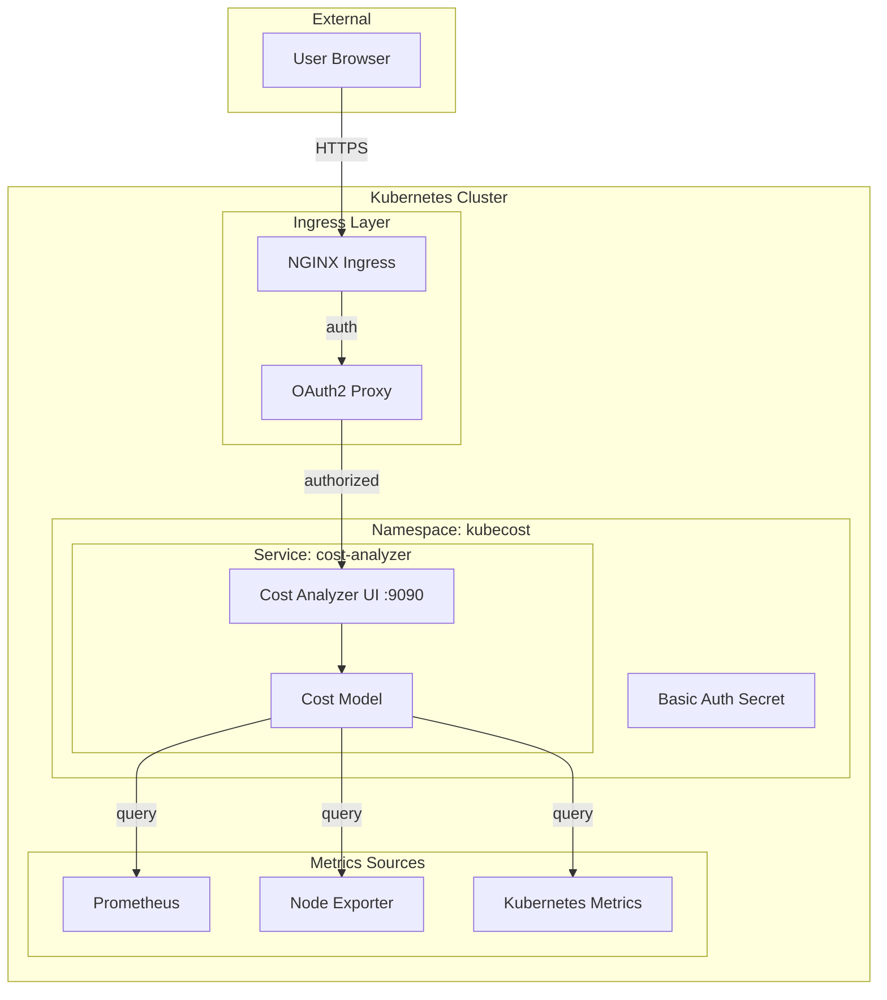

# Kubecost Module

Terraform module for deploying [Kubecost](https://www.kubecost.com/) to Kubernetes. Provides real-time cost visibility and insights for Kubernetes workloads, helping optimize resource allocation and reduce cloud spending.

## Architecture



## Features

- Real-time Kubernetes cost monitoring
- Cost allocation by namespace, deployment, label
- Savings recommendations and optimization insights
- Integration with cloud billing APIs
- OAuth2 proxy protection

## Resources Created

- `kubernetes_namespace.kubecost` - Dedicated namespace
- `kubernetes_secret.frontend_basic_auth` - Basic auth credentials
- `helm_release.kubecost` - Kubecost Helm chart deployment

## Variables

| Name | Description | Default |
|------|-------------|---------|
| `nginx_frontend_basic_auth_base64` | Base64 encoded basic auth credentials | (required, sensitive) |
| `kubecost_token` | Kubecost license token | (required, sensitive) |
| `kubecost_ingress_enable_tls` | Enable TLS for ingress | `true` |
| `kubecost_ingress_class_name` | Ingress class name | `nginx` |
| `kubecost_ingress_host` | Ingress hostname | `cost.chrislee.local` |
| `auth_oauth2_proxy_host` | OAuth2 proxy host for authentication | `auth.chrislee.local` |

## Usage

### 1. Get Kubecost Token

1. Visit <https://www.kubecost.com/install.html#show-instructions>
2. Enter your email to receive a free token
3. Copy the token for configuration

### 2. Configure Variables

Set in Terraform Cloud or `.env`:

```bash
TF_VAR_kubecost_token="your-kubecost-token"
TF_VAR_kubecost_ingress_host="cost.chrislee.local"
```

### 3. Deploy

```bash
cd stage2
terraform apply
```

### 4. Access Dashboard

Navigate to `https://cost.chrislee.local` (or your configured domain).

## Helm Chart

| Property | Value |
|----------|-------|
| Repository | <https://kubecost.github.io/cost-analyzer/> |
| Chart | cost-analyzer |

## Dashboard Features

| Feature | Description |
|---------|-------------|
| Cost Allocation | View costs by namespace, controller, pod, label |
| Savings | Recommendations for right-sizing and optimization |
| Health | Cluster health and efficiency metrics |
| Reports | Custom cost reports and exports |
| Alerts | Cost anomaly detection and alerts |

## References

- [Kubecost Documentation](https://docs.kubecost.com/)
- [Kubecost Helm Chart](https://github.com/kubecost/cost-analyzer-helm-chart)
- [Cost Allocation Guide](https://docs.kubecost.com/using-kubecost/cost-allocation)
