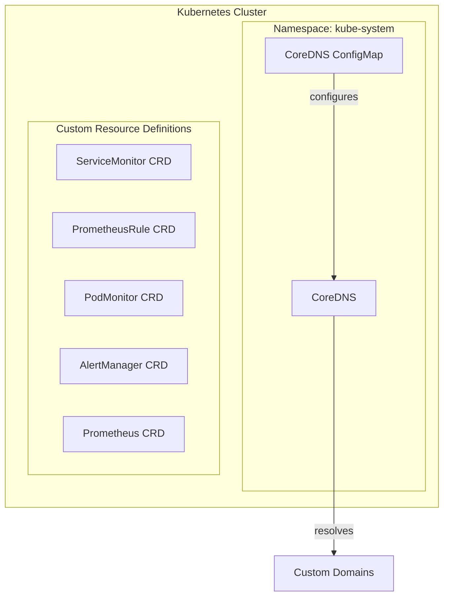
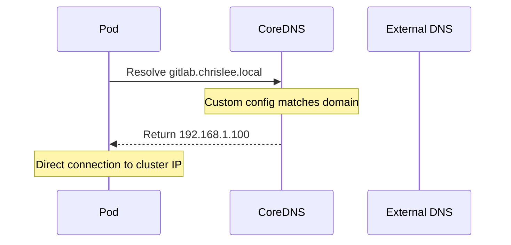

# Kubernetes Module

Terraform module for core Kubernetes configuration including custom CoreDNS settings and Prometheus Operator CRDs. This module is the foundation that other modules depend on.

## Architecture



## Components

### CoreDNS Custom Configuration

Resolves hairpin NAT issues by configuring CoreDNS to route specific domains directly to the cluster IP instead of through external DNS.



### Prometheus CRDs

Installs Prometheus Operator CRDs required by the monitoring stack and other modules that create ServiceMonitor resources.

## Resources Created

- `kubernetes_config_map.coredns` - Modified CoreDNS configuration (kubeadm only)
- `null_resource.prometheus_crd` - Prometheus Operator CRDs installation

## Variables

| Name | Description | Default |
|------|-------------|---------|
| `kubernetes_cluster_type` | Cluster type (kubeadm, k3s, minikube) | `kubeadm` |
| `kubernetes_override_domains` | Space-delimited domains for CoreDNS | `gitlab.chrislee.local registry.chrislee.local minio.chrislee.local` |
| `kubernetes_override_ip` | IP address for custom domain resolution | `192.168.1.100` |

## Usage

### Initial Setup (New Cluster)

For a new cluster, the CoreDNS ConfigMap must be imported first:

```bash
cd stage2
terraform import 'module.kubernetes.kubernetes_config_map.coredns[0]' kube-system/coredns
```

### Configure Custom Domains

Set in Terraform Cloud or `.env`:

```bash
TF_VAR_kubernetes_override_domains="gitlab.chrislee.local registry.chrislee.local minio.chrislee.local"
TF_VAR_kubernetes_override_ip="192.168.1.100"
```

## Prometheus CRDs Installed

| CRD | Purpose |
|-----|---------|
| `alertmanagerconfigs.monitoring.coreos.com` | AlertManager configuration |
| `alertmanagers.monitoring.coreos.com` | AlertManager instances |
| `podmonitors.monitoring.coreos.com` | Pod metrics scraping |
| `probes.monitoring.coreos.com` | Blackbox probing |
| `prometheusagents.monitoring.coreos.com` | Prometheus agents |
| `prometheuses.monitoring.coreos.com` | Prometheus instances |
| `prometheusrules.monitoring.coreos.com` | Alerting rules |
| `scrapeconfigs.monitoring.coreos.com` | Scrape configurations |
| `servicemonitors.monitoring.coreos.com` | Service metrics scraping |
| `thanosrulers.monitoring.coreos.com` | Thanos rulers |

## References

- [CoreDNS Documentation](https://coredns.io/manual/toc/)
- [Prometheus Operator](https://prometheus-operator.dev/)
- [Prometheus Operator CRDs](https://github.com/prometheus-operator/prometheus-operator#customresourcedefinitions)
