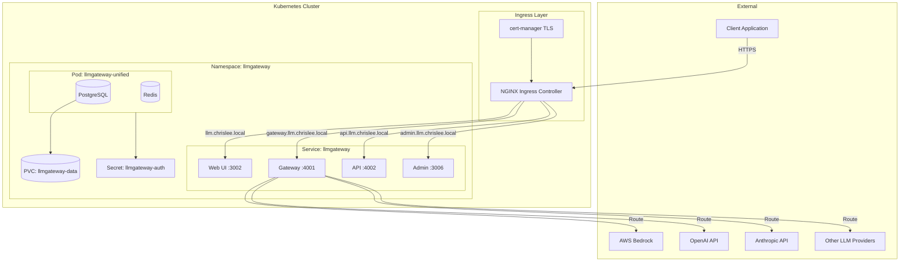
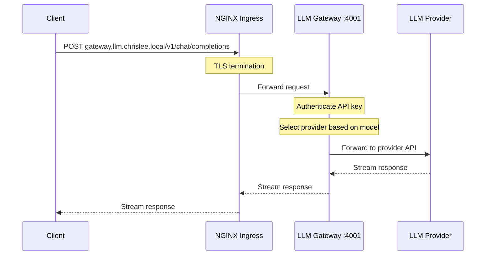

# LLM Gateway Module

Terraform module for deploying [LLM Gateway](https://docs.llmgateway.io) to Kubernetes. Provides a unified API gateway for multiple LLM providers with load balancing, health-aware routing, and usage tracking.

## Architecture



## Request Flow



## Endpoints

Each service is exposed on its own subdomain for clean routing:

| Subdomain | Port | Description |
|-----------|------|-------------|
| `llm.chrislee.local` | 3002 | Web UI - Dashboard and management (OAuth protected) |
| `api.llm.chrislee.local` | 4002 | API - Internal management API (OAuth protected) |
| `gateway.llm.chrislee.local` | 4001 | Gateway - OpenAI-compatible API endpoint (API key auth) |
| `admin.llm.chrislee.local` | 3006 | Admin - System-wide settings (OAuth protected) |

## Resources Created

- `kubernetes_namespace.llmgateway` - Dedicated namespace
- `kubernetes_secret.llmgateway_auth` - AUTH_SECRET for session management
- `kubernetes_persistent_volume_claim_v1.llmgateway_data` - PostgreSQL data storage
- `kubernetes_deployment_v1.llmgateway` - Unified container deployment
- `kubernetes_service_v1.llmgateway` - ClusterIP service
- `kubernetes_ingress_v1.llmgateway_ui` - UI ingress (OAuth protected)
- `kubernetes_ingress_v1.llmgateway_api` - API ingress (OAuth protected)
- `kubernetes_ingress_v1.llmgateway_gateway` - Gateway ingress (API key auth)
- `kubernetes_ingress_v1.llmgateway_admin` - Admin ingress (OAuth protected)
- `kubernetes_manifest.llmgateway_certificate` - TLS certificate (cert-manager)

## Variables

| Name | Description | Default |
|------|-------------|---------|
| `llmgateway_enable` | Enable LLM Gateway deployment | `false` |
| `llmgateway_domain` | Base domain (subdomains derived: api., gateway., admin.) | `llm.chrislee.local` |
| `llmgateway_ingress_class_name` | Ingress class | `nginx` |
| `llmgateway_ingress_enable_tls` | Enable TLS | `true` |
| `llmgateway_storage_size` | PVC size for PostgreSQL | `10Gi` |
| `llmgateway_storage_class_name` | Storage class | `longhorn` |
| `llmgateway_auth_secret` | AUTH_SECRET for sessions | (required) |
| `llmgateway_image_tag` | Docker image tag | `latest` |
| `llmgateway_replicas` | Number of replicas (ReadWriteMany required for >1) | `1` |
| `llmgateway_admin_emails` | Comma-separated admin emails for admin dashboard | `""` |
| `auth_oauth2_proxy_host` | OAuth2 proxy host for authentication | `""` |

## Usage

### 1. Enable the Module

Set in Terraform Cloud or `.env`:

```bash
TF_VAR_llmgateway_enable=true
TF_VAR_llmgateway_domain="llm.chrislee.local"
TF_VAR_llmgateway_auth_secret="$(openssl rand -hex 32)"
TF_VAR_llmgateway_admin_emails="admin@chrislee.local,admin2@chrislee.local"
```

> **Note**: `llmgateway_admin_emails` controls which users have access to the Admin Dashboard at `https://admin.<domain>`. Users must first create an account via the main UI, then their email is checked against this list.

### 2. Deploy

```bash
cd stage2
terraform init
terraform apply
```

### 3. Configure AWS Bedrock (Post-Deployment)

1. Create AWS Bedrock Long-Term API Key in AWS Console
2. Access `https://llm.chrislee.local`
3. Create organization and project
4. Navigate to **Provider Keys**
5. Add AWS Bedrock with your API key and region prefix

### 4. Test the Gateway

```bash
$ curl -s https://gateway.llm.chrislee.local

$ export LLM_GATEWAY_API_KEY=llmgateway-api-key-1234567890

$ curl -s https://gateway.llm.chrislee.local/v1/models \
  -H "Authorization: Bearer $LLM_GATEWAY_API_KEY"

$ curl -X POST https://gateway.llm.chrislee.local/v1/chat/completions \
  -H "Authorization: Bearer $LLM_GATEWAY_API_KEY" \
  -H "Content-Type: application/json" \
  -d '{
    "model": "openai/gpt-5.1-codex",
    "messages": [{"role": "user", "content": "Hello, say hi in one word"}],
    "max_tokens": 10
  }'
```

## References

- [LLM Gateway Documentation](https://docs.llmgateway.io)
- [Self-Host Guide](https://docs.llmgateway.io/self-host)
- [AWS Bedrock Integration](https://docs.llmgateway.io/integrations/aws-bedrock)
- [GitHub Releases](https://github.com/theopenco/llmgateway/releases)
