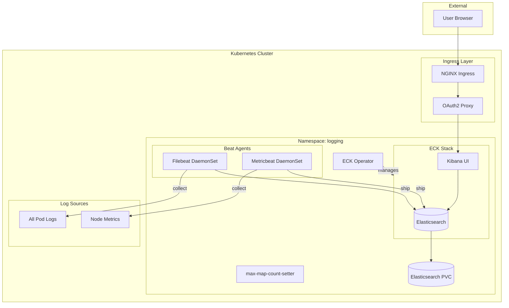
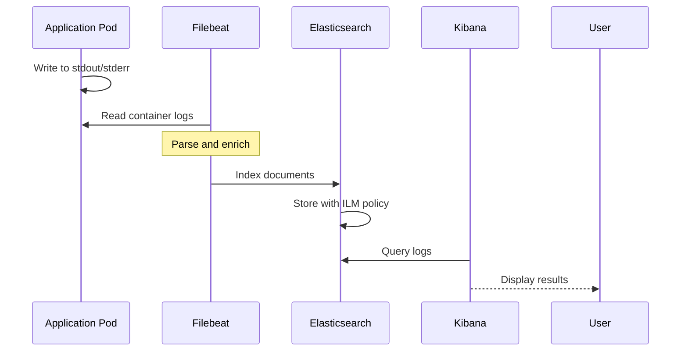

# Logging Module

Terraform module for deploying the [Elastic Cloud on Kubernetes (ECK)](https://www.elastic.co/guide/en/cloud-on-k8s/) stack to Kubernetes. Provides centralized log collection, storage, and visualization with Elasticsearch, Kibana, Filebeat, and Metricbeat.

## Architecture



## Log Collection Flow



## Resources Created

### ECK Operator

- `kubernetes_namespace.logging` - Dedicated namespace
- `helm_release.eck_operator` - ECK Operator chart
- `null_resource.eck_operator_ready` - Operator readiness check

### Elasticsearch

- `kubectl_manifest.max_map_count_setter` - Kernel settings DaemonSet
- `kubectl_manifest.elasticsearch` - Elasticsearch cluster
- `kubernetes_secret.elasticsearch_secret` - Credentials
- `kubernetes_job.elasticsearch_post_setup` - Post-deployment configuration

### Kibana

- `kubectl_manifest.kibana` - Kibana instance
- `kubernetes_ingress_v1.kibana_ingress` - Ingress with OAuth2

### Beats

- `kubernetes_manifest.filebeat_*` - Filebeat RBAC and DaemonSet
- `kubernetes_manifest.metricbeat_*` - Metricbeat RBAC and DaemonSet

## Variables

### Elasticsearch

| Name | Description | Default |
|------|-------------|---------|
| `elasticsearch_resource_request_memory` | Memory request | `2Gi` |
| `elasticsearch_resource_request_cpu` | CPU request | `1` |
| `elasticsearch_resource_limit_memory` | Memory limit | `2Gi` |
| `elasticsearch_resource_limit_cpu` | CPU limit | `1` |
| `elasticsearch_storage_size` | Storage size | `5Gi` |
| `elasticsearch_storage_class_name` | Storage class | `longhorn` |

### Kibana

| Name | Description | Default |
|------|-------------|---------|
| `kibana_resource_request_memory` | Memory request | `1Gi` |
| `kibana_resource_limit_memory` | Memory limit | `1Gi` |
| `kibana_ingress_class_name` | Ingress class | `nginx` |
| `kibana_ingress_enable_tls` | Enable TLS | `false` |
| `kibana_domain` | Kibana hostname | `kibana.chrislee.local` |

### Common

| Name | Description | Default |
|------|-------------|---------|
| `nginx_frontend_basic_auth_base64` | Basic auth | (required, sensitive) |
| `auth_oauth2_proxy_host` | OAuth2 proxy | `auth.chrislee.local` |

## Usage

### Access Kibana

Navigate to `https://kibana.chrislee.local` (OAuth2 protected).

### Get Elasticsearch Credentials

```bash
# Username is 'elastic'
kubectl -n logging get secret elasticsearch-es-elastic-user -o jsonpath="{.data.elastic}" | base64 -d
```

### View Logs in Kibana

1. Go to **Discover**
2. Select `filebeat-*` index pattern
3. Use KQL to search: `kubernetes.namespace: "gitlab"`

### Query Elasticsearch Directly

```bash
ES_PASSWORD=$(kubectl -n logging get secret elasticsearch-es-elastic-user -o jsonpath="{.data.elastic}" | base64 -d)

curl -k -u "elastic:${ES_PASSWORD}" "https://elasticsearch.logging.svc:9200/_cat/indices?v"
```

## Helm Charts / Operators

| Component | Type |
|-----------|------|
| ECK Operator | Helm |
| Elasticsearch | ECK CRD |
| Kibana | ECK CRD |
| Filebeat | ECK CRD |
| Metricbeat | ECK CRD |

## Outputs

| Name | Description |
|------|-------------|
| `elasticsearch_host` | Elasticsearch service hostname |
| `elasticsearch_port` | Elasticsearch service port |
| `elasticsearch_username` | Elasticsearch username |
| `elasticsearch_password` | Elasticsearch password |

These outputs are used by the monitoring module for ElastAlert2 integration.

## Index Lifecycle Management

Filebeat uses ILM policies for log retention:

- Hot phase: Active writes
- Delete phase: Automatic cleanup after retention period

## References

- [Elastic Cloud on Kubernetes](https://www.elastic.co/guide/en/cloud-on-k8s/)
- [Elasticsearch Documentation](https://www.elastic.co/guide/en/elasticsearch/reference/current/)
- [Kibana Documentation](https://www.elastic.co/guide/en/kibana/current/)
- [Filebeat Documentation](https://www.elastic.co/guide/en/beats/filebeat/current/)
- [Metricbeat Documentation](https://www.elastic.co/guide/en/beats/metricbeat/current/)
