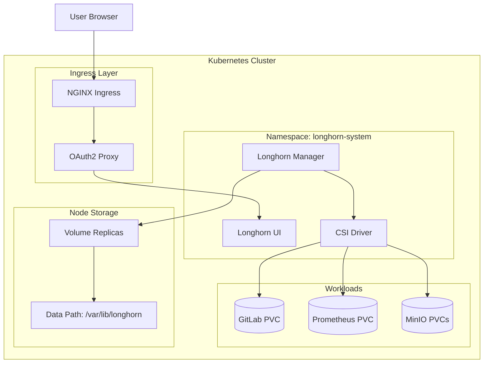
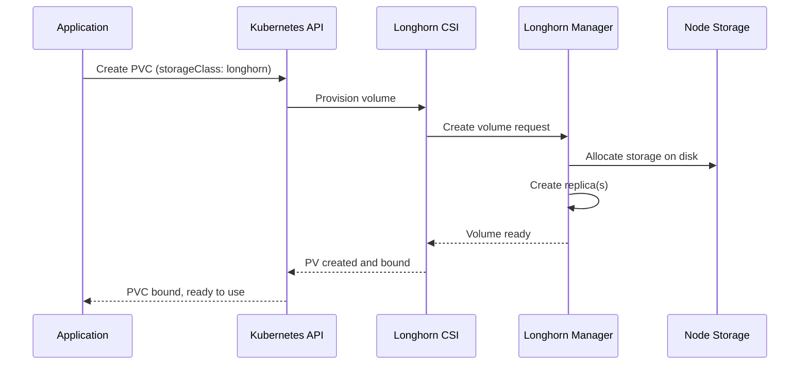

# Longhorn Storage Module

Terraform module for deploying [Longhorn](https://longhorn.io/) distributed block storage to Kubernetes. Provides persistent volumes with replication, snapshots, and backups for stateful workloads.

## Architecture



## Volume Provisioning Flow



## Resources Created

- `kubernetes_namespace.longhorn` - Dedicated namespace (longhorn-system)
- `kubernetes_secret.frontend_basic_auth` - Basic auth for UI
- `helm_release.longhorn` - Longhorn Helm chart
- `null_resource.remove_default` - Removes default StorageClass from local-path

## Variables

| Name | Description | Default |
|------|-------------|---------|
| `nginx_frontend_basic_auth_base64` | Base64 encoded basic auth | (required, sensitive) |
| `longhorn_default_settings_default_data_path` | Data storage path on nodes | `/var/lib/longhorn` |
| `longhorn_ingress_class_name` | Ingress class for UI | (required) |
| `longhorn_ingress_host` | Hostname for UI access | (required) |
| `longhorn_ingress_enable_tls` | Enable TLS for UI | `true` |
| `auth_oauth2_proxy_host` | OAuth2 proxy for authentication | `auth.chrislee.local` |

## Usage

### Configure Storage Path

Set custom data path if needed:

```bash
TF_VAR_longhorn_default_settings_default_data_path="/mnt/storage/longhorn"
```

### Configure UI Access

```bash
TF_VAR_longhorn_ingress_host="longhorn.chrislee.local"
```

### Access Dashboard

Navigate to `https://longhorn.chrislee.local` (OAuth2 protected).

## Helm Chart

| Property | Value |
|----------|-------|
| Repository | <https://charts.longhorn.io> |
| Chart | longhorn |

## StorageClass

After deployment, `longhorn` becomes the default StorageClass:

```yaml
apiVersion: v1
kind: PersistentVolumeClaim
metadata:
  name: my-pvc
spec:
  accessModes:
    - ReadWriteOnce
  storageClassName: longhorn
  resources:
    requests:
      storage: 10Gi
```

## Features

| Feature | Description |
|---------|-------------|
| Replication | Configurable replica count for data redundancy |
| Snapshots | Point-in-time volume snapshots |
| Backups | Backup to S3-compatible storage (MinIO) |
| Expansion | Online volume expansion |
| Encryption | Volume encryption at rest |
| DR | Disaster recovery with cross-cluster replication |

## References

- [Longhorn Documentation](https://longhorn.io/docs/)
- [Longhorn Helm Chart](https://github.com/longhorn/charts)
- [Best Practices](https://longhorn.io/docs/latest/best-practices/)
