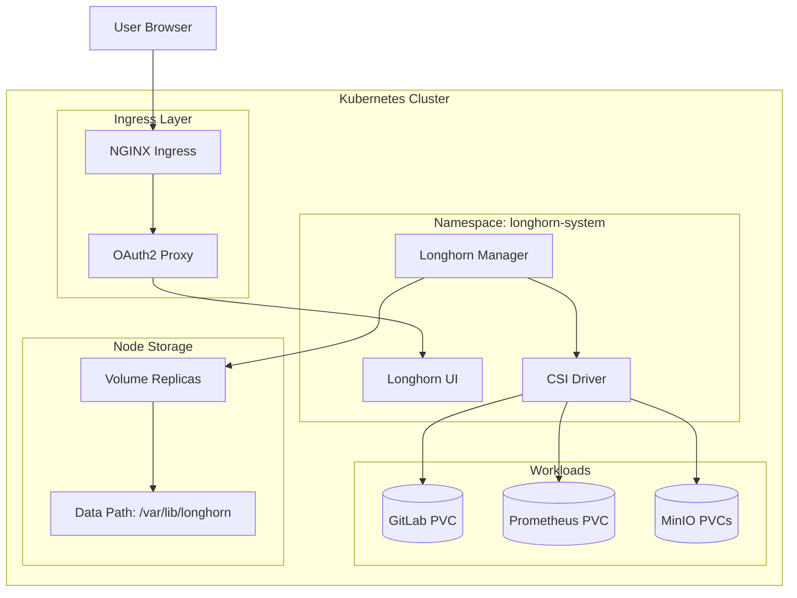
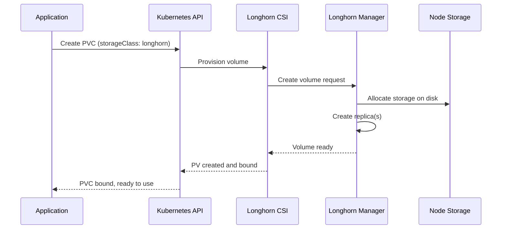
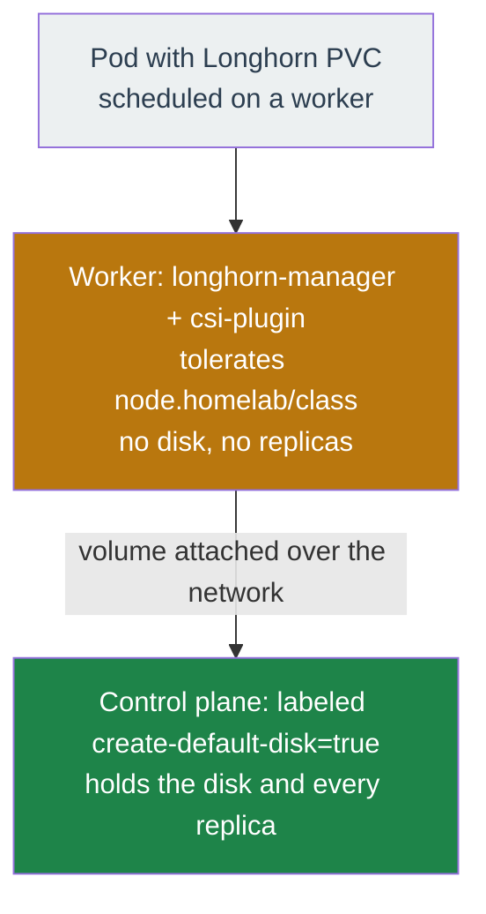

# Longhorn Storage Module

Terraform module for deploying [Longhorn](https://longhorn.io/) distributed block storage to Kubernetes. Provides persistent volumes with replication, snapshots, and backups for stateful workloads.

## Architecture


```mermaid
flowchart TB
    subgraph k8s [Kubernetes Cluster]
        subgraph ns [Namespace: longhorn-system]
            Manager[Longhorn Manager]
            UI[Longhorn UI]
            Driver[CSI Driver]
        end

        subgraph workloads [Workloads]
            GitLab[(GitLab PVC)]
            Prometheus[(Prometheus PVC)]
            MinIO[(MinIO PVCs)]
        end

        subgraph node [Node Storage]
            Disk1["Data Path: /var/lib/longhorn"]
            Replica1[Volume Replicas]
        end

        subgraph ingress [Ingress Layer]
            Nginx[NGINX Ingress]
            OAuth[OAuth2 Proxy]
        end
    end

    User[User Browser] --> Nginx
    Nginx --> OAuth
    OAuth --> UI

    Manager --> Driver
    Driver --> GitLab
    Driver --> Prometheus
    Driver --> MinIO
    Manager --> Replica1
    Replica1 --> Disk1
```

## Volume Provisioning Flow


```mermaid
sequenceDiagram
    participant App as Application
    participant K8s as Kubernetes API
    participant CSI as Longhorn CSI
    participant Manager as Longhorn Manager
    participant Node as Node Storage

    App->>K8s: Create PVC (storageClass: longhorn)
    K8s->>CSI: Provision volume
    CSI->>Manager: Create volume request
    Manager->>Node: Allocate storage on disk
    Manager->>Manager: Create replica(s)
    Manager-->>CSI: Volume ready
    CSI-->>K8s: PV created and bound
    K8s-->>App: PVC bound, ready to use
```

## Node Topology

Storage nodes and compute nodes are separated. Only nodes labeled
`node.longhorn.io/create-default-disk=true` get a Longhorn disk, so replicas stay on the
control plane. Tainted workers run the CSI stack so their pods can mount volumes, but hold
no data.


```mermaid
flowchart TB
    PodApp["Pod with Longhorn PVC<br/>scheduled on a worker"]:::app
    CSIWorker["Worker: longhorn-manager + csi-plugin<br/>tolerates node.homelab/class<br/>no disk, no replicas"]:::compute
    StorageCP["Control plane: labeled create-default-disk=true<br/>holds the disk and every replica"]:::store

    PodApp --> CSIWorker
    CSIWorker -->|"volume attached over the network"| StorageCP

    classDef app fill:#ecf0f1,color:#2c3e50
    classDef compute fill:#b9770e,color:#ffffff
    classDef store fill:#1e8449,color:#ffffff
```

The label is applied by `kubernetes_labels.longhorn_default_disk`, not by hand. Longhorn
evaluates `createDefaultDiskLabeledNodes` only the first time it detects a node, so the
label must exist before `helm_release.longhorn` runs. It is a hard precondition: without it
a rebuilt control plane comes up with no disk and every PVC stays `Pending`, and nothing
fails at apply time to tell you why.

Enabling the setting does **not** remove disks from nodes Longhorn already knows about. A
worker that joined while the setting was disabled keeps the default disk it was given;
remove that disk in the Longhorn UI if you want it compute-only.

### Applying toleration changes

`defaultSettings.taintToleration` is a Longhorn [Danger Zone](https://longhorn.io/docs/1.10.1/references/settings/#danger-zone)
setting. Longhorn will not reconcile it into a component that has running engines or
replicas, so on a cluster with attached volumes the Setting CR can sit at `APPLIED=false`
indefinitely:

```bash
kubectl -n longhorn-system get setting taint-toleration
# NAME              VALUE                          APPLIED
# taint-toleration  node.homelab/class:NoSchedule  false
```

`APPLIED=false` does not mean the toleration is missing everywhere. A newly joined node's
instance-manager has no running engines, so it receives the toleration immediately. What
lags is the control plane's own instance-manager, which is harmless here because the control
plane is untainted. Check the component that actually matters rather than the flag:

```bash
kubectl -n longhorn-system get ds longhorn-csi-plugin \
  -o jsonpath='{.spec.template.spec.tolerations}'
kubectl -n longhorn-system get pods -o wide \
  --field-selector spec.nodeName=<worker-node>
```

To force full reconciliation, detach every volume first, then re-apply:

```bash
kubectl scale deploy/<app> --replicas=0 -n <namespace>   # detach the workloads
kubectl -n longhorn-system get volumes.longhorn.io \
  -o custom-columns=NAME:.metadata.name,STATE:.status.state   # all must read "detached"
# terraform apply, then scale back up
```

## Resources Created

- `kubernetes_namespace.longhorn` - Dedicated namespace (longhorn-system)
- `kubernetes_secret.frontend_basic_auth` - Basic auth for UI
- `data.kubernetes_nodes.control_plane` - Looks up the control-plane node to label
- `kubernetes_labels.longhorn_default_disk` - Marks the control plane as the storage node
- `helm_release.longhorn` - Longhorn Helm chart
- `null_resource.remove_default` - Removes default StorageClass from local-path

## Variables

| Name | Description | Default |
|------|-------------|---------|
| `nginx_frontend_basic_auth_base64` | Base64 encoded basic auth | (required, sensitive) |
| `longhorn_default_settings_default_data_path` | Data storage path on nodes | `/var/lib/longhorn` |
| `longhorn_ingress_class_name` | Ingress class for UI | (required) |
| `longhorn_ingress_host` | Hostname for UI access | (required) |
| `longhorn_ingress_enable_tls` | Enable TLS for UI | `true` |
| `auth_oauth2_proxy_host` | OAuth2 proxy for authentication | `auth.chrislee.local` |

## Usage

### Configure Storage Path

Set custom data path if needed:

```bash
TF_VAR_longhorn_default_settings_default_data_path="/mnt/storage/longhorn"
```

### Configure UI Access

```bash
TF_VAR_longhorn_ingress_host="longhorn.chrislee.local"
```

### Access Dashboard

Navigate to `https://longhorn.chrislee.local` (OAuth2 protected).

## Helm Chart

| Property | Value |
|----------|-------|
| Repository | <https://charts.longhorn.io> |
| Chart | longhorn |

## StorageClass

After deployment, `longhorn` becomes the default StorageClass:

```yaml
apiVersion: v1
kind: PersistentVolumeClaim
metadata:
  name: my-pvc
spec:
  accessModes:
    - ReadWriteOnce
  storageClassName: longhorn
  resources:
    requests:
      storage: 10Gi
```

## Features

| Feature | Description |
|---------|-------------|
| Replication | Configurable replica count for data redundancy |
| Snapshots | Point-in-time volume snapshots |
| Backups | Backup to S3-compatible storage (MinIO) |
| Expansion | Online volume expansion |
| Encryption | Volume encryption at rest |
| DR | Disaster recovery with cross-cluster replication |

## References

- [Longhorn Documentation](https://longhorn.io/docs/)
- [Longhorn Helm Chart](https://github.com/longhorn/charts)
- [Best Practices](https://longhorn.io/docs/latest/best-practices/)
