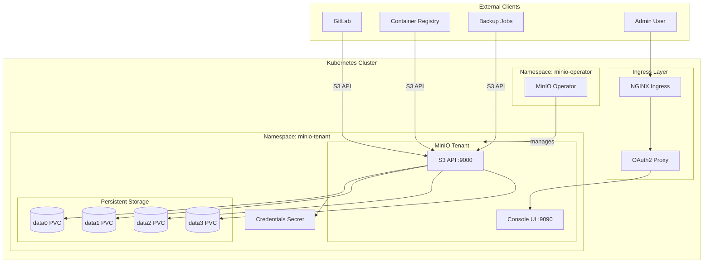
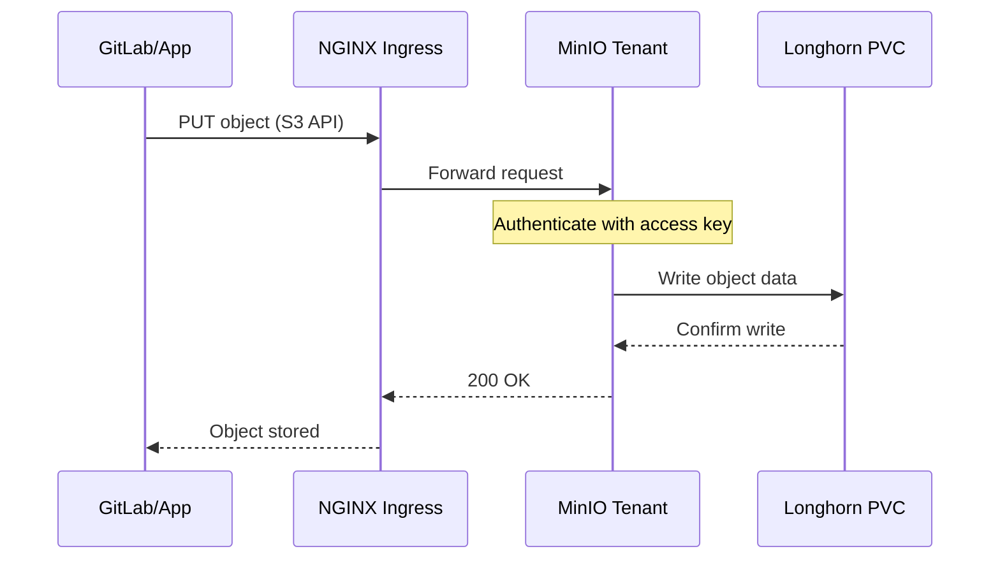

# MinIO Object Storage Module

Terraform module for deploying [MinIO](https://min.io/) S3-compatible object storage to Kubernetes. Provides object storage for GitLab artifacts, container registry, backups, and other services requiring S3-compatible storage.

## Architecture



## Request Flow



## Resources Created

- `kubernetes_namespace.minio_operator` - Operator namespace
- `kubernetes_namespace.minio_tenant` - Tenant namespace
- `kubernetes_secret.frontend_basic_auth` - Basic auth for console
- `kubernetes_secret.minio_tenant_env` - Root credentials
- `kubernetes_secret.minio_tenant_user` - User access credentials
- `kubernetes_config_map.minio_custom_headers` - NGINX headers
- `helm_release.minio_operator` - MinIO Operator
- `helm_release.minio_tenant` - MinIO Tenant

## Variables

| Name | Description | Default |
|------|-------------|---------|
| `nginx_frontend_basic_auth_base64` | Base64 encoded basic auth | (required, sensitive) |
| `minio_tenant_root_user` | Root username | `minio` |
| `minio_tenant_pools_servers` | Number of MinIO servers | `1` |
| `minio_tenant_pools_size` | Storage capacity per volume | `10Gi` |
| `minio_tenant_pools_storage_class_name` | Storage class for PVCs | `longhorn` |
| `minio_tenant_default_buckets` | List of buckets to create | (required) |
| `minio_tenant_user_access_key` | User access key | `minio-user` |
| `minio_tenant_ingress_class_name` | Ingress class | `nginx` |
| `minio_tenant_ingress_api_host` | S3 API hostname | `minio.chrislee.local` |
| `minio_tenant_ingress_console_host` | Console hostname | `minio-console.chrislee.local` |
| `minio_tenant_ingress_enable_tls` | Enable TLS | `true` |
| `auth_oauth2_proxy_host` | OAuth2 proxy host | `auth.chrislee.local` |

## Default Buckets

The module creates these buckets for GitLab integration:

- `registry` - Container registry storage
- `git-lfs` - Git LFS objects
- `runner-cache` - CI runner cache
- `gitlab-uploads` - User uploads
- `gitlab-artifacts` - CI artifacts
- `gitlab-backups` - Automated backups
- `gitlab-packages` - Package registry
- `gitlab-mr-diffs` - Merge request diffs
- `gitlab-terraform-state` - Terraform state
- `gitlab-pages` - GitLab Pages
- `gitlab-registry-storage` - Registry metadata

## Usage

### Configure Storage Size

```bash
TF_VAR_minio_tenant_pools_size="50Gi"
```

### Access Console

Navigate to `https://minio-console.chrislee.local` (OAuth2 protected).

### Use S3 API

```bash
# Configure AWS CLI
aws configure set aws_access_key_id minio-user
aws configure set aws_secret_access_key <secret-from-terraform-output>

# List buckets
aws --endpoint-url https://minio.chrislee.local s3 ls

# Upload file
aws --endpoint-url https://minio.chrislee.local s3 cp file.txt s3://gitlab-backups/
```

## Helm Charts

| Component | Repository | Chart |
|-----------|------------|-------|
| Operator | <https://operator.min.io> | operator |
| Tenant | <https://operator.min.io> | tenant |

## Outputs

| Name | Description |
|------|-------------|
| `minio_tenant_user_secret_key` | User secret key for S3 access |

## Expanding Storage

To expand PVC storage when full:

```bash
kubectl edit -n minio-tenant pvc data0-minio-tenant-pool-0-0
kubectl edit -n minio-tenant pvc data1-minio-tenant-pool-0-0
kubectl edit -n minio-tenant pvc data2-minio-tenant-pool-0-0
kubectl edit -n minio-tenant pvc data3-minio-tenant-pool-0-0
```

## References

- [MinIO Documentation](https://min.io/docs/minio/kubernetes/upstream/)
- [MinIO Operator](https://github.com/minio/operator)
- [S3 API Reference](https://docs.aws.amazon.com/AmazonS3/latest/API/Welcome.html)
