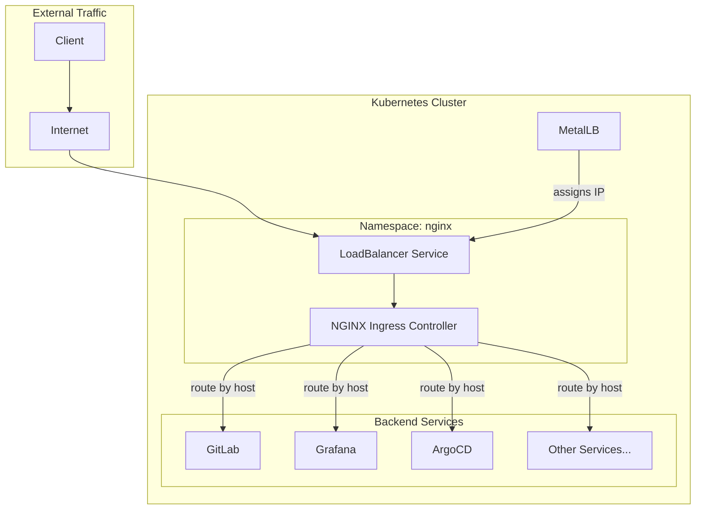
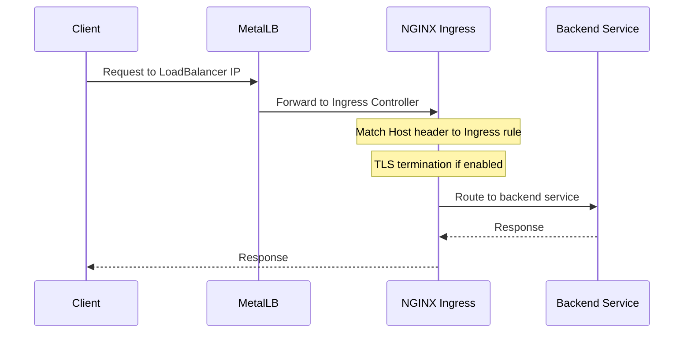

# NGINX Ingress Controller Module

Terraform module for deploying [NGINX Ingress Controller](https://kubernetes.github.io/ingress-nginx/) to Kubernetes. Provides HTTP/HTTPS load balancing for all services in the cluster with MetalLB integration for bare-metal LoadBalancer support.

## Architecture



## Traffic Flow



## Resources Created

- `kubernetes_namespace.nginx` - Dedicated namespace
- `helm_release.nginx` - NGINX Ingress Controller Helm chart

## Variables

| Name | Description | Default |
|------|-------------|---------|
| `nginx_service_loadbalancer_ip` | Static IP for LoadBalancer service | `""` |
| `nginx_client_max_body_size` | Maximum allowed request body size | `10M` |
| `nginx_client_body_buffer_size` | Client request body buffer size | `10M` |
| `wireguard_port` | WireGuard UDP port to expose | `51820` |

## Usage

### Configure LoadBalancer IP

Set in Terraform Cloud or `.env`:

```bash
TF_VAR_nginx_service_loadbalancer_ip="192.168.1.100"
```

### Adjust Body Size Limits

For large file uploads (e.g., GitLab):

```bash
TF_VAR_nginx_client_max_body_size="100M"
TF_VAR_nginx_client_body_buffer_size="100M"
```

## Helm Chart

| Property | Value |
|----------|-------|
| Repository | <https://kubernetes.github.io/ingress-nginx> |
| Chart | ingress-nginx |

## Features

| Feature | Description |
|---------|-------------|
| TLS Termination | Handles HTTPS with cert-manager certificates |
| Host-based Routing | Routes traffic based on Host header |
| Path-based Routing | Routes traffic based on URL path |
| Rate Limiting | Configurable rate limits per ingress |
| OAuth2 Integration | Works with oauth2-proxy for authentication |
| WebSocket Support | Full WebSocket support for real-time apps |
| TCP/UDP Passthrough | Exposes WireGuard UDP port |

## References

- [NGINX Ingress Controller Documentation](https://kubernetes.github.io/ingress-nginx/)
- [Ingress Controller Helm Chart](https://github.com/kubernetes/ingress-nginx/tree/main/charts/ingress-nginx)
- [Annotations Reference](https://kubernetes.github.io/ingress-nginx/user-guide/nginx-configuration/annotations/)
